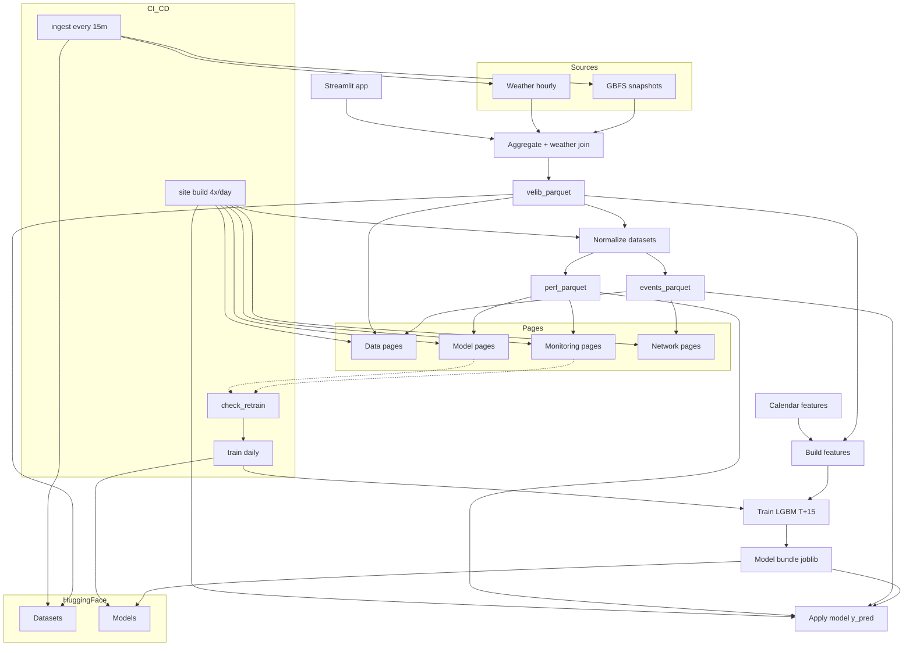
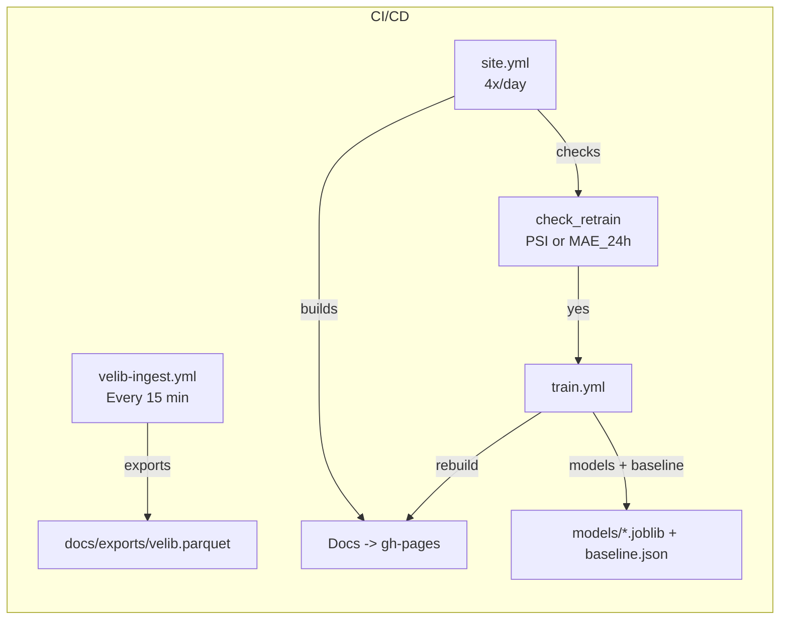

# 🚲 Vélib’ Paris — Forecast & Monitoring
[](https://github.com/Adrien-1997/bike-forecast-paris-velib/actions/workflows/ingest.yml)
[](https://github.com/Adrien-1997/bike-forecast-paris-velib/actions/workflows/train.yml)
[](https://adrien-1997.github.io/bike-forecast-paris-velib/)
[](https://adrien-1997-bike-forecast-paris-velib-appstreamlit-app-vq1xma.streamlit.app/)


Short-term forecasting (+60 min) and professional monitoring of the Vélib’ bike network in Paris.
Public GBFS snapshots -> normalized 15-min aggregates -> features & model training -> monitoring with auto-retrain.

> Quick links:
> Docs -> https://adrien-1997.github.io/bike-forecast-paris-velib/
> App  -> https://velib-forecast.streamlit.app/

---

## Table of Contents

- [Key Features](#-key-features)
- [Pipelines — Data → ML → Docs & App](#-pipelines--data--ml--docs--app)
- [CI/CD (GitHub Actions)](#-cicd-github-actions)
- [Run locally](#-run-locally)
- [Streamlit App](#-app-streamlit)
- [Data Contracts (canonical schemas)](#-data-contracts-canonical-schemas)
- [Project Layout](#-project-layout)
- [Release Notes — v2.2.0](#-release-notes--v210)
- [Author & License](#-author--license)

---

## 🔎 Key Features

## Key Features

- **60-min forecasting (T+60)**  
  LightGBM predicts bike availability 60 minutes ahead with strict feature parity (lags/rollings + calendar features).

- **Robust data pipeline**  
  Ingestion every **15 min** → DuckDB snapshots → 15-min aggregation + weather join → canonical `docs/exports/velib.parquet`.

- **Clean targets & alignment**  
  `y_true = bikes@T+60` (shift), baseline = persistence@T, predictions aligned on **T** to avoid leakage.

- **Hugging Face integration**  
  - **Datasets**: parquet exports pushed to HF Datasets.  
  - **Models**: `.joblib` bundles (model + feature contract + horizon) pushed to HF Model Hub.

- **Monitoring & quality**  
  - **Data health**: freshness, completeness, schema checks.  
  - **Drift**: PSI across key features.  
  - **Model health**: MAE/RMSE, lift vs baseline, coverage, calibration.  
  - **Parquet freshness badge** in the app UI.

- **Documentation pages (MkDocs)**  
  - **Data**: Exports, Dictionary, Methodology.  
  - **Monitoring**: Data health, Drift, Model health.  
  - **Model**: Pipeline, Performance, Explainability.  
  - **Network**: Overview, Stations, Dynamics.

- **CI/CD**  
  1. `velib-ingest` (15 min) → update parquet + push HF dataset.  
  2. `velib-train` (daily or triggered) → export models to HF.  
  3. `monitoring-site` (4×/day) → build pages, run drift/perf checks, deploy **gh-pages**.

- **Streamlit app**  
  Interactive map, real-time availability/saturation, **T+60** forecasts, reads model bundle + parquet.

- **Analytics & insights**  
  Station clustering, heatmaps, variability, daily/hourly profiles, residual analysis & calibration.


> All figures and tables displayed on the online site are generated from the canonical dataset (`velib.parquet`), available on Hugging Face Datasets.

---

## 🧭 Pipelines — Data → ML → Docs & App (+ Hugging Face)



### Core src/* chain

1) Ingestion — `src/ingest.py` (every 15 min)  
   Pull GBFS, normalize, upsert station meta, append one row/station in snapshots.

2) Aggregation — `src/aggregate.py` (15-min + weather)  
   Right-closed 15-min grid; `occ = bikes/capacity` (safe clamp); join weather; write `docs/exports/velib.parquet`.

3) Feature builder — `src/features.py`  
   Hour/DOW cyclics, lags (t-15/30/45/60), rolling mean/std, static station, weather. (horizon=60)

4) Forecast — `src/forecast.py`  
   LightGBM with early-stopping; saves `models/*.joblib` and `docs/exports/baseline.json`.

---

### 🤖 CI/CD (GitHub Actions)

This pipeline keeps data and docs fresh while guarding model quality:

- **Ingestion (`velib-ingest.yml`, every 15 min):** fetch GBFS → update DuckDB snapshots → aggregate to 15‑min bins → export `docs/exports/velib.parquet`.
- **Docs & monitoring (`site.yml`, 4×/day @ 00/06/12/18 UTC):** build MkDocs, compute metrics, check **drift/perf** (PSI / MAE_24h). If thresholds are exceeded, it triggers retraining.
- **Training (`train.yml`, daily fallback or immediate):** train LightGBM T+60, write `models/*.joblib` and `docs/exports/baseline.json`, then rebuild docs.



#### Jobs at a glance

| Job | What it does | Deps |
|---|---|---|
| **build-monitor** (`site.yml`) | Install `requirements-doc.txt` (headless `MPLBACKEND=Agg`), run `tools/generate_monitoring.py`, decide retrain via `tools/check_retrain.py` (**PSI ≥ 0.20** or **MAE_24h ≥ 1.20× baseline**), build & deploy MkDocs to `gh-pages`. | pandas, numpy, pyarrow, matplotlib, scikit-learn, folium, mkdocs |
| **retrain-and-rebuild** (`train.yml`, conditional) | Install `requirements-train.txt` (scikit-learn + lightgbm), run `src.forecast.train(horizon_minutes=60, lookback_days=30)`, save `models/*.joblib` and `docs/exports/baseline.json`, **force-add** ignored paths, re‑generate monitoring, rebuild docs, deploy. | scikit-learn, lightgbm |

**Operational notes**  
- `tools/check_retrain.py` supports legacy `docs/exports/metrics.json` **and** the new CSV/Parquet tables.  
- The commit step **force‑adds** `baseline.json` (and models if you choose) even if `.gitignore` ignores `docs/exports` / `models`.  
- Cache `~/.cache/pip` to speed up both jobs.

---

## 🚀 Run locally

```bash
# 1) Analytics / docs deps
pip install -r requirements-doc.txt

# 2) Build all figures/pages from canonical parquet
python tools/generate_monitoring.py

# 3) Serve docs locally
mkdocs serve
```

**Use a trained model?** Merge predictions into `docs/exports/perf.parquet` (`ts, station_id, y_pred`) then re‑run monitoring.

---

## 🧪 App (Streamlit)

```bash
pip install streamlit
streamlit run app/streamlit_app.py
```
- Reads: `models/*.joblib` + `docs/exports/velib.parquet`.  
- Live demo: see README badges.

---

## 📐 Data Contracts (canonical schemas)

**A) `warehouse.duckdb::snapshots` (append‑only)**  
`ts, station_id, bikes, capacity, docks_free, is_renting, is_returning, is_installed, name, lat, lon[, ebikes]`  
Index hint: clustered by `(ts, station_id)`.

**B) `docs/exports/velib.parquet` (15‑min canonical)**  
`ts(UTC), station_id, bikes, capacity, occ, lat, lon, name, temp_c, rain_mm, wind_kph, dow, hour`

**C) Training exports (`tools/datasets.py`)**  
- `events.parquet` → `ts, station_id, bikes, capacity, occ, lat, lon, name`  
- `perf.parquet` → `ts, station_id, y_true, y_pred[, y_pred_baseline]` (rebuild `y_true` via **T+60** shift if missing)

---

## 📁 Project Layout

```
bike-forecast-paris-velib/
├─ app/ # Streamlit app
├─ src/ # ingestion, aggregation, features, forecast
│ ├─ ingest.py
│ ├─ aggregate.py
│ ├─ features.py
│ └─ forecast.py
├─ tools/
│ ├─ datasets.py
│ ├─ apply_model.py
│ ├─ build_*.py
│ └─ check_retrain.py
├─ docs/
│ ├─ assets/{figs,tables,maps}
│ ├─ exports/
│ └─ {network,model,monitoring,data}/
├─ models/
├─ .github/workflows/{ingest.yml,train.yml,site.yml}
└─ mkdocs.yml
```
---


## Release Notes — v2.3.0

**MkDocs revamp (site overhaul)**
- Clear 4×3 structure: **Network**, **Model**, **Monitoring**, **Data**.
- *One script = one page*: dedicated `tools/build_*` generators with KPI injection into Markdown.
- Maps & charts: Folium map **with legend**, “Today vs Median” curve, daily KPIs vs **D-7/D-14/D-21**.
- Robust relative paths (`use_directory_urls: true`) and auto-created `docs/assets/{figs,tables,maps}`.
- Windows-friendly: ASCII logs, UTF-8 (no BOM).
- **Backed by Hugging Face**: the canonical dataset (`velib.parquet`) is stored on **Hugging Face Datasets**; pages are built from that source and published on GitHub Pages.

**Model & data**
- `apply_model.py`: correct **T+h → T** alignment, stable station mapping.
- `datasets.py`: cleaner output; safer types/encoding.

---

## 👤 Author & License

**Adrien Morel** — Data Scientist (applied math & ML)  
Docs: [https://adrien-1997.github.io/bike-forecast-paris-velib/](https://adrien-1997.github.io/bike-forecast-paris-velib/) • App: [https://adrien-1997-bike-forecast-paris-velib-appstreamlit-app-vq1xma.streamlit.app/](https://velib-forecast.streamlit.app/)

**License:** MIT
