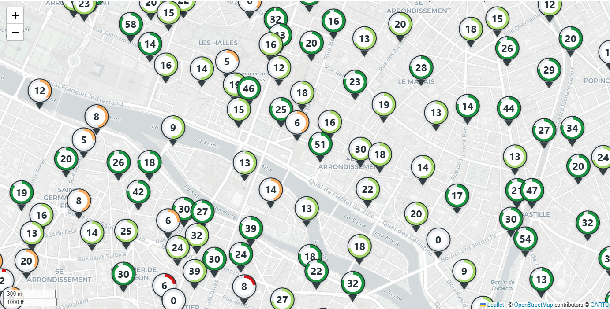
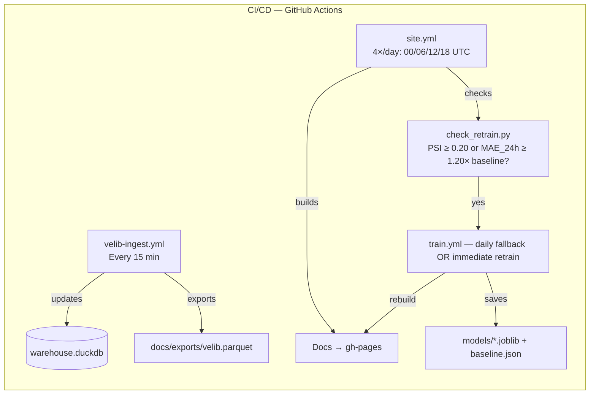

# 🚲 Vélib’ Paris — Forecast & Monitoring
[](https://github.com/Adrien-1997/bike-forecast-paris-velib/actions/workflows/ingest.yml)
[](https://github.com/Adrien-1997/bike-forecast-paris-velib/actions/workflows/train.yml)
[](https://adrien-1997.github.io/bike-forecast-paris-velib/)
[](https://adrien-1997-bike-forecast-paris-velib-appstreamlit-app-vq1xma.streamlit.app/)




**Short-term forecasting (+60 min) and professional monitoring of the Vélib’ bike network in Paris.**  
Public GBFS snapshots → normalized 15‑min aggregates → **features & model training** → monitoring with **auto‑retrain**.

> Quick links:
> **Docs** → https://adrien-1997.github.io/bike-forecast-paris-velib/
> **App** → https://adrien-1997-bike-forecast-paris-velib-appstreamlit-app-vq1xma.streamlit.app/

---

## Table of Contents

- [Key Features](#-key-features)
- [Pipelines — Data → ML → Docs & App](#-pipelines--data--ml--docs--app)
- [CI/CD (GitHub Actions)](#-cicd-github-actions)
- [Run locally](#-run-locally)
- [Streamlit App](#-app-streamlit)
- [Data Contracts (canonical schemas)](#-data-contracts-canonical-schemas)
- [Project Layout](#-project-layout)
- [Release Notes — v2.1.0](#-release-notes--v210)
- [Author & License](#-author--license)

---

## 🔎 Key Features

- **Ingestion every 15 min**: full network snapshot stored in DuckDB.
- **15‑min aggregation**: standardized exports (`docs/exports/velib.parquet`, `.csv`) enriched with weather.
- **Real‑time monitoring**: interactive map with occupancy, available bikes, and free docks.
- **KPIs & history**: track occupancy, total bikes, and overall network availability.
- **Forecasts (ML)**: **LightGBM** predicts the number of available bikes at **+1h (T+60 min)**.
- **CI/CD (GitHub Actions)**:
  1) `velib-ingest` (**every 15 min**) → API snapshots → DuckDB → 15‑min aggregation → export to `docs/exports/velib.parquet`.
  2) `velib-train` (**daily**, fallback) → forced LightGBM retraining (MAE/RMSE validated), updates `models/*.joblib` and `docs/exports/baseline.json`.
  3) `monitoring-site` (**4×/day**) → generates metrics & MkDocs pages, detects drift/perf (**PSI ≥ 0.20** or **MAE_24h ≥ 1.20× baseline**) and **triggers immediate retrain if thresholds are exceeded**, rebuilds pages (updated importances), then builds & deploys to `gh-pages`.
- **ML artifacts**: model saved at `models/lgb_nbvelos_T+60min.joblib` (also downloadable as a CI artifact).
- **Streamlit app (live)**: interactive web app with map + **T+60 min forecasts**, geolocation, address search, and per‑station details. Runs with `streamlit run app/streamlit_app.py`, reading `models/*.joblib` and `docs/exports/velib.parquet`. Deployed on Streamlit Community Cloud (auto‑build on `main`).
- **Usage analytics (7 days)**: daily time series, hourly profiles, peak‑risk heatmaps, station variability, **station clustering**.
- **Forecast performance**: MAE/RMSE by horizon, **Observed vs Predicted**, residuals, **bias over time**, **calibration**.
- **Monitoring (data + model)**: data health, **PSI drift**, feature‑importance proxy, **MAE trend**.
- **Interactive map (Folium)**: station markers with occupancy & availability, saved to `docs/assets/maps/usage_map.html` and embedded in the app.
- **Auto‑retrain**: if **PSI ≥ 0.20** or **MAE_24h ≥ 1.20 × baseline**, a LightGBM model retrains and the site is rebuilt.

> All figures/tables come from `docs/exports/velib.parquet` via `tools/*` scripts.

---

## 🧭 Pipelines — Data → ML → Docs & App

```mermaid
flowchart LR

  %% ===== Ingestion & Warehouse =====
  A[GBFS ingestion<br/>src/ingest.py<br/>(every 15 min)]
  B[DuckDB snapshots<br/>warehouse.duckdb]
  C[15-min aggregation + weather<br/>src/aggregate.py]
  D[Canonical export<br/>docs/exports/velib.parquet (+ CSV)]

  %% ===== Normalization & Targets =====
  E[Normalization<br/>tools/datasets.py]
  EV[events.parquet<br/>ts, station_id, bikes, capacity, occ, lat, lon, name]
  PF[perf.parquet<br/>ts, station_id, y_true, y_pred_baseline, y_pred?, horizon_min]

  %% ===== Model =====
  G[Feature builder<br/>(src/features, src/cal_features)]
  H[Train LightGBM<br/>(h = 60 min)]
  I[Model bundle<br/>models/lgb_nbvelos_T+60min.joblib]
  M[Inject predictions<br/>tools/apply_model.py → perf.y_pred]

  %% ===== Pages: Network =====
  subgraph R[Network]
    RO[build_network_overview.py<br/>KPIs + map + curves]
    RS[build_network_stations.py<br/>Table + clustering]
    RD[build_network_dynamics.py<br/>Heatmaps h×j, tension]
  end

  %% ===== Pages: Model =====
  subgraph MO[Model]
    MP[build_model_performance.py<br/>MAE/RMSE, lift, obs vs pred]
    ML[build_model_pipeline.py<br/>Data, features, validation]
    MX[build_model_explainability.py<br/>Residuals, importance, calibration]
  end

  %% ===== Pages: Monitoring =====
  subgraph MON[Monitoring]
    MDH[build_monitoring_data_health.py<br/>Freshness, completeness, schema]
    MDR[build_monitoring_drift.py<br/>PSI/K–S (features & target)]
    MMH[build_monitoring_model_health.py<br/>MAE/lift/calibration/coverage]
  end

  %% ===== Pages: Data =====
  subgraph DA[Data]
    DE[build_data_exports.py<br/>Exports catalog]
    DD[build_data_dictionary.py<br/>Dictionary & schema]
    DM[build_data_methodology.py<br/>Methodology & licenses]
  end

  %% ===== Assets & Site =====
  X[docs/assets<br/>(figs, tables, maps)]
  K[MkDocs → gh-pages]
  L[Streamlit app (opt)<br/>app/streamlit_app.py]

  %% ===== CI / Automation =====
  CI1[velib-ingest<br/>(15 min)]
  CI2[velib-train<br/>(daily)]
  CI3[monitoring-site<br/>(4×/day 00·06·12·18 UTC)]
  T[check_retrain.py<br/>PSI↑ or MAE_24h↑ → retrain?]

  %% Flows
  A --> B --> C --> D
  D --> E --> EV
  E --> PF
  EV --> G
  PF --> G
  G --> H --> I
  I --> M
  EV --> M
  PF --> M

  %% Pages read from events/perf
  EV --> RO
  EV --> RS
  EV --> RD
  PF --> MP
  D  --> ML
  PF --> MX
  EV --> MDH
  EV --> MDR
  PF --> MMH

  %% Assets & site
  RO --> X
  RS --> X
  RD --> X
  MP --> X
  ML --> X
  MX --> X
  MDH --> X
  MDR --> X
  MMH --> X
  DE --> X
  DD --> X
  DM --> X
  X --> K

  %% App
  D --> L
  I --> L

  %% CI
  CI1 --> B
  CI3 --> K
  MP --> T
  MMH --> T
  MDR --> T
  T -->|yes| CI2
  CI2 --> H
  CI2 --> K
```

### Core `src/*` chain

**1) Ingestion — `src/ingest.py` (every 15 min)**  
Pull GBFS `station_status` + `station_information`, normalize, upsert station meta, append one row/station to `snapshots(ts, station_id, bikes, capacity, docks_free, flags, lat, lon, name)`. Idempotent per `(ts, station_id)`.

**2) Aggregation — `src/aggregate.py` (15‑min + weather)**  
Right‑closed 15‑min grid; `occ = bikes / capacity` with safe division & clamping; join weather (nearest/binned). Emit canonical `docs/exports/velib.parquet` (+ CSV mirror for small slices).

**3) Feature builder — `src/features.py`**  
Temporal (hour, DOW; cyclic sin/cos), lags (`t‑15/‑30/‑45/‑60`), rolling (`mean/std 1h`), station static (capacity, lat/lon or cluster), weather (temp, rain, wind). Returns `(X, y)` aligned for **horizon=60**.

**4) Forecast — `src/forecast.py`**  
LightGBM (sklearn API) with early‑stopping. Baselines: persistence / rolling. Saves:
- `models/lgb_nbvelos_T+60min.joblib` (bundle with features/spec)  
- `docs/exports/baseline.json` (MAE/RMSE/N, horizon, params, git SHA)

---

### 🤖 CI/CD (GitHub Actions)

This pipeline keeps data and docs fresh while guarding model quality:

- **Ingestion (`velib-ingest.yml`, every 15 min):** fetch GBFS → update DuckDB snapshots → aggregate to 15‑min bins → export `docs/exports/velib.parquet`.
- **Docs & monitoring (`site.yml`, 4×/day @ 00/06/12/18 UTC):** build MkDocs, compute metrics, check **drift/perf** (PSI / MAE_24h). If thresholds are exceeded, it triggers retraining.
- **Training (`train.yml`, daily fallback or immediate):** train LightGBM T+60, write `models/*.joblib` and `docs/exports/baseline.json`, then rebuild docs.



#### Jobs at a glance

| Job | What it does | Deps |
|---|---|---|
| **build-monitor** (`site.yml`) | Install `requirements-doc.txt` (headless `MPLBACKEND=Agg`), run `tools/generate_monitoring.py`, decide retrain via `tools/check_retrain.py` (**PSI ≥ 0.20** or **MAE_24h ≥ 1.20× baseline**), build & deploy MkDocs to `gh-pages`. | pandas, numpy, pyarrow, matplotlib, scikit-learn, folium, mkdocs |
| **retrain-and-rebuild** (`train.yml`, conditional) | Install `requirements-train.txt` (scikit-learn + lightgbm), run `src.forecast.train(horizon_minutes=60, lookback_days=30)`, save `models/*.joblib` and `docs/exports/baseline.json`, **force-add** ignored paths, re‑generate monitoring, rebuild docs, deploy. | scikit-learn, lightgbm |

**Operational notes**  
- `tools/check_retrain.py` supports legacy `docs/exports/metrics.json` **and** the new CSV/Parquet tables.  
- The commit step **force‑adds** `baseline.json` (and models if you choose) even if `.gitignore` ignores `docs/exports` / `models`.  
- Cache `~/.cache/pip` to speed up both jobs.

---

## 🚀 Run locally

```bash
# 1) Analytics / docs deps
pip install -r requirements-doc.txt

# 2) Build all figures/pages from canonical parquet
python tools/generate_monitoring.py

# 3) Serve docs locally
mkdocs serve
```

**Use a trained model?** Merge predictions into `docs/exports/perf.parquet` (`ts, station_id, y_pred`) then re‑run monitoring.

---

## 🧪 App (Streamlit)

```bash
pip install streamlit
streamlit run app/streamlit_app.py
```
- Reads: `models/*.joblib` + `docs/exports/velib.parquet`.  
- Live demo: see README badges.

---

## 📐 Data Contracts (canonical schemas)

**A) `warehouse.duckdb::snapshots` (append‑only)**  
`ts, station_id, bikes, capacity, docks_free, is_renting, is_returning, is_installed, name, lat, lon[, ebikes]`  
Index hint: clustered by `(ts, station_id)`.

**B) `docs/exports/velib.parquet` (15‑min canonical)**  
`ts(UTC), station_id, bikes, capacity, occ, lat, lon, name, temp_c, rain_mm, wind_kph, dow, hour`

**C) Training exports (`tools/datasets.py`)**  
- `events.parquet` → `ts, station_id, bikes, capacity, occ, lat, lon, name`  
- `perf.parquet` → `ts, station_id, y_true, y_pred[, y_pred_baseline]` (rebuild `y_true` via **T+60** shift if missing)

---

## 📁 Project Layout

```
bike-forecast-paris-velib/
├─ app/                  # Streamlit app
├─ src/                  # ingestion, aggregation, features, forecast
│  ├─ ingest.py
│  ├─ aggregate.py
│  ├─ features.py        # (recommended separation)
│  └─ forecast.py
├─ tools/
│  ├─ datasets.py
│  ├─ build_usage.py
│  ├─ build_performance.py
│  ├─ build_monitoring.py
│  ├─ orchestrate_reports.py
│  └─ generate_monitoring.py
├─ docs/
│  ├─ assets/{figs,tables,maps}
│  ├─ exports/{auto,...}
│  ├─ usage/
│  ├─ monitoring/
│  └─ stations/
├─ models/
├─ .github/workflows/{ingest.yml,train.yml,site.yml}
└─ mkdocs.yml
```
---


## 🆕 Release Notes — v2.1.0

- **README makeover:** coherent structure, TOC, clarified sections, and polished copy.
- **Source deep-dive:** aligned with `src/` modules and canonical data contracts.
- **Schedules affirmed:** ingestion **every 15 min**, monitoring **4×/day**, training **daily**.
- **CI/CD schedules:** ingestion **every 15 min**, monitoring **4×/day**, training **daily**.

---

## 👤 Author & License

**Adrien Morel** — Data Scientist (applied math & ML)  
Docs: https://adrien-1997.github.io/bike-forecast-paris-velib/ • App: https://adrien-1997-bike-forecast-paris-velib-appstreamlit-app-vq1xma.streamlit.app/

**License:** MIT
