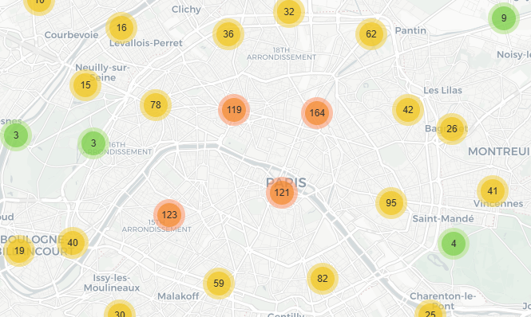
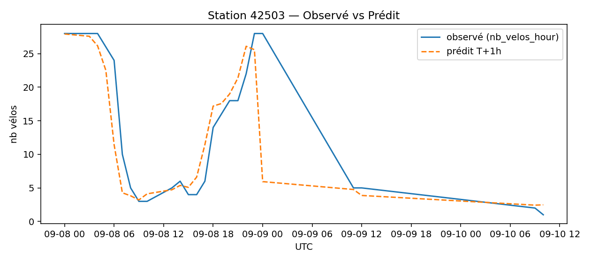

# 🚲 Vélib’ Paris — Forecast & Risk (T+3h/T+6h)

[](https://github.com/Adrien-1997/bike-forecast-paris-velib/actions/workflows/pipeline.yml)
[](https://adrien-1997.github.io/bike-forecast-paris-velib/)
[](https://github.com/Adrien-1997/bike-forecast-paris-velib/releases/tag/v1.0.0)




**Prédire & monitorer l’usage du réseau Vélib’ parisien grâce aux données publiques.**

👉 [Voir la démo en ligne](https://adrien-1997.github.io/bike-forecast-paris-velib/)

---

## 📊 Fonctionnalités

- **Monitoring temps réel** : carte interactive des stations (occupation, vélos dispo, bornes libres).  
- **Historique & KPI** : tendances 72h, vélos totaux, bornes libres, occupation moyenne.  
- **Prévisions (ML)** : modèles LightGBM prédisent la dispo des stations à **+1h, +3h, +6h**.  

---

## 📷 Aperçu des résultats

### Occupation moyenne réseau


### Vélos disponibles (total réseau)


### Exemple de prévision par station


---

## 🛠️ Pipeline technique

```
flowchart LR
    A[Ingestion GBFS/Opendata] --> B[DuckDB snapshots]
    B --> C[Aggregate (hourly)]
    C --> D[ML Forecast LightGBM]
    D --> E[Exports CSV/Parquet]
    E --> F[Visualisation MkDocs + GitHub Pages]
```

---

## 🚀 Déploiement

### Local
```
python -m src.ingest
python -m src.aggregate
python tools/make_report.py
mkdocs serve
```

### CI/CD GitHub Actions
- `pipeline.yml` : ingestion, agrégat, forecast, build, commit.  
- `gh-pages.yml` : déploiement auto sur GitHub Pages.

---

## 📂 Arborescence

```
bike-forecast-paris-velib/
├── src/              # ingestion, features, forecast
├── tools/            # scripts: report, map, monitoring, forecast page
├── exports/          # exports parquet/csv
├── docs/             # site MkDocs
│   ├── assets/figs/  # images générées
│   └── *.md
├── warehouse.duckdb  # DB snapshots (non versionné conseillé)
├── mkdocs.yml        # config site
└── requirements.txt
```

---

## 👤 Auteur

Projet conçu par **Adrien Morel** — Data Scientist (maths appliquées & machine learning).  
👉 [Portfolio](https://portfolio-ad94d.web.app/) • [LinkedIn](https://www.linkedin.com/in/adrien-m-1997)
