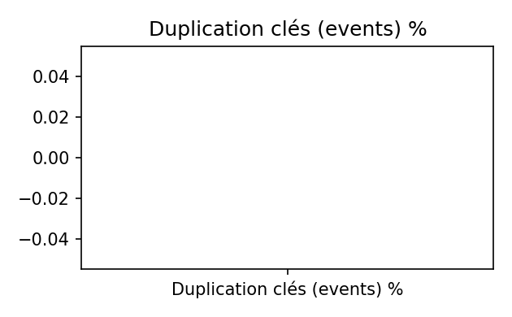
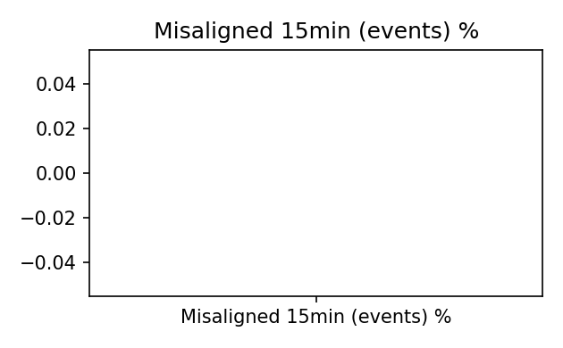

# Dictionnaire & schéma

**Objectif.** Fournir un **contrat formel**: noms, types, unités, domaines, contraintes et **règles de validation**, pour intégrer les données sans lire le code.

> **Build (UTC)** : `2025-09-17T23:49:38.622469+00:00`  
> **Fenêtre `events`** : `2025-09-07T23:00:00+00:00` → `2025-09-17T22:45:00+00:00` · **rows** = 584,989  
> **Fenêtre `perf`** : `2025-09-07T23:00:00+00:00` → `2025-09-17T22:45:00+00:00` · **rows** = 584,989

---

## Coup d’œil visuel
  

---

## Contenu détaillé

### Champs canoniques (par fichier)
- Dictionnaire `events` : ../../assets/tables/data/dictionary/dictionary_events.csv  
- Dictionnaire `perf` : ../../assets/tables/data/dictionary/dictionary_perf.csv  
- Schéma réel `events` : ../../assets/tables/data/dictionary/schema_events_actual.csv  
- Schéma réel `perf` : ../../assets/tables/data/dictionary/schema_perf_actual.csv

Chaque table documente : **Nom** · **Type (pandas/SQL)** · **Unité/domaine** · **Description** · **Obligatoire ?** · **Valeur par défaut** · **Exemples**.

### Clés & unicité
- `(ts, station_id)` est la **clé primaire unique** dans `events.parquet` et `perf.parquet`.  
- Rapport : ../../assets/tables/data/dictionary/keys_uniqueness_report.csv

### Règles de cohérence
- `bikes >= 0`, `capacity >= 0`, `0 ≤ occ ≤ 1`.  
- Si `capacity` connue, alors `occ ≈ bikes / capacity` (tolérance).  
- `y_true`, `y_pred`, `y_pred_baseline` **non négatifs** ; `horizon_min > 0`.  
- **Horodatage** : `ts` en **UTC tz-aware**, arrondi *:00, :15, :30, :45*.

Règles listées : ../../assets/tables/data/dictionary/validation_rules.csv — Rapport d’exécution : ../../assets/tables/data/dictionary/validation_report_events.csv · ../../assets/tables/data/dictionary/validation_report_perf.csv

### Exemples
- Échantillon `events` : ../../assets/tables/data/dictionary/examples_events.csv  
- Échantillon `perf` : ../../assets/tables/data/dictionary/examples_perf.csv
