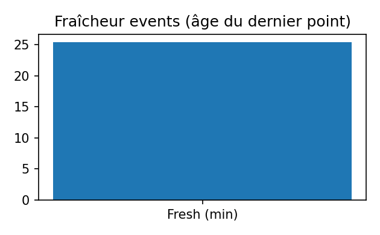
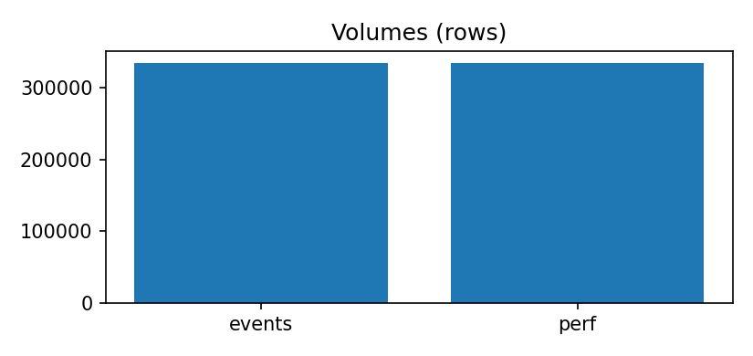

# Exports

Cette page liste **tout ce qui est publié** (fichiers de données et tables dérivées) et rappelle le **contrat minimal** pour les consommer sans surprise.

> **Build (UTC)** : `2025-09-17T23:49:35.683953+00:00`  
> **Fenêtre `events`** : `2025-09-07T23:00:00+00:00` → `2025-09-17T22:45:00+00:00` · **rows** = 584,989 · **stations** ≈ 1473  
> **Fenêtre `perf`** : `2025-09-07T23:00:00+00:00` → `2025-09-17T22:45:00+00:00` · **rows** = 584,989

---

## Coup d’œil visuel
  

---

## Fichiers principaux
- **`docs/exports/events.parquet`**  
  - **Clé** : `(ts, station_id)` unique.  
  - **Colonnes canoniques (si présentes)** :  
    - `ts` *(UTC, 15 min)* — horodatage du **bin source**.  
    - `station_id` *(str)* — identifiant station stable.  
    - `bikes` *(int ≥ 0)* — vélos disponibles.  
    - `capacity` *(int ≥ 0)* — capacité estimée du dock.  
    - `occ` *(float ∈ [0,1])* — ratio d’occupation (ex. `bikes / capacity`, si capacité connue).  
    - **Métadonnées** : `name` *(str)*, `lat` *(float)*, `lon` *(float)*, `hour_utc` *(0–23)*.  
    - **Météo (optionnelles)** : `temp_C` *(°C)*, `precip_mm` *(mm)*, `wind_mps` *(m/s)*.
- **`docs/exports/perf.parquet`**  
  - **Clé** : `(ts, station_id)` unique.  
  - **Colonnes canoniques** :  
    - `ts` *(UTC, 15 min)* — **même bin source T** que `events`.  
    - `station_id` *(str)*.  
    - `y_true` *(float/int ≥ 0)* — cible observée à **T+h** (ramenée à T via `shift(-steps)`).  
    - `y_pred_baseline` *(float ≥ 0)* — **persistance** (valeur observée à T).  
    - `y_pred` *(float ≥ 0, optionnel)* — prédiction **modèle** alignée sur T (injectée après coup).  
    - `horizon_min` *(int > 0, ex. 60)* — horizon en minutes.

---

## Tables secondaires (lecture & monitoring)
Exportées sous `docs/assets/tables/exports/` :
- Schémas : `../../assets/tables/exports/schema_events.csv` · `../../assets/tables/exports/schema_perf.csv`
- Contrats : `../../assets/tables/exports/contract_events_report.csv` · `../../assets/tables/exports/contract_perf_report.csv`
- Catalog : `../../assets/tables/exports/catalog.csv` · Build info : `../../assets/tables/exports/build_info.json`

---

## Cadence & fraîcheur
- Ingestion et normalisation **toutes les 15 minutes** (ou au rythme de la source).  
- Les assets analytiques (tables/figures) sont régénérés **plusieurs fois par jour**.  
- Cette page précise **la date/heure du dernier build** et la **fenêtre couverte**.

---

## Garanties minimales
- Pas de **fusion en avance** (aucune fuite de futur) ; `perf.parquet` est strictement aligné **à T**.  
- **Aucune imputation lourde** dans les exports (ni interpolation) : les trous reflètent l’état réel de l’ingestion.  
- Clés `(ts, station_id)` **sans doublons** ; horodatages **arrondis 15 min**.
