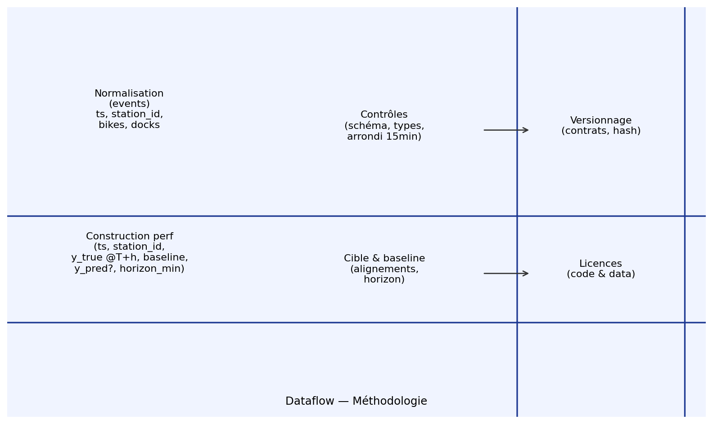
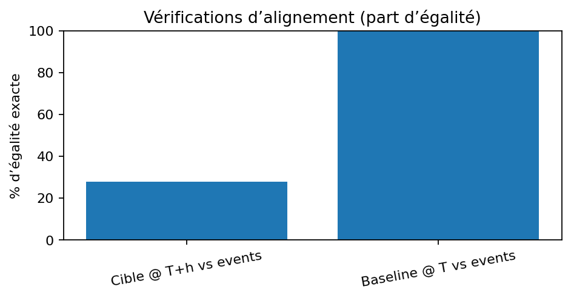
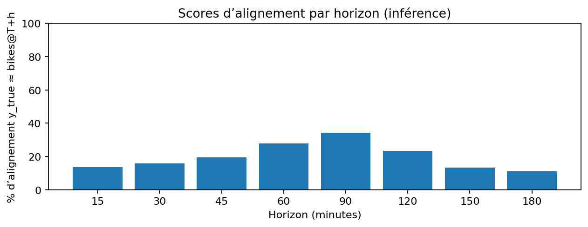

# Données — Méthodologie & licences

Cette page documente **comment** les exports sont produits et **dans quel cadre** ils peuvent être utilisés.

---

## 1) Méthodologie de fabrication (vue d’ensemble)

- **Normalisation** : renommage des colonnes source → **schéma canonique**, arrondi des timestamps à 15 min, harmonisation des types.  
- **Séparation** en deux vues :  
  - **`events.parquet`** (état instantané) ;  
  - **`perf.parquet`** (vérité à T+h ramenée à T, baseline, et prédictions si injectées).  
- **Cible & baseline** : `y_true` = `bikes` à **T+h** par station ; `y_pred_baseline` = persistance (`bikes` à **T**).  
- **Injection modèle** : `y_pred` est ajoutée après normalisation, en garantissant l’alignement sur **T** et le **mapping station** robuste (nom/lat/lon → `station_id`).

---

## 2) Qualité & monitoring

- Contrôles automatiques **à chaque build** : fraîcheur, complétude, schéma, anomalies (séries plates, doublons).  
- **Drift** suivi par PSI/K–S sur les features clés (si disponibles) et dérive de cible.  
- **Traçabilité** : horodatages de build et métriques exposés dans `docs/assets/tables/`.

### Cible & baseline — vérifications clés

- **Horizon retenu** : **60 min** (perf:horizon_min).  
- **Part d’égalité** cible vs events @T+60 : **23.40%**  
- **Part d’égalité** baseline vs events @T : **100.00%**

**Scores d’alignement par horizon (inférence)**  
*(utile si `horizon_min` n’est pas présent dans `perf`)*

---

## 3) Versionnage & compatibilité

- Le **contrat de schéma** est **stable** ; toute rupture sera annoncée via **bump de version** et *release notes*.  
- Les colonnes optionnelles peuvent **apparaître/disparaître** sans rompre le contrat (elles sont marquées *optionnelles* dans le dictionnaire).

- Empreintes actuelles (hash):  
  - `events` → `b5e92159349340ce`  
  - `perf` → `2189f9e1ca1986bd`

---

## 4) Licences & usages

- **Données dérivées** : les exports restent soumis à la **licence de la source originale** (respecter attribution/partage).  
- **Code** : licence du dépôt (ex. MIT).  
- **Usages** : pas de tentative de **ré-identification** ; pas d’usage contraire aux CGU de la source ; indiquer l’**UTC** lors de toute republication de chronologies.

> Licences détectées : code = **None**, data = **None**.

---

## 5) Limites & transparence

- Les exports **reflètent l’état réel** de l’ingestion : pas d’imputation lourde ; les trous sont signalés, pas “réparés”.  
- Les capacités peuvent évoluer ; `occ` est une approximation lorsque la capacité n’est pas officiellement publiée.

---

## 6) Tables & artefacts

- **Schémas effectifs** :  
  - `../../assets/tables/data/methodology/events_schema_actual.csv`  
  - `../../assets/tables/data/methodology/perf_schema_actual.csv`  
- **Contrôles de normalisation** : `../../assets/tables/data/methodology/normalization_report.csv`  
- **Cible & baseline (checks)** : `../../assets/tables/data/methodology/target_baseline_checks.csv`  
- **Injection modèle (couverture/erreur)** : `../../assets/tables/data/methodology/model_injection_report.csv`  
- **Versioning (JSON)** : `../../assets/tables/data/methodology/versioning.json`  
- **Licences (CSV)** : `../../assets/tables/data/methodology/licenses.csv`  
- **Résumé de build** : `../../assets/tables/data/methodology/summary.json`

*Fuseau d’affichage (paramètre) : `Europe/Paris` — Build UTC : `2025-09-17T23:49:46+00:00Z`.*
