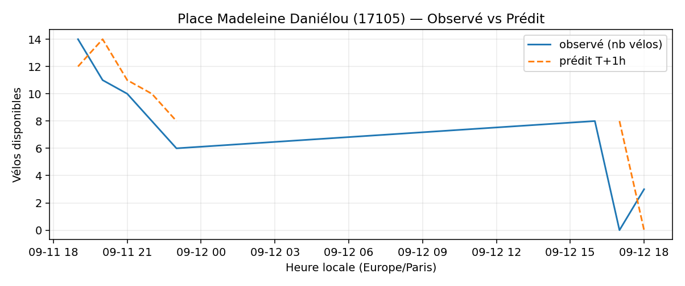
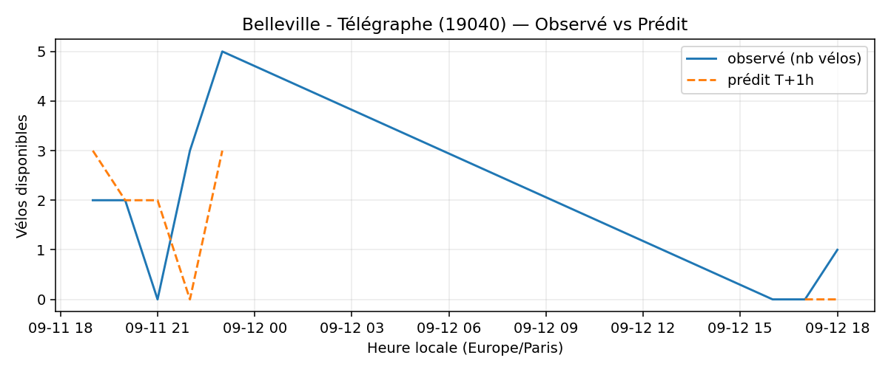
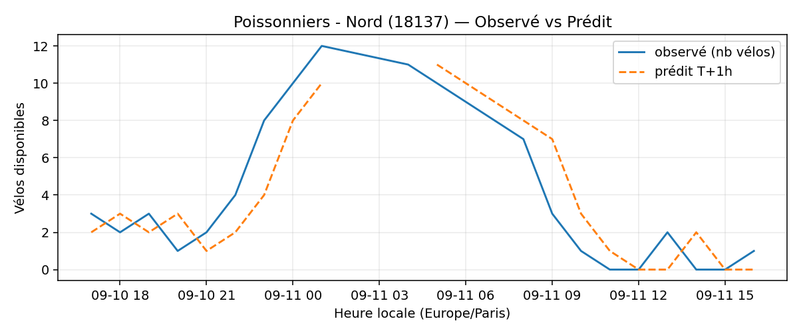
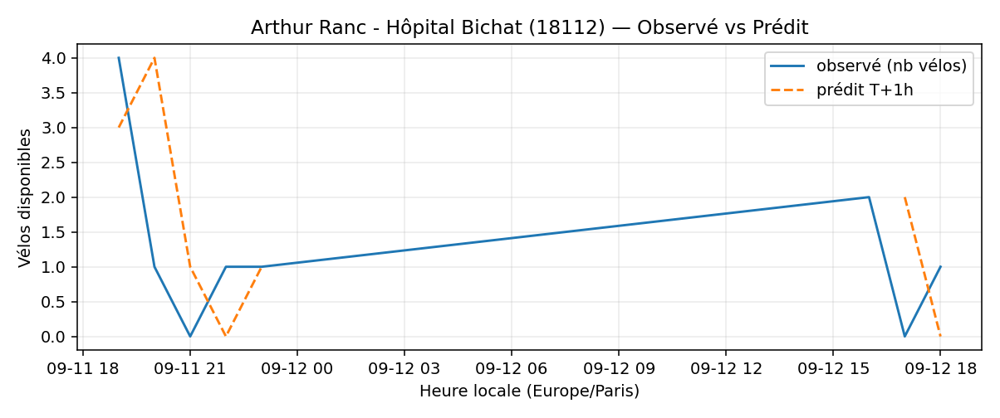
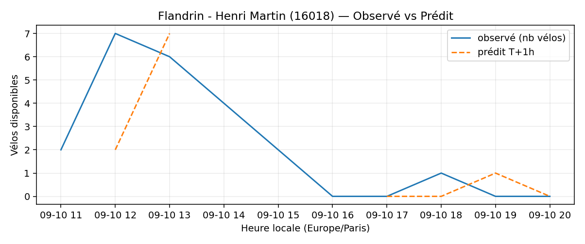

# Prévisions

*Dernière heure considérée : **12/09 18h** (Europe/Paris)*

## Top-10 stations à risque (faible nb vélos prévu T+1h)

| Station                                     |   Prédit T+1h (vélos) | Taux prévu   | Dernière obs.   |
|:--------------------------------------------|----------------------:|:-------------|:----------------|
| Pesaro - Préfecture (`92007`)               |                     0 | 0.0%         | 12/09 18h       |
| Nanterre - Université (`92004`)             |                     0 | 0.0%         | 12/09 18h       |
| Place Madeleine Daniélou (`17105`)          |                     0 | 0.0%         | 12/09 18h       |
| Champs-Elysees - Bassano (`8116`)           |                     0 | 0.0%         | 12/09 18h       |
| Commandant Schloesing - Pétrarque (`16202`) |                     0 | 0.0%         | 12/09 18h       |
| Belleville - Télégraphe (`19040`)           |                     0 | 0.0%         | 12/09 18h       |
| Poissonniers - Nord (`18137`)               |                     0 | 0.0%         | 12/09 18h       |
| Arthur Ranc - Hôpital Bichat (`18112`)      |                     0 | 0.0%         | 12/09 18h       |
| Place des Fêtes - Solitaires (`19210`)      |                     0 | 0.0%         | 12/09 18h       |
| Flandrin - Henri Martin (`16018`)           |                     0 | 0.0%         | 12/09 18h       |

## Top-10 risque de saturation (taux prévu élevé)

| Station                                            |   Prédit T+1h (vélos) | Taux prévu   | Dernière obs.   |
|:---------------------------------------------------|----------------------:|:-------------|:----------------|
| BNF - Bibliothèque Nationale de France (`13123`)   |                    60 | 142.9%       | 12/09 18h       |
| Bercy - Villot (`12105`)                           |                    37 | 112.1%       | 12/09 18h       |
| Tremblay - Lac des Minimes (`12127`)               |                    52 | 108.3%       | 12/09 18h       |
| Aristide Briand - Place de la Résistance (`21302`) |                    26 | 104.0%       | 12/09 18h       |
| Saint-Denis - Rivoli (`1003`)                      |                    44 | 102.3%       | 12/09 18h       |
| Chevaleret - Louise Weiss (`13015`)                |                    35 | 100.0%       | 12/09 18h       |
| Gare d'Austerlitz - Quai Saint-Bernard (`13104`)   |                    27 | 100.0%       | 12/09 18h       |
| Victoria - Place du Chatelet (`1002`)              |                    22 | 100.0%       | 12/09 18h       |
| Poissy - Saint-Germain (`5019`)                    |                    25 | 100.0%       | 12/09 18h       |
| Harpe - Saint-Germain (`5001`)                     |                    44 | 97.8%        | 12/09 18h       |

## Détails par station (graphiques)

???+ info "Pesaro - Préfecture (92007)"

    

???+ info "Nanterre - Université (92004)"

    

???+ info "Place Madeleine Daniélou (17105)"

    

???+ info "Champs-Elysees - Bassano (8116)"

    

???+ info "Commandant Schloesing - Pétrarque (16202)"

    

???+ info "Belleville - Télégraphe (19040)"

    

???+ info "Poissonniers - Nord (18137)"

    

???+ info "Arthur Ranc - Hôpital Bichat (18112)"

    

???+ info "Place des Fêtes - Solitaires (19210)"

    

???+ info "Flandrin - Henri Martin (16018)"

    

