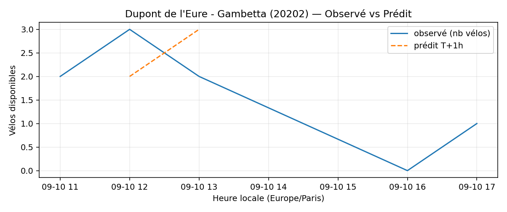

# Prévisions

*Dernière heure considérée : **10/09 22h** (Europe/Paris)*

## Top-10 stations à risque (faible nb vélos prévu T+1h)

| Station                                     |   Prédit T+1h (vélos) | Taux prévu   | Dernière obs.   |
|:--------------------------------------------|----------------------:|:-------------|:----------------|
| Batignolles - Rome (`8051`)                 |                     0 | 0.0%         | 10/09 22h       |
| Gaston Roussel - Commune de Paris (`32308`) |                     0 | 0.0%         | 10/09 22h       |
| Lieutenant Chauré - Etienne Marey (`20134`) |                     0 | 0.0%         | 10/09 22h       |
| Parc André Citroën (`15059`)                |                     0 | 0.0%         | 10/09 22h       |
| Dupont de l'Eure - Gambetta (`20202`)       |                     0 | 0.0%         | 10/09 22h       |
| La Jarry - Place Diderot (`43010`)          |                     0 | 0.0%         | 10/09 22h       |
| Stade - Chevilly (`45504`)                  |                     0 | 0.0%         | 10/09 22h       |
| Place des Ardoines (`44018`)                |                     0 | 0.0%         | 10/09 22h       |
| Mairie de Romainville (`32301`)             |                     0 | 0.0%         | 10/09 22h       |
| Saint-Fargeau - Mortier (`20117`)           |                     0 | 0.0%         | 10/09 22h       |

## Top-10 risque de saturation (taux prévu élevé)

| Station                                            |   Prédit T+1h (vélos) | Taux prévu   | Dernière obs.   |
|:---------------------------------------------------|----------------------:|:-------------|:----------------|
| Westermeyer - Paul Vaillant-Couturier (`42004`)    |                    29 | 116.0%       | 10/09 22h       |
| Aristide Briand - Place de la Résistance (`21302`) |                    26 | 104.0%       | 10/09 22h       |
| Paul Vaillant-Couturier - Gare RER (`44002`)       |                    26 | 100.0%       | 10/09 22h       |
| Place Eustache Deschamps (`42303`)                 |                    20 | 100.0%       | 10/09 22h       |
| Gare - Aristide Briand (`21329`)                   |                    29 | 100.0%       | 10/09 22h       |
| Place de l'Eglise - Vitry-sur-Seine (`44004`)      |                    28 | 100.0%       | 10/09 22h       |
| Pierre Joseph Desault (`13120`)                    |                    19 | 100.0%       | 10/09 22h       |
| Félix Faure - Convention (`15069`)                 |                    43 | 97.7%        | 10/09 22h       |
| Jean Jaurès - Jean Baptiste Clément (`21003`)      |                    38 | 97.4%        | 10/09 22h       |
| Convention - Lourmel (`15062`)                     |                    35 | 97.2%        | 10/09 22h       |

## Détails par station (graphiques)

???+ info "Batignolles - Rome (8051)"

    

???+ info "Gaston Roussel - Commune de Paris (32308)"

    

???+ info "Lieutenant Chauré - Etienne Marey (20134)"

    

???+ info "Parc André Citroën (15059)"

    

???+ info "Dupont de l'Eure - Gambetta (20202)"

    

???+ info "La Jarry - Place Diderot (43010)"

    

???+ info "Stade - Chevilly (45504)"

    

???+ info "Place des Ardoines (44018)"

    

???+ info "Mairie de Romainville (32301)"

    

???+ info "Saint-Fargeau - Mortier (20117)"

    

