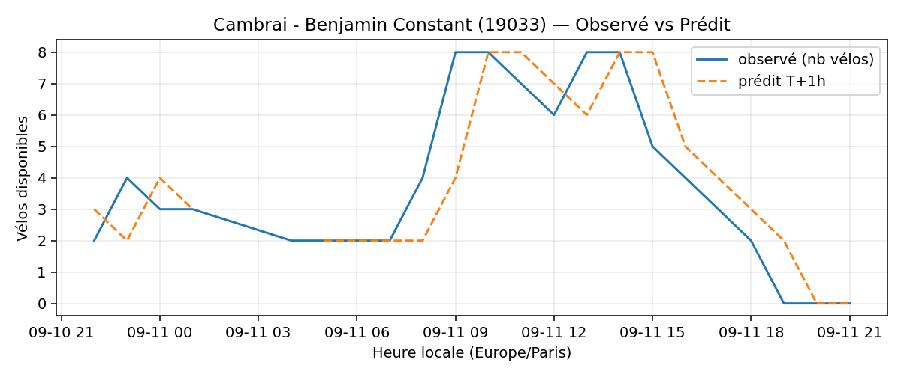

# Prévisions

*Dernière heure considérée : **11/09 21h** (Europe/Paris)*

## Top-10 stations à risque (faible nb vélos prévu T+1h)

| Station                                     |   Prédit T+1h (vélos) | Taux prévu   | Dernière obs.   |
|:--------------------------------------------|----------------------:|:-------------|:----------------|
| Nanterre - Université (`92004`)             |                     0 | 0.0%         | 11/09 21h       |
| Mairie du 20ème (`20106`)                   |                     0 | 0.0%         | 11/09 21h       |
| Porte de Ménilmontant (`20027`)             |                     0 | 0.0%         | 11/09 21h       |
| Frères Flavien - Porte des Lilas (`20029`)  |                     0 | 0.0%         | 11/09 21h       |
| Place des Fêtes - Solitaires (`19210`)      |                     0 | 0.0%         | 11/09 21h       |
| Manin - Secrétan (`19114`)                  |                     0 | 0.0%         | 11/09 21h       |
| Charles Robin - Grange aux Belles (`10207`) |                     0 | 0.0%         | 11/09 21h       |
| Sully - Morland (`4201`)                    |                     0 | 0.0%         | 11/09 21h       |
| Amaury Duval - Gabriel Péri (`21219`)       |                     0 | 0.0%         | 11/09 21h       |
| Cambrai - Benjamin Constant (`19033`)       |                     0 | 0.0%         | 11/09 21h       |

## Top-10 risque de saturation (taux prévu élevé)

| Station                                            |   Prédit T+1h (vélos) | Taux prévu   | Dernière obs.   |
|:---------------------------------------------------|----------------------:|:-------------|:----------------|
| BNF - Bibliothèque Nationale de France (`13123`)   |                    50 | 119.0%       | 11/09 21h       |
| Aristide Briand - Place de la Résistance (`21302`) |                    26 | 104.0%       | 11/09 21h       |
| Boutroux - Porte de Vitry (`13047`)                |                    49 | 100.0%       | 11/09 21h       |
| Jacques Callot - Mazarine (`6013`)                 |                    28 | 100.0%       | 11/09 21h       |
| Pont de Lodi - Dauphine (`6014`)                   |                    23 | 100.0%       | 11/09 21h       |
| Place de Verdun (`43402`)                          |                    39 | 97.5%        | 11/09 21h       |
| Quatre Vents - Carrefour de l'Odéon (`6028`)       |                    36 | 97.3%        | 11/09 21h       |
| Convention - Lourmel (`15062`)                     |                    35 | 97.2%        | 11/09 21h       |
| André Mazet - Saint-André des Arts (`6015`)        |                    53 | 96.4%        | 11/09 21h       |
| Westermeyer - Paul Vaillant-Couturier (`42004`)    |                    24 | 96.0%        | 11/09 21h       |

## Détails par station (graphiques)

???+ info "Nanterre - Université (92004)"

    

???+ info "Mairie du 20ème (20106)"

    

???+ info "Porte de Ménilmontant (20027)"

    

???+ info "Frères Flavien - Porte des Lilas (20029)"

    

???+ info "Place des Fêtes - Solitaires (19210)"

    

???+ info "Manin - Secrétan (19114)"

    

???+ info "Charles Robin - Grange aux Belles (10207)"

    

???+ info "Sully - Morland (4201)"

    

???+ info "Amaury Duval - Gabriel Péri (21219)"

    

???+ info "Cambrai - Benjamin Constant (19033)"

    

