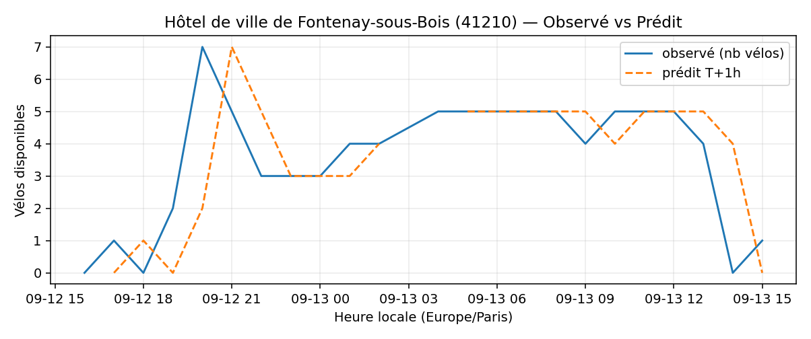
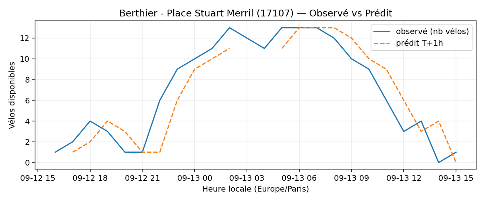
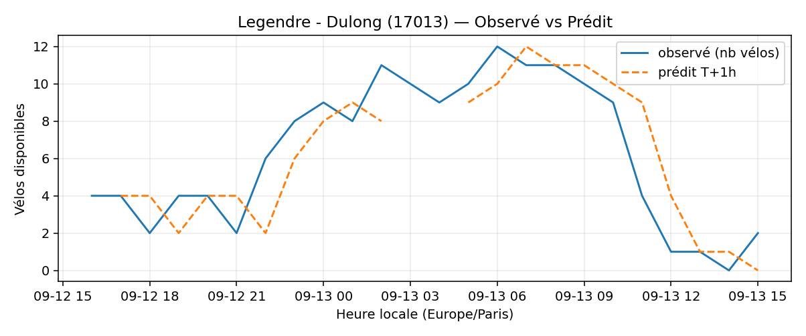
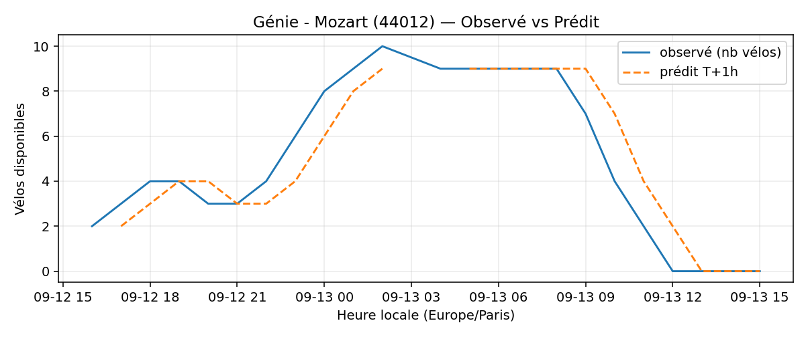

# Prévisions

*Dernière heure considérée : **13/09 15h** (Europe/Paris)*

## Top-10 stations à risque (faible nb vélos prévu T+1h)

| Station                                        |   Prédit T+1h (vélos) | Taux prévu   | Dernière obs.   |
|:-----------------------------------------------|----------------------:|:-------------|:----------------|
| Sully - Morland (`4201`)                       |                     0 | 0.0%         | 13/09 15h       |
| Hôtel de ville de Fontenay-sous-Bois (`41210`) |                     0 | 0.0%         | 13/09 15h       |
| Crevaux - Bugeaud (`16105`)                    |                     0 | 0.0%         | 13/09 15h       |
| Berthier - Place Stuart Merril (`17107`)       |                     0 | 0.0%         | 13/09 15h       |
| Legendre - Dulong (`17013`)                    |                     0 | 0.0%         | 13/09 15h       |
| Génie - Mozart (`44012`)                       |                     0 | 0.0%         | 13/09 15h       |
| Place des Ardoines (`44018`)                   |                     0 | 0.0%         | 13/09 15h       |
| Ranelagh - Mozart (`16026`)                    |                     0 | 0.0%         | 13/09 15h       |
| Stade - Chevilly (`45504`)                     |                     0 | 0.0%         | 13/09 15h       |
| Gaston Roussel - Commune de Paris (`32308`)    |                     0 | 0.0%         | 13/09 15h       |

## Top-10 risque de saturation (taux prévu élevé)

| Station                                            |   Prédit T+1h (vélos) | Taux prévu   | Dernière obs.   |
|:---------------------------------------------------|----------------------:|:-------------|:----------------|
| Westermeyer - Paul Vaillant-Couturier (`42004`)    |                    33 | 132.0%       | 13/09 15h       |
| Aristide Briand - Place de la Résistance (`21302`) |                    26 | 104.0%       | 13/09 15h       |
| Saint-Antoine Sévigné (`4010`)                     |                    27 | 103.8%       | 13/09 15h       |
| Bercy - Villot (`12105`)                           |                    34 | 103.0%       | 13/09 15h       |
| Hôtel de Ville de Champigny sur Marne (`45001`)    |                    21 | 100.0%       | 13/09 15h       |
| Roquette - Auguste Laurent (`11022`)               |                    16 | 100.0%       | 13/09 15h       |
| Fessart - Château (`21030`)                        |                    20 | 100.0%       | 13/09 15h       |
| Oratoire - Rivoli (`1025`)                         |                    18 | 100.0%       | 13/09 15h       |
| Convention - Saint-Charles (`15063`)               |                    23 | 100.0%       | 13/09 15h       |
| Victoria - Place du Chatelet (`1002`)              |                    22 | 100.0%       | 13/09 15h       |

## Détails par station (graphiques)

???+ info "Sully - Morland (4201)"

    

???+ info "Hôtel de ville de Fontenay-sous-Bois (41210)"

    

???+ info "Crevaux - Bugeaud (16105)"

    

???+ info "Berthier - Place Stuart Merril (17107)"

    

???+ info "Legendre - Dulong (17013)"

    

???+ info "Génie - Mozart (44012)"

    

???+ info "Place des Ardoines (44018)"

    

???+ info "Ranelagh - Mozart (16026)"

    

???+ info "Stade - Chevilly (45504)"

    

???+ info "Gaston Roussel - Commune de Paris (32308)"

    

