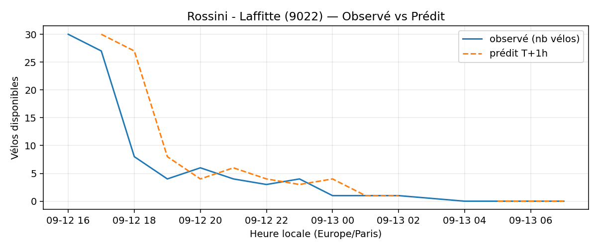
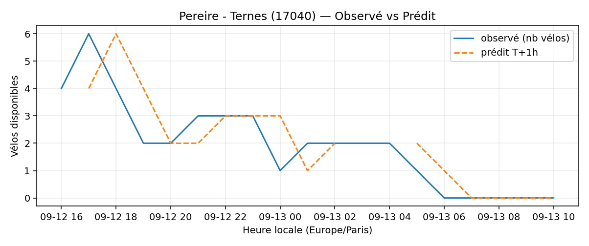
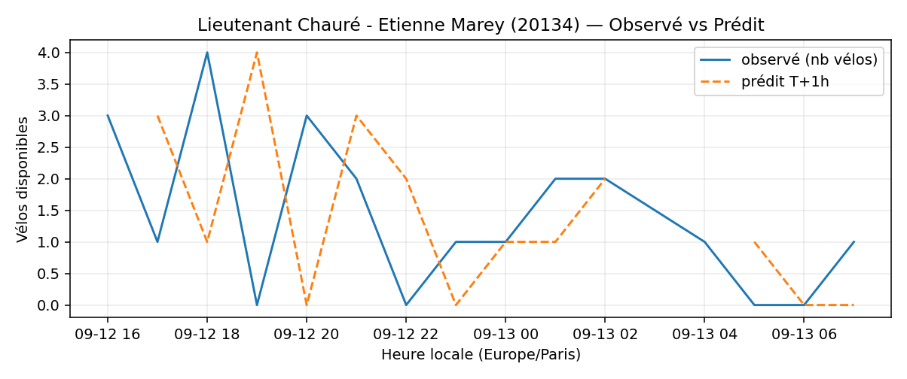
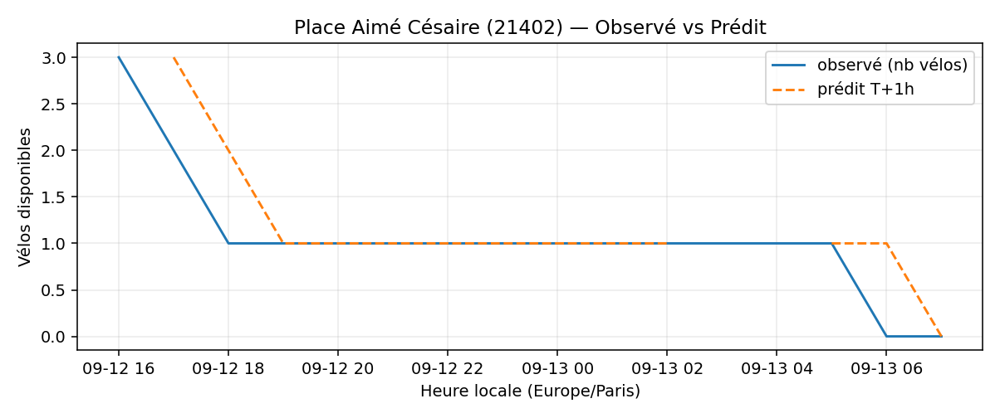
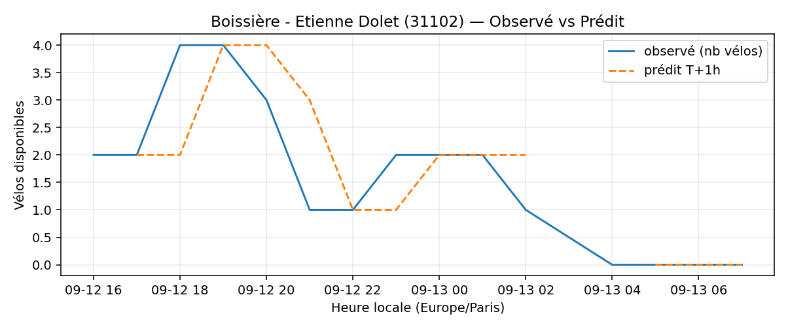

# Prévisions

*Dernière heure considérée : **13/09 07h** (Europe/Paris)*

## Top-10 stations à risque (faible nb vélos prévu T+1h)

| Station                                     |   Prédit T+1h (vélos) | Taux prévu   | Dernière obs.   |
|:--------------------------------------------|----------------------:|:-------------|:----------------|
| Rossini - Laffitte (`9022`)                 |                     0 | 0.0%         | 13/09 07h       |
| Place des Fêtes - Solitaires (`19210`)      |                     0 | 0.0%         | 13/09 07h       |
| Pereire - Ternes (`17040`)                  |                     0 | 0.0%         | 13/09 07h       |
| Commandant Schloesing - Pétrarque (`16202`) |                     0 | 0.0%         | 13/09 07h       |
| Champs-Elysees - Bassano (`8116`)           |                     0 | 0.0%         | 13/09 07h       |
| Lieutenant Chauré - Etienne Marey (`20134`) |                     0 | 0.0%         | 13/09 07h       |
| Place Aimé Césaire (`21402`)                |                     0 | 0.0%         | 13/09 07h       |
| Octave Feuillet - Albéric Magnard (`16110`) |                     0 | 0.0%         | 13/09 07h       |
| Boissière - Etienne Dolet (`31102`)         |                     0 | 0.0%         | 13/09 07h       |
| Charles de Gaulle (`22019`)                 |                     0 | 0.0%         | 13/09 07h       |

## Top-10 risque de saturation (taux prévu élevé)

| Station                                            |   Prédit T+1h (vélos) | Taux prévu   | Dernière obs.   |
|:---------------------------------------------------|----------------------:|:-------------|:----------------|
| Westermeyer - Paul Vaillant-Couturier (`42004`)    |                    42 | 168.0%       | 13/09 07h       |
| Aristide Briand - Place de la Résistance (`21302`) |                    35 | 140.0%       | 13/09 07h       |
| Daumesnil - Picpus (`12010`)                       |                    24 | 114.3%       | 13/09 07h       |
| Place Charles Vallin (`15122`)                     |                    28 | 107.7%       | 13/09 07h       |
| Port - Maurice Chevalier (`41304`)                 |                    31 | 103.3%       | 13/09 07h       |
| Charles Frérot - Albert Guilpin (`42505`)          |                    30 | 100.0%       | 13/09 07h       |
| Liberté - Vert-de-Maisons (`47007`)                |                    20 | 100.0%       | 13/09 07h       |
| Les Planètes (`47008`)                             |                    21 | 100.0%       | 13/09 07h       |
| Roquette - Auguste Laurent (`11022`)               |                    16 | 100.0%       | 13/09 07h       |
| Riquet - Marx Dormoy (`18010`)                     |                    36 | 100.0%       | 13/09 07h       |

## Détails par station (graphiques)

???+ info "Rossini - Laffitte (9022)"

    

???+ info "Place des Fêtes - Solitaires (19210)"

    

???+ info "Pereire - Ternes (17040)"

    

???+ info "Commandant Schloesing - Pétrarque (16202)"

    

???+ info "Champs-Elysees - Bassano (8116)"

    

???+ info "Lieutenant Chauré - Etienne Marey (20134)"

    

???+ info "Place Aimé Césaire (21402)"

    

???+ info "Octave Feuillet - Albéric Magnard (16110)"

    

???+ info "Boissière - Etienne Dolet (31102)"

    

???+ info "Charles de Gaulle (22019)"

    

