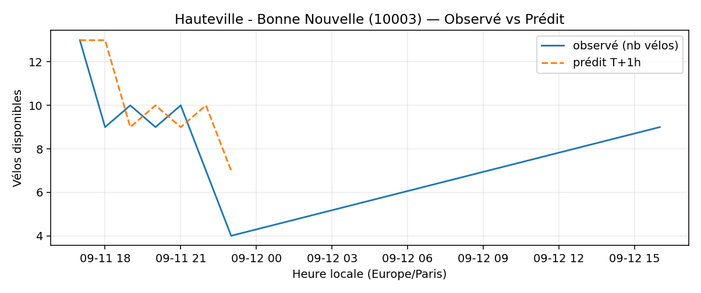
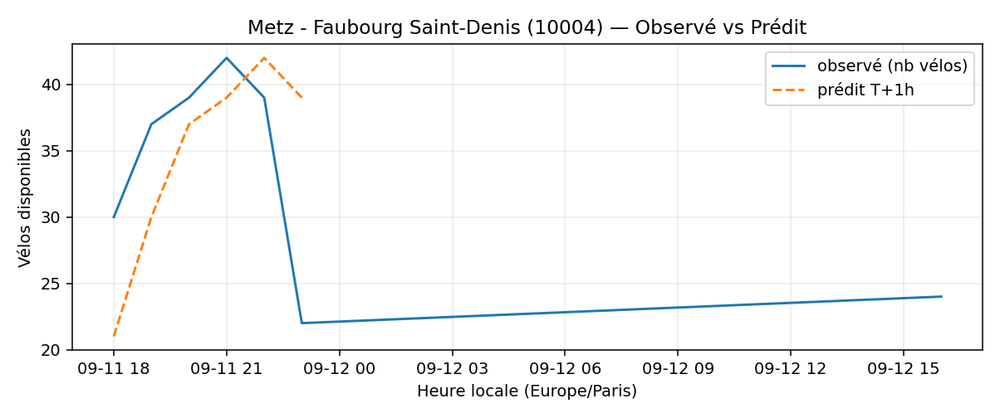
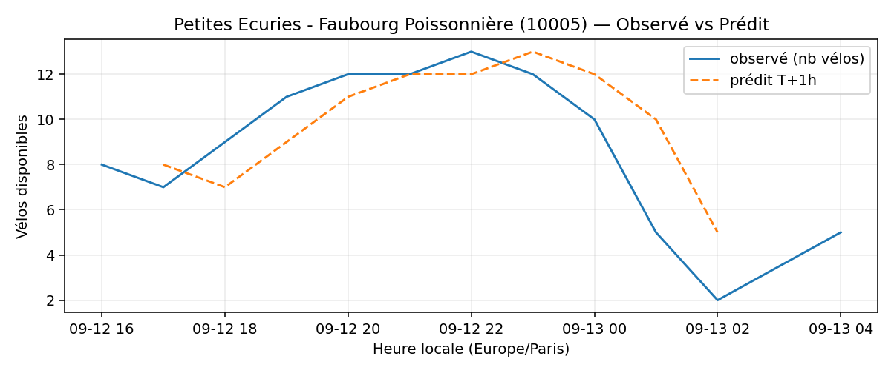
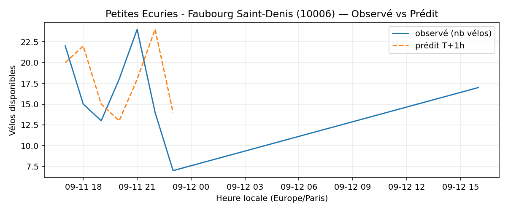
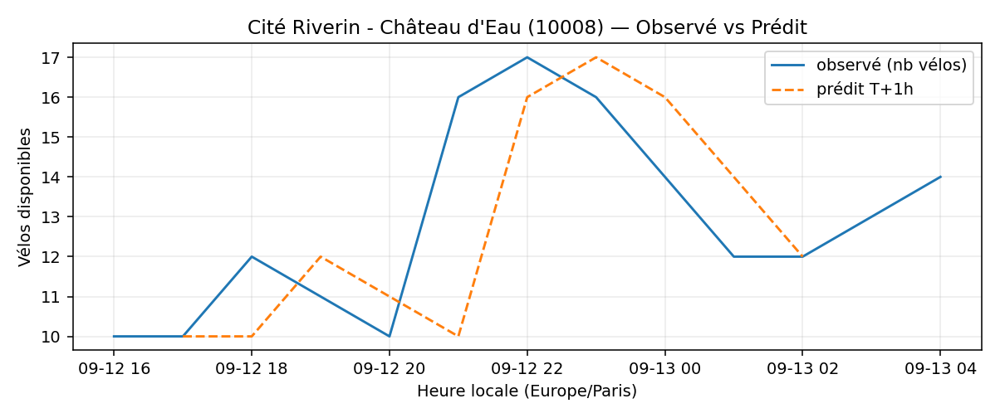
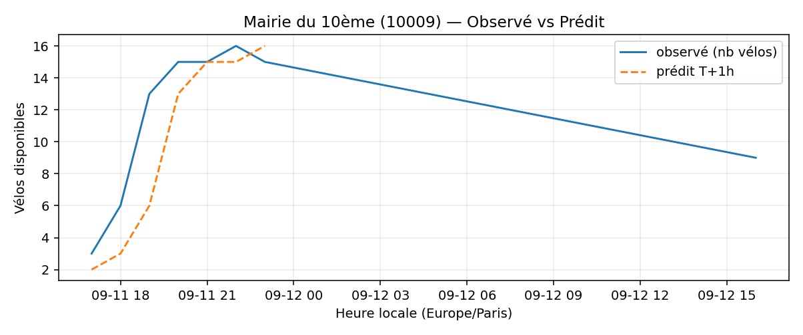
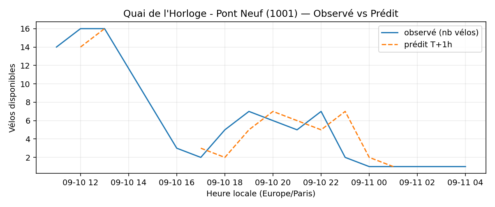
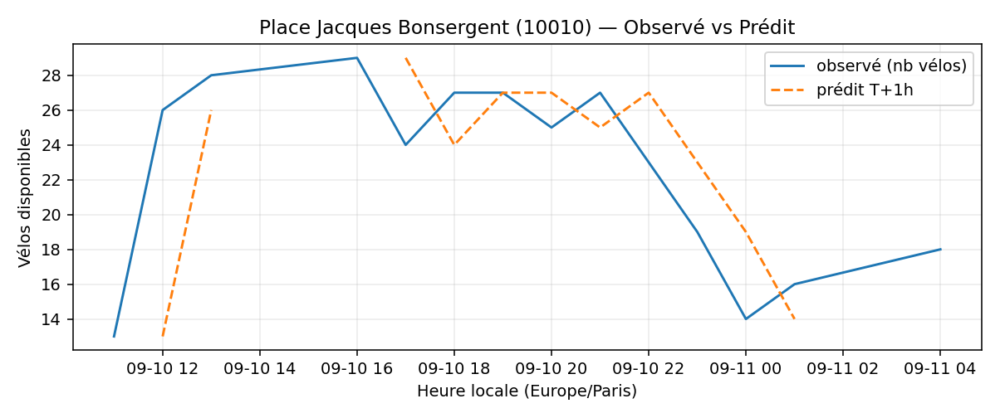
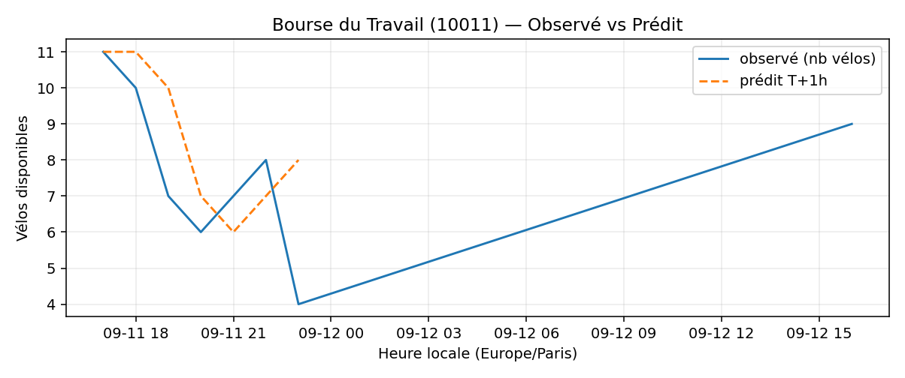
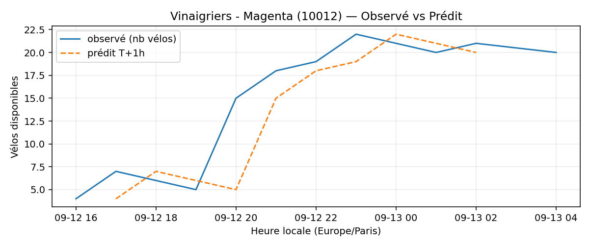

# Prévisions

*Dernière heure considérée : **12/09 16h** (Europe/Paris)*

## Top-10 stations à risque (faible nb vélos prévu T+1h)

| Station                                           | Prédit T+1h (vélos)   | Taux prévu   | Dernière obs.   |
|:--------------------------------------------------|:----------------------|:-------------|:----------------|
| Hauteville - Bonne Nouvelle (`10003`)             | —                     | —            | 12/09 16h       |
| Metz - Faubourg Saint-Denis (`10004`)             | —                     | —            | 12/09 16h       |
| Petites Ecuries - Faubourg Poissonnière (`10005`) | —                     | —            | 12/09 16h       |
| Petites Ecuries - Faubourg Saint-Denis (`10006`)  | —                     | —            | 12/09 16h       |
| Cité Riverin - Château d'Eau (`10008`)            | —                     | —            | 12/09 16h       |
| Mairie du 10ème (`10009`)                         | —                     | —            | 12/09 16h       |
| Quai de l'Horloge - Pont Neuf (`1001`)            | —                     | —            | 12/09 16h       |
| Place Jacques Bonsergent (`10010`)                | —                     | —            | 12/09 16h       |
| Bourse du Travail (`10011`)                       | —                     | —            | 12/09 16h       |
| Vinaigriers - Magenta (`10012`)                   | —                     | —            | 12/09 16h       |

## Top-10 risque de saturation (taux prévu élevé)

| Station                                           | Prédit T+1h (vélos)   | Taux prévu   | Dernière obs.   |
|:--------------------------------------------------|:----------------------|:-------------|:----------------|
| Hauteville - Bonne Nouvelle (`10003`)             | —                     | —            | 12/09 16h       |
| Metz - Faubourg Saint-Denis (`10004`)             | —                     | —            | 12/09 16h       |
| Petites Ecuries - Faubourg Poissonnière (`10005`) | —                     | —            | 12/09 16h       |
| Petites Ecuries - Faubourg Saint-Denis (`10006`)  | —                     | —            | 12/09 16h       |
| Cité Riverin - Château d'Eau (`10008`)            | —                     | —            | 12/09 16h       |
| Mairie du 10ème (`10009`)                         | —                     | —            | 12/09 16h       |
| Quai de l'Horloge - Pont Neuf (`1001`)            | —                     | —            | 12/09 16h       |
| Place Jacques Bonsergent (`10010`)                | —                     | —            | 12/09 16h       |
| Bourse du Travail (`10011`)                       | —                     | —            | 12/09 16h       |
| Vinaigriers - Magenta (`10012`)                   | —                     | —            | 12/09 16h       |

## Détails par station (graphiques)

???+ info "Hauteville - Bonne Nouvelle (10003)"

    

???+ info "Metz - Faubourg Saint-Denis (10004)"

    

???+ info "Petites Ecuries - Faubourg Poissonnière (10005)"

    

???+ info "Petites Ecuries - Faubourg Saint-Denis (10006)"

    

???+ info "Cité Riverin - Château d'Eau (10008)"

    

???+ info "Mairie du 10ème (10009)"

    

???+ info "Quai de l'Horloge - Pont Neuf (1001)"

    

???+ info "Place Jacques Bonsergent (10010)"

    

???+ info "Bourse du Travail (10011)"

    

???+ info "Vinaigriers - Magenta (10012)"

    

