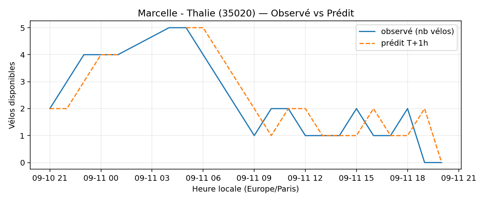
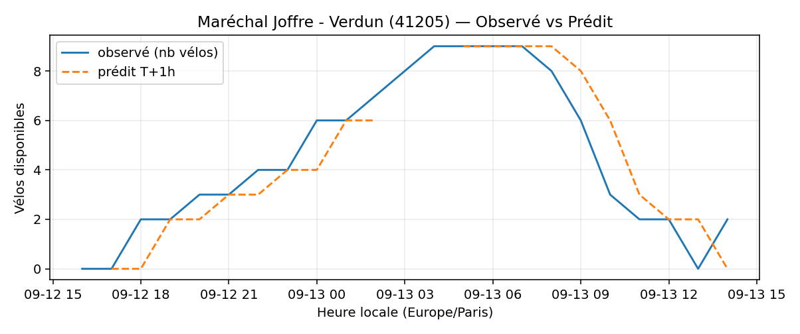
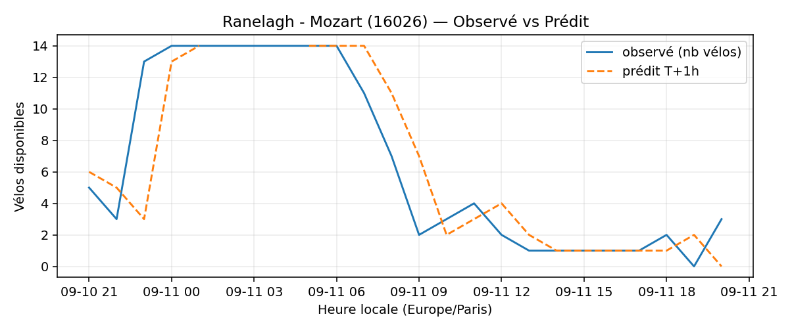

# Prévisions

*Dernière heure considérée : **11/09 20h** (Europe/Paris)*

## Top-10 stations à risque (faible nb vélos prévu T+1h)

| Station                                     |   Prédit T+1h (vélos) | Taux prévu   | Dernière obs.   |
|:--------------------------------------------|----------------------:|:-------------|:----------------|
| Vivienne - Petits Champs (`2201`)           |                     0 | 0.0%         | 11/09 20h       |
| Place de la Division Leclerc (`22603`)      |                     0 | 0.0%         | 11/09 20h       |
| Marcelle - Thalie (`35020`)                 |                     0 | 0.0%         | 11/09 20h       |
| Parc André Citroën (`15059`)                |                     0 | 0.0%         | 11/09 20h       |
| Sully - Morland (`4201`)                    |                     0 | 0.0%         | 11/09 20h       |
| Gare de Sèvres - Ville d'Avray (`23107`)    |                     0 | 0.0%         | 11/09 20h       |
| Charles Robin - Grange aux Belles (`10207`) |                     0 | 0.0%         | 11/09 20h       |
| Maréchal Joffre - Verdun (`41205`)          |                     0 | 0.0%         | 11/09 20h       |
| Belles Feuilles - Place de Mexico (`16010`) |                     0 | 0.0%         | 11/09 20h       |
| Ranelagh - Mozart (`16026`)                 |                     0 | 0.0%         | 11/09 20h       |

## Top-10 risque de saturation (taux prévu élevé)

| Station                                            |   Prédit T+1h (vélos) | Taux prévu   | Dernière obs.   |
|:---------------------------------------------------|----------------------:|:-------------|:----------------|
| BNF - Bibliothèque Nationale de France (`13123`)   |                    53 | 126.2%       | 11/09 20h       |
| Aristide Briand - Place de la Résistance (`21302`) |                    26 | 104.0%       | 11/09 20h       |
| Temple - Jean-Pierre Timbaud (`11040`)             |                    36 | 100.0%       | 11/09 20h       |
| Pont de Lodi - Dauphine (`6014`)                   |                    23 | 100.0%       | 11/09 20h       |
| Lucien Lanternier - Le Luth (`22303`)              |                    27 | 100.0%       | 11/09 20h       |
| André Mazet - Saint-André des Arts (`6015`)        |                    54 | 98.2%        | 11/09 20h       |
| Turbigo - Réaumur (`3011`)                         |                    30 | 96.8%        | 11/09 20h       |
| Saint-Bon - Rivoli (`4018`)                        |                    30 | 96.8%        | 11/09 20h       |
| Balzac - Champs Elysées (`8052`)                   |                    29 | 96.7%        | 11/09 20h       |
| Jacques Callot - Mazarine (`6013`)                 |                    27 | 96.4%        | 11/09 20h       |

## Détails par station (graphiques)

???+ info "Vivienne - Petits Champs (2201)"

    

???+ info "Place de la Division Leclerc (22603)"

    

???+ info "Marcelle - Thalie (35020)"

    

???+ info "Parc André Citroën (15059)"

    

???+ info "Sully - Morland (4201)"

    

???+ info "Gare de Sèvres - Ville d'Avray (23107)"

    

???+ info "Charles Robin - Grange aux Belles (10207)"

    

???+ info "Maréchal Joffre - Verdun (41205)"

    

???+ info "Belles Feuilles - Place de Mexico (16010)"

    

???+ info "Ranelagh - Mozart (16026)"

    

