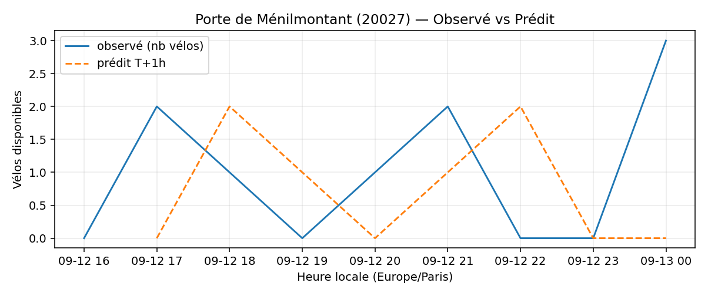
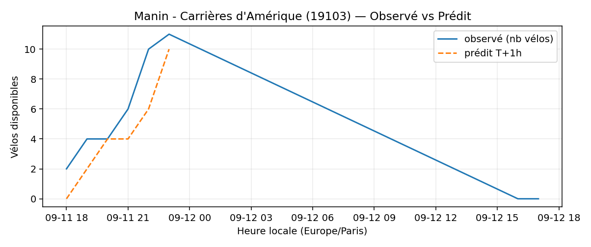

# Prévisions

*Dernière heure considérée : **12/09 17h** (Europe/Paris)*

## Top-10 stations à risque (faible nb vélos prévu T+1h)

| Station                                     |   Prédit T+1h (vélos) | Taux prévu   | Dernière obs.   |
|:--------------------------------------------|----------------------:|:-------------|:----------------|
| Piat - Parc de Belleville (`20113`)         |                     0 | 0.0%         | 12/09 17h       |
| Louis Lumière - Porte de Bagnolet (`20115`) |                     0 | 0.0%         | 12/09 17h       |
| Square des Saint-Simoniens (`20119`)        |                     0 | 0.0%         | 12/09 17h       |
| Porte de Bagnolet (`20022`)                 |                     0 | 0.0%         | 12/09 17h       |
| Porte de Ménilmontant (`20027`)             |                     0 | 0.0%         | 12/09 17h       |
| Pyrénées - Dagorno (`20011`)                |                     0 | 0.0%         | 12/09 17h       |
| Manin - Carrières d'Amérique (`19103`)      |                     0 | 0.0%         | 12/09 17h       |
| Pré Saint-Gervais - Lilas (`19113`)         |                     0 | 0.0%         | 12/09 17h       |
| Place des Fêtes - Solitaires (`19210`)      |                     0 | 0.0%         | 12/09 17h       |
| Belleville - Télégraphe (`19040`)           |                     0 | 0.0%         | 12/09 17h       |

## Top-10 risque de saturation (taux prévu élevé)

| Station                                          |   Prédit T+1h (vélos) | Taux prévu   | Dernière obs.   |
|:-------------------------------------------------|----------------------:|:-------------|:----------------|
| BNF - Bibliothèque Nationale de France (`13123`) |                    56 | 133.3%       | 12/09 17h       |
| Tremblay - Lac des Minimes (`12127`)             |                    59 | 122.9%       | 12/09 17h       |
| Bercy - Villot (`12105`)                         |                    38 | 115.2%       | 12/09 17h       |
| Place Balard (`15056`)                           |                    24 | 109.1%       | 12/09 17h       |
| Place du Lieutenant Henri Karcher (`1026`)       |                    30 | 100.0%       | 12/09 17h       |
| Montmartre - Etienne Marcel (`2005`)             |                    16 | 100.0%       | 12/09 17h       |
| Quai de l'Horloge - Pont Neuf (`1001`)           |                    17 | 100.0%       | 12/09 17h       |
| Vincent Auriol - Louise Weiss (`13049`)          |                    22 | 100.0%       | 12/09 17h       |
| Gare d'Austerlitz - Quai Saint-Bernard (`13104`) |                    27 | 100.0%       | 12/09 17h       |
| Rome - Provence (`8007`)                         |                    30 | 100.0%       | 12/09 17h       |

## Détails par station (graphiques)

???+ info "Piat - Parc de Belleville (20113)"

    

???+ info "Louis Lumière - Porte de Bagnolet (20115)"

    

???+ info "Square des Saint-Simoniens (20119)"

    

???+ info "Porte de Bagnolet (20022)"

    

???+ info "Porte de Ménilmontant (20027)"

    

???+ info "Pyrénées - Dagorno (20011)"

    

???+ info "Manin - Carrières d'Amérique (19103)"

    

???+ info "Pré Saint-Gervais - Lilas (19113)"

    

???+ info "Place des Fêtes - Solitaires (19210)"

    

???+ info "Belleville - Télégraphe (19040)"

    

