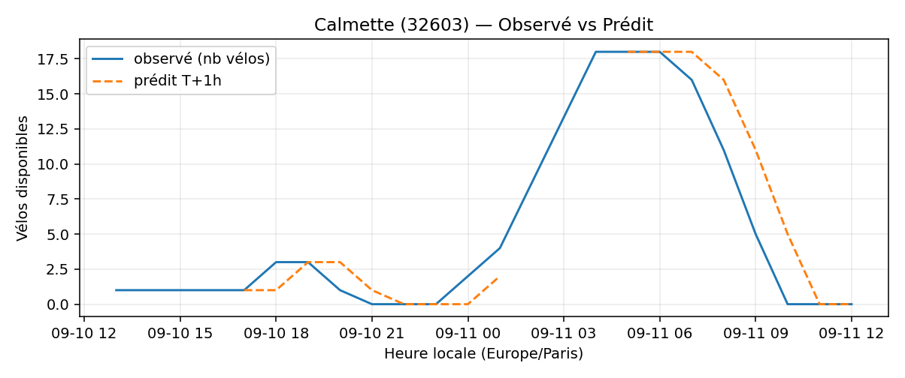

# Prévisions

*Dernière heure considérée : **11/09 12h** (Europe/Paris)*

## Top-10 stations à risque (faible nb vélos prévu T+1h)

| Station                                     |   Prédit T+1h (vélos) | Taux prévu   | Dernière obs.   |
|:--------------------------------------------|----------------------:|:-------------|:----------------|
| Marché Saint-Quentin (`10021`)              |                     0 | 0.0%         | 11/09 12h       |
| Nanterre - Université (`92004`)             |                     0 | 0.0%         | 11/09 12h       |
| Place du 8 Mai 1945 (`25008`)               |                     0 | 0.0%         | 11/09 12h       |
| Commandant Schloesing - Pétrarque (`16202`) |                     0 | 0.0%         | 11/09 12h       |
| Gaston Roussel - Commune de Paris (`32308`) |                     0 | 0.0%         | 11/09 12h       |
| De Gaulle - Moulin (`28002`)                |                     0 | 0.0%         | 11/09 12h       |
| Calmette (`32603`)                          |                     0 | 0.0%         | 11/09 12h       |
| Porte des Lilas - Faidherbe (`32601`)       |                     0 | 0.0%         | 11/09 12h       |
| Cujas - Saint-Michel (`5106`)               |                     0 | —            | 11/09 12h       |
| Gare de Bellevue (`21953`)                  |                     0 | 0.0%         | 11/09 12h       |

## Top-10 risque de saturation (taux prévu élevé)

| Station                                          |   Prédit T+1h (vélos) | Taux prévu   | Dernière obs.   |
|:-------------------------------------------------|----------------------:|:-------------|:----------------|
| Place Balard (`15056`)                           |                    36 | 163.6%       | 11/09 12h       |
| Enfants du Paradis - Peupliers (`21021`)         |                    63 | 157.5%       | 11/09 12h       |
| Tremblay - Lac des Minimes (`12127`)             |                    70 | 145.8%       | 11/09 12h       |
| Place du Moulin de Javel (`15058`)               |                    60 | 133.3%       | 11/09 12h       |
| BNF - Bibliothèque Nationale de France (`13123`) |                    55 | 131.0%       | 11/09 12h       |
| Madeleine Vionnet (`33019`)                      |                    44 | 129.4%       | 11/09 12h       |
| Bercy - Villot (`12105`)                         |                    41 | 124.2%       | 11/09 12h       |
| Malesherbes - Place de la Madeleine (`8004`)     |                    79 | 117.9%       | 11/09 12h       |
| Saint-Antoine Sévigné (`4010`)                   |                    27 | 103.8%       | 11/09 12h       |
| Laffitte - Italiens (`9023`)                     |                    33 | 100.0%       | 11/09 12h       |

## Détails par station (graphiques)

???+ info "Marché Saint-Quentin (10021)"

    

???+ info "Nanterre - Université (92004)"

    

???+ info "Place du 8 Mai 1945 (25008)"

    

???+ info "Commandant Schloesing - Pétrarque (16202)"

    

???+ info "Gaston Roussel - Commune de Paris (32308)"

    

???+ info "De Gaulle - Moulin (28002)"

    

???+ info "Calmette (32603)"

    

???+ info "Porte des Lilas - Faidherbe (32601)"

    

???+ info "Cujas - Saint-Michel (5106)"

    

???+ info "Gare de Bellevue (21953)"

    

