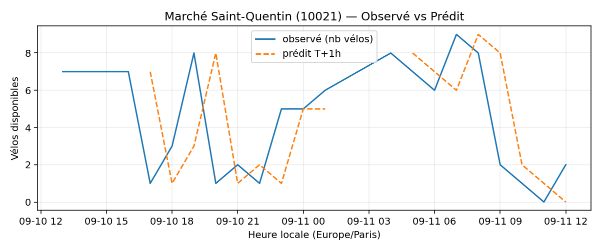
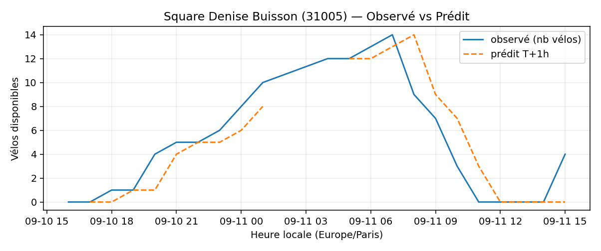
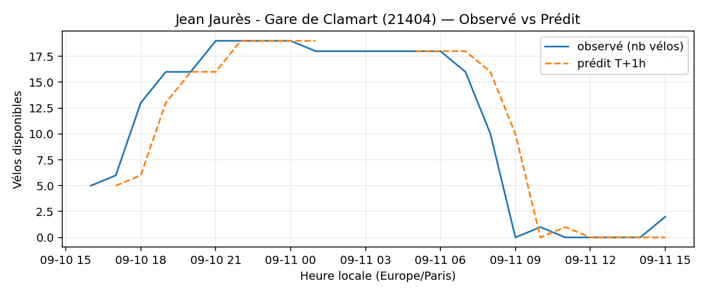
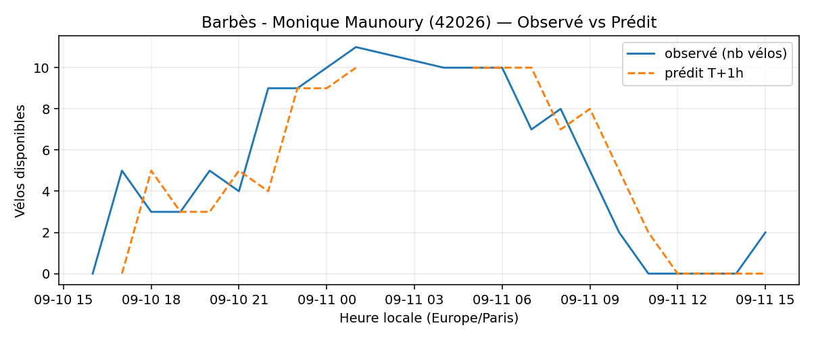

# Prévisions

*Dernière heure considérée : **11/09 15h** (Europe/Paris)*

## Top-10 stations à risque (faible nb vélos prévu T+1h)

| Station                                     |   Prédit T+1h (vélos) | Taux prévu   | Dernière obs.   |
|:--------------------------------------------|----------------------:|:-------------|:----------------|
| Nanterre - Université (`92004`)             |                     0 | 0.0%         | 11/09 15h       |
| Marché Saint-Quentin (`10021`)              |                     0 | 0.0%         | 11/09 15h       |
| Square Denise Buisson (`31005`)             |                     0 | 0.0%         | 11/09 15h       |
| Jean Jaurès - Gare de Clamart (`21404`)     |                     0 | 0.0%         | 11/09 15h       |
| Porte des Lilas - Faidherbe (`32601`)       |                     0 | 0.0%         | 11/09 15h       |
| Gaston Roussel - Commune de Paris (`32308`) |                     0 | 0.0%         | 11/09 15h       |
| Barbès - Monique Maunoury (`42026`)         |                     0 | 0.0%         | 11/09 15h       |
| Sully - Morland (`4201`)                    |                     0 | 0.0%         | 11/09 15h       |
| Pyrénées - Dagorno (`20011`)                |                     0 | 0.0%         | 11/09 15h       |
| Sorbier - Gasnier-Guy (`20010`)             |                     0 | 0.0%         | 11/09 15h       |

## Top-10 risque de saturation (taux prévu élevé)

| Station                                          |   Prédit T+1h (vélos) | Taux prévu   | Dernière obs.   |
|:-------------------------------------------------|----------------------:|:-------------|:----------------|
| Enfants du Paradis - Peupliers (`21021`)         |                    69 | 172.5%       | 11/09 15h       |
| Tremblay - Lac des Minimes (`12127`)             |                    65 | 135.4%       | 11/09 15h       |
| BNF - Bibliothèque Nationale de France (`13123`) |                    56 | 133.3%       | 11/09 15h       |
| Place Balard (`15056`)                           |                    29 | 131.8%       | 11/09 15h       |
| Madeleine Vionnet (`33019`)                      |                    44 | 129.4%       | 11/09 15h       |
| Bercy - Villot (`12105`)                         |                    41 | 124.2%       | 11/09 15h       |
| Saint-Antoine Sévigné (`4010`)                   |                    32 | 123.1%       | 11/09 15h       |
| Malesherbes - Place de la Madeleine (`8004`)     |                    78 | 116.4%       | 11/09 15h       |
| Place du Moulin de Javel (`15058`)               |                    52 | 115.6%       | 11/09 15h       |
| Square Pierre Lazareff (`2004`)                  |                    16 | 100.0%       | 11/09 15h       |

## Détails par station (graphiques)

???+ info "Nanterre - Université (92004)"

    

???+ info "Marché Saint-Quentin (10021)"

    

???+ info "Square Denise Buisson (31005)"

    

???+ info "Jean Jaurès - Gare de Clamart (21404)"

    

???+ info "Porte des Lilas - Faidherbe (32601)"

    

???+ info "Gaston Roussel - Commune de Paris (32308)"

    

???+ info "Barbès - Monique Maunoury (42026)"

    

???+ info "Sully - Morland (4201)"

    

???+ info "Pyrénées - Dagorno (20011)"

    

???+ info "Sorbier - Gasnier-Guy (20010)"

    

