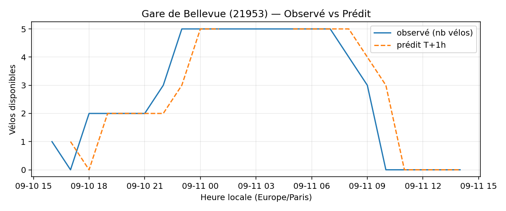
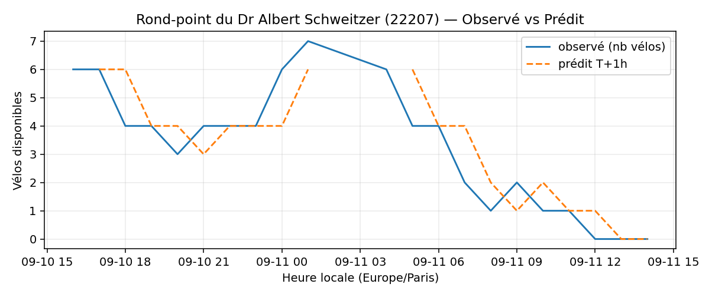
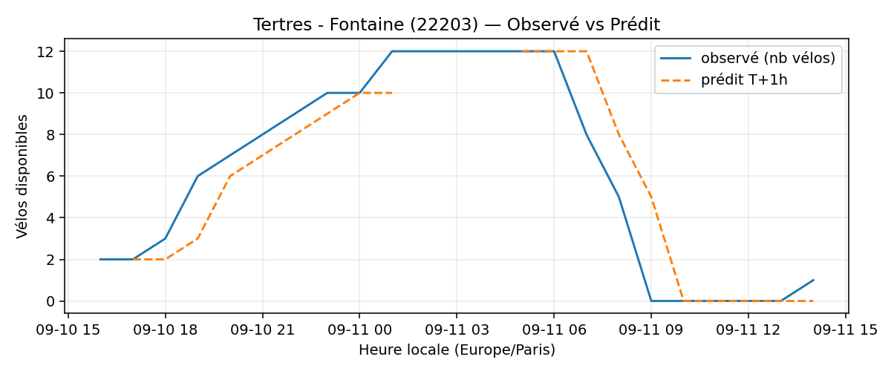
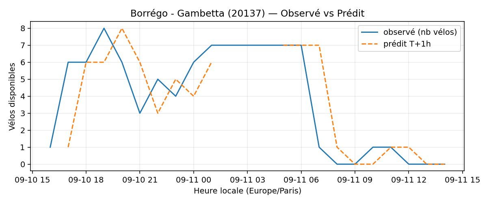

# Prévisions

*Dernière heure considérée : **11/09 14h** (Europe/Paris)*

## Top-10 stations à risque (faible nb vélos prévu T+1h)

| Station                                      |   Prédit T+1h (vélos) | Taux prévu   | Dernière obs.   |
|:---------------------------------------------|----------------------:|:-------------|:----------------|
| Jean Jaurès - Gare de Clamart (`21404`)      |                     0 | 0.0%         | 11/09 14h       |
| Mûriers - Père Lachaise (`20142`)            |                     0 | 0.0%         | 11/09 14h       |
| Vivienne - Petits Champs (`2201`)            |                     0 | 0.0%         | 11/09 14h       |
| Gare de Bellevue (`21953`)                   |                     0 | 0.0%         | 11/09 14h       |
| Charles Robin - Grange aux Belles (`10207`)  |                     0 | 0.0%         | 11/09 14h       |
| Rond-point du Dr Albert Schweitzer (`22207`) |                     0 | 0.0%         | 11/09 14h       |
| Tertres - Fontaine (`22203`)                 |                     0 | 0.0%         | 11/09 14h       |
| Charles de Gaulle (`22019`)                  |                     0 | 0.0%         | 11/09 14h       |
| Place du 14 Juillet (`22408`)                |                     0 | 0.0%         | 11/09 14h       |
| Borrégo - Gambetta (`20137`)                 |                     0 | 0.0%         | 11/09 14h       |

## Top-10 risque de saturation (taux prévu élevé)

| Station                                          |   Prédit T+1h (vélos) | Taux prévu   | Dernière obs.   |
|:-------------------------------------------------|----------------------:|:-------------|:----------------|
| Enfants du Paradis - Peupliers (`21021`)         |                    63 | 157.5%       | 11/09 14h       |
| Place Balard (`15056`)                           |                    31 | 140.9%       | 11/09 14h       |
| Tremblay - Lac des Minimes (`12127`)             |                    64 | 133.3%       | 11/09 14h       |
| BNF - Bibliothèque Nationale de France (`13123`) |                    56 | 133.3%       | 11/09 14h       |
| Madeleine Vionnet (`33019`)                      |                    44 | 129.4%       | 11/09 14h       |
| Malesherbes - Place de la Madeleine (`8004`)     |                    78 | 116.4%       | 11/09 14h       |
| Place du Moulin de Javel (`15058`)               |                    52 | 115.6%       | 11/09 14h       |
| Bercy - Villot (`12105`)                         |                    38 | 115.2%       | 11/09 14h       |
| Saint-Antoine Sévigné (`4010`)                   |                    29 | 111.5%       | 11/09 14h       |
| Mairie du 7ème (`7102`)                          |                    48 | 100.0%       | 11/09 14h       |

## Détails par station (graphiques)

???+ info "Jean Jaurès - Gare de Clamart (21404)"

    

???+ info "Mûriers - Père Lachaise (20142)"

    

???+ info "Vivienne - Petits Champs (2201)"

    

???+ info "Gare de Bellevue (21953)"

    

???+ info "Charles Robin - Grange aux Belles (10207)"

    

???+ info "Rond-point du Dr Albert Schweitzer (22207)"

    

???+ info "Tertres - Fontaine (22203)"

    

???+ info "Charles de Gaulle (22019)"

    

???+ info "Place du 14 Juillet (22408)"

    

???+ info "Borrégo - Gambetta (20137)"

    

