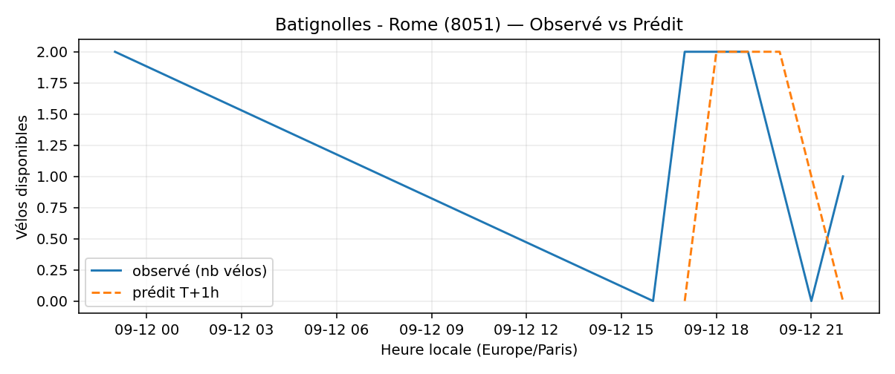
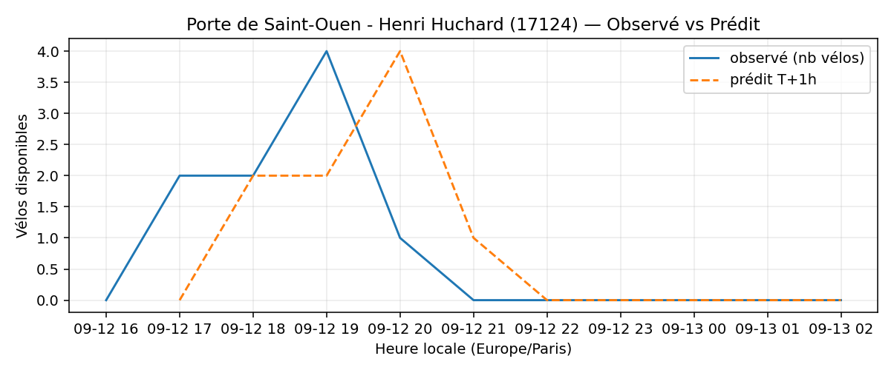
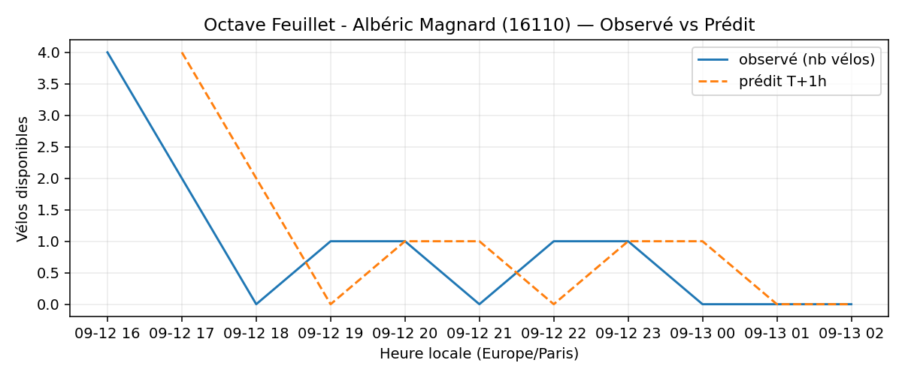
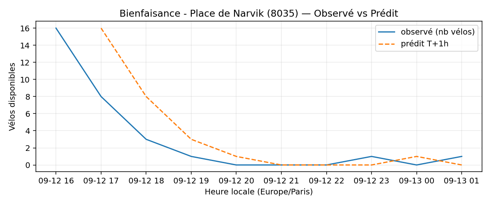
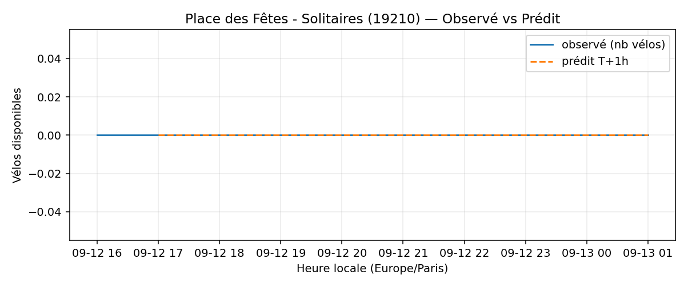

# Prévisions

*Dernière heure considérée : **13/09 01h** (Europe/Paris)*

## Top-10 stations à risque (faible nb vélos prévu T+1h)

| Station                                       |   Prédit T+1h (vélos) | Taux prévu   | Dernière obs.   |
|:----------------------------------------------|----------------------:|:-------------|:----------------|
| Batignolles - Rome (`8051`)                   |                     0 | 0.0%         | 13/09 01h       |
| Lepic - Armée d'Orient (`18113`)              |                     0 | 0.0%         | 13/09 01h       |
| Porte de Saint-Ouen - Henri Huchard (`17124`) |                     0 | 0.0%         | 13/09 01h       |
| Square Louise Michel (`18006`)                |                     0 | 0.0%         | 13/09 01h       |
| Octave Feuillet - Albéric Magnard (`16110`)   |                     0 | 0.0%         | 13/09 01h       |
| Champs-Elysees - Bassano (`8116`)             |                     0 | 0.0%         | 13/09 01h       |
| Hoche - Tilsitt (`8057`)                      |                     0 | 0.0%         | 13/09 01h       |
| Commandant Schloesing - Pétrarque (`16202`)   |                     0 | 0.0%         | 13/09 01h       |
| Bienfaisance - Place de Narvik (`8035`)       |                     0 | 0.0%         | 13/09 01h       |
| Place des Fêtes - Solitaires (`19210`)        |                     0 | 0.0%         | 13/09 01h       |

## Top-10 risque de saturation (taux prévu élevé)

| Station                                            |   Prédit T+1h (vélos) | Taux prévu   | Dernière obs.   |
|:---------------------------------------------------|----------------------:|:-------------|:----------------|
| Aristide Briand - Place de la Résistance (`21302`) |                    32 | 128.0%       | 13/09 01h       |
| Westermeyer - Paul Vaillant-Couturier (`42004`)    |                    31 | 124.0%       | 13/09 01h       |
| Bercy - Villot (`12105`)                           |                    38 | 115.2%       | 13/09 01h       |
| Daumesnil - Picpus (`12010`)                       |                    24 | 114.3%       | 13/09 01h       |
| BNF - Bibliothèque Nationale de France (`13123`)   |                    43 | 102.4%       | 13/09 01h       |
| Abbé Groult - Convention (`15039`)                 |                    12 | 100.0%       | 13/09 01h       |
| Place du 17 Octobre (`22306`)                      |                    20 | 100.0%       | 13/09 01h       |
| Paul Vaillant-Couturier - Gare RER (`44002`)       |                    26 | 100.0%       | 13/09 01h       |
| Keller - La Roquette (`11003`)                     |                    33 | 97.1%        | 13/09 01h       |
| Châteaudun - Place de la Liberté (`22507`)         |                    25 | 96.2%        | 13/09 01h       |

## Détails par station (graphiques)

???+ info "Batignolles - Rome (8051)"

    

???+ info "Lepic - Armée d'Orient (18113)"

    

???+ info "Porte de Saint-Ouen - Henri Huchard (17124)"

    

???+ info "Square Louise Michel (18006)"

    

???+ info "Octave Feuillet - Albéric Magnard (16110)"

    

???+ info "Champs-Elysees - Bassano (8116)"

    

???+ info "Hoche - Tilsitt (8057)"

    

???+ info "Commandant Schloesing - Pétrarque (16202)"

    

???+ info "Bienfaisance - Place de Narvik (8035)"

    

???+ info "Place des Fêtes - Solitaires (19210)"

    

