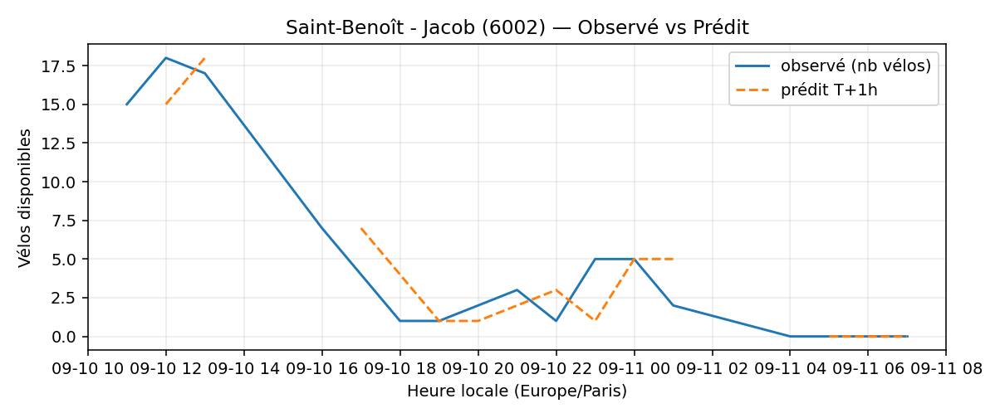

# Prévisions

*Dernière heure considérée : **11/09 07h** (Europe/Paris)*

## Top-10 stations à risque (faible nb vélos prévu T+1h)

| Station                                     |   Prédit T+1h (vélos) | Taux prévu   | Dernière obs.   |
|:--------------------------------------------|----------------------:|:-------------|:----------------|
| Place des Ardoines (`44018`)                |                     0 | 0.0%         | 11/09 07h       |
| Stade - Chevilly (`45504`)                  |                     0 | 0.0%         | 11/09 07h       |
| Commandant Schloesing - Pétrarque (`16202`) |                     0 | 0.0%         | 11/09 07h       |
| La Jarry - Place Diderot (`43010`)          |                     0 | 0.0%         | 11/09 07h       |
| Place des Fêtes - Solitaires (`19210`)      |                     0 | 0.0%         | 11/09 07h       |
| Saint-Benoît - Jacob (`6002`)               |                     0 | 0.0%         | 11/09 07h       |
| Champs-Elysees - Bassano (`8116`)           |                     0 | 0.0%         | 11/09 07h       |
| Belles Feuilles - Place de Mexico (`16010`) |                     0 | 0.0%         | 11/09 07h       |
| Sully - Morland (`4201`)                    |                     0 | 0.0%         | 11/09 07h       |
| De Gaulle - Moulin (`28002`)                |                     0 | 0.0%         | 11/09 07h       |

## Top-10 risque de saturation (taux prévu élevé)

| Station                                            |   Prédit T+1h (vélos) | Taux prévu   | Dernière obs.   |
|:---------------------------------------------------|----------------------:|:-------------|:----------------|
| Aristide Briand - Place de la Résistance (`21302`) |                    27 | 108.0%       | 11/09 07h       |
| Abbé Groult - Convention (`15039`)                 |                    12 | 100.0%       | 11/09 07h       |
| Averroès - Aimé Césaire (`35015`)                  |                    19 | 100.0%       | 11/09 07h       |
| Anatole France - President Roosevelt (`33017`)     |                    29 | 100.0%       | 11/09 07h       |
| Geoffroy-Saint-Hilaire - Saint-Marcel (`5105`)     |                    17 | 100.0%       | 11/09 07h       |
| Félix Faure - Convention (`15069`)                 |                    44 | 100.0%       | 11/09 07h       |
| Abbeville - Faubourg Poissonnière (`9002`)         |                    14 | 100.0%       | 11/09 07h       |
| Gabrielle Josserand - Edouard Vaillant (`35003`)   |                    25 | 100.0%       | 11/09 07h       |
| Gare RER - Général de Gaulle (`22302`)             |                    41 | 100.0%       | 11/09 07h       |
| République - Danton (`41204`)                      |                    20 | 100.0%       | 11/09 07h       |

## Détails par station (graphiques)

???+ info "Place des Ardoines (44018)"

    

???+ info "Stade - Chevilly (45504)"

    

???+ info "Commandant Schloesing - Pétrarque (16202)"

    

???+ info "La Jarry - Place Diderot (43010)"

    

???+ info "Place des Fêtes - Solitaires (19210)"

    

???+ info "Saint-Benoît - Jacob (6002)"

    

???+ info "Champs-Elysees - Bassano (8116)"

    

???+ info "Belles Feuilles - Place de Mexico (16010)"

    

???+ info "Sully - Morland (4201)"

    

???+ info "De Gaulle - Moulin (28002)"

    

