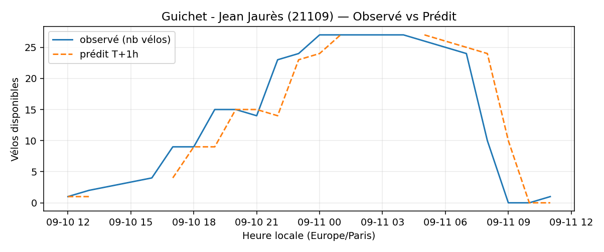
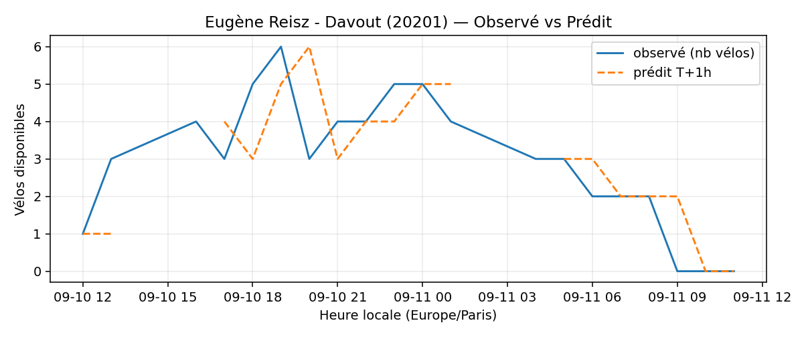
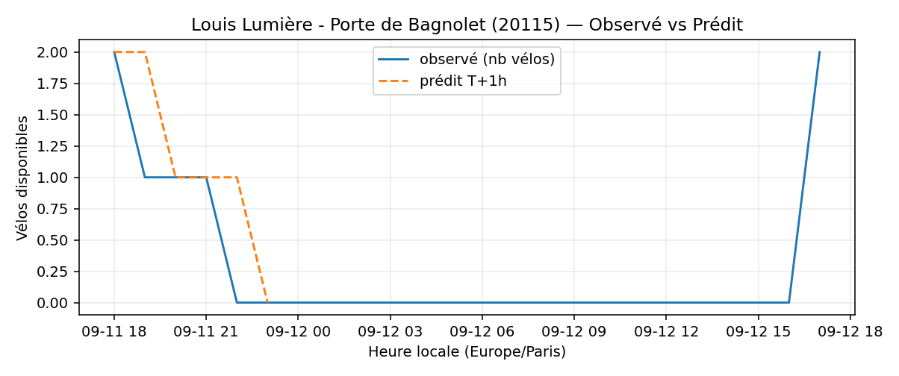
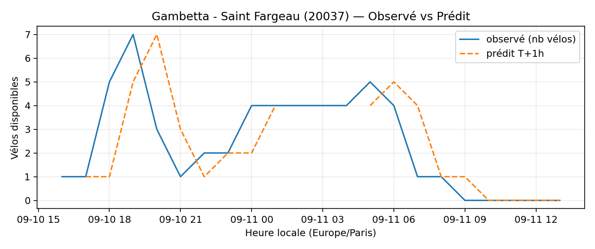
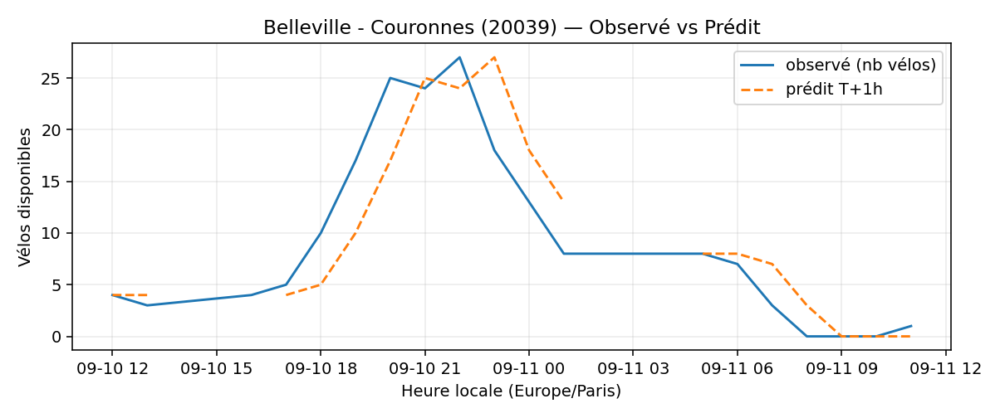

# Prévisions

*Dernière heure considérée : **11/09 11h** (Europe/Paris)*

## Top-10 stations à risque (faible nb vélos prévu T+1h)

| Station                                     |   Prédit T+1h (vélos) | Taux prévu   | Dernière obs.   |
|:--------------------------------------------|----------------------:|:-------------|:----------------|
| Nanterre - Université (`92004`)             |                     0 | 0.0%         | 11/09 11h       |
| Guichet - Jean Jaurès (`21109`)             |                     0 | 0.0%         | 11/09 11h       |
| Eugène Reisz - Davout (`20201`)             |                     0 | 0.0%         | 11/09 11h       |
| Mûriers - Père Lachaise (`20142`)           |                     0 | 0.0%         | 11/09 11h       |
| Boyer - Ménilmontant (`20121`)              |                     0 | 0.0%         | 11/09 11h       |
| Réunion - Avron (`20132`)                   |                     0 | 0.0%         | 11/09 11h       |
| Louis Lumière - Porte de Bagnolet (`20115`) |                     0 | 0.0%         | 11/09 11h       |
| Piat - Parc de Belleville (`20113`)         |                     0 | 0.0%         | 11/09 11h       |
| Gambetta - Saint Fargeau (`20037`)          |                     0 | 0.0%         | 11/09 11h       |
| Belleville - Couronnes (`20039`)            |                     0 | 0.0%         | 11/09 11h       |

## Top-10 risque de saturation (taux prévu élevé)

| Station                                          |   Prédit T+1h (vélos) | Taux prévu   | Dernière obs.   |
|:-------------------------------------------------|----------------------:|:-------------|:----------------|
| Place Balard (`15056`)                           |                    38 | 172.7%       | 11/09 11h       |
| Enfants du Paradis - Peupliers (`21021`)         |                    61 | 152.5%       | 11/09 11h       |
| Tremblay - Lac des Minimes (`12127`)             |                    70 | 145.8%       | 11/09 11h       |
| Madeleine Vionnet (`33019`)                      |                    48 | 141.2%       | 11/09 11h       |
| Place du Moulin de Javel (`15058`)               |                    62 | 137.8%       | 11/09 11h       |
| BNF - Bibliothèque Nationale de France (`13123`) |                    52 | 123.8%       | 11/09 11h       |
| Bercy - Villot (`12105`)                         |                    40 | 121.2%       | 11/09 11h       |
| Malesherbes - Place de la Madeleine (`8004`)     |                    79 | 117.9%       | 11/09 11h       |
| Président Roosevelt - Rouget de Lisle (`21320`)  |                    40 | 100.0%       | 11/09 11h       |
| Rossini - Laffitte (`9022`)                      |                    33 | 100.0%       | 11/09 11h       |

## Détails par station (graphiques)

???+ info "Nanterre - Université (92004)"

    

???+ info "Guichet - Jean Jaurès (21109)"

    

???+ info "Eugène Reisz - Davout (20201)"

    

???+ info "Mûriers - Père Lachaise (20142)"

    

???+ info "Boyer - Ménilmontant (20121)"

    

???+ info "Réunion - Avron (20132)"

    

???+ info "Louis Lumière - Porte de Bagnolet (20115)"

    

???+ info "Piat - Parc de Belleville (20113)"

    

???+ info "Gambetta - Saint Fargeau (20037)"

    

???+ info "Belleville - Couronnes (20039)"

    

