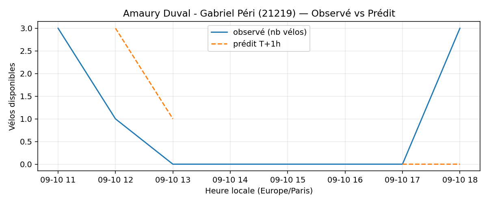

# Prévisions

*Dernière heure considérée : **10/09 18h** (Europe/Paris)*

## Top-10 stations à risque (faible nb vélos prévu T+1h)

| Station                                     |   Prédit T+1h (vélos) | Taux prévu   | Dernière obs.   |
|:--------------------------------------------|----------------------:|:-------------|:----------------|
| Nanterre - Université (`92004`)             |                     0 | 0.0%         | 10/09 18h       |
| Charles Robin - Grange aux Belles (`10207`) |                     0 | 0.0%         | 10/09 18h       |
| Square Denise Buisson (`31005`)             |                     0 | 0.0%         | 10/09 18h       |
| Champs-Elysees - Bassano (`8116`)           |                     0 | 0.0%         | 10/09 18h       |
| Commandant Schloesing - Pétrarque (`16202`) |                     0 | 0.0%         | 10/09 18h       |
| Amaury Duval - Gabriel Péri (`21219`)       |                     0 | 0.0%         | 10/09 18h       |
| Vivienne - Petits Champs (`2201`)           |                     0 | 0.0%         | 10/09 18h       |
| Batignolles - Abel Truchet (`17050`)        |                     0 | 0.0%         | 10/09 18h       |
| De Gaulle - Moulin (`28002`)                |                     0 | 0.0%         | 10/09 18h       |
| Place de la Division Leclerc (`22603`)      |                     0 | 0.0%         | 10/09 18h       |

## Top-10 risque de saturation (taux prévu élevé)

| Station                                          |   Prédit T+1h (vélos) | Taux prévu   | Dernière obs.   |
|:-------------------------------------------------|----------------------:|:-------------|:----------------|
| Enfants du Paradis - Peupliers (`21021`)         |                    60 | 150.0%       | 10/09 18h       |
| Place Balard (`15056`)                           |                    28 | 127.3%       | 10/09 18h       |
| BNF - Bibliothèque Nationale de France (`13123`) |                    43 | 102.4%       | 10/09 18h       |
| Place de la République - Voltaire (`11046`)      |                    19 | 100.0%       | 10/09 18h       |
| Belleville -  Pré Saint-Gervais (`19121`)        |                    21 | 100.0%       | 10/09 18h       |
| Convention - Lourmel (`15062`)                   |                    36 | 100.0%       | 10/09 18h       |
| Petites Ecuries - Faubourg Saint-Denis (`10006`) |                    28 | 100.0%       | 10/09 18h       |
| Lassus - Delouvain (`19038`)                     |                    20 | 100.0%       | 10/09 18h       |
| Belleville - Pyrénées (`19041`)                  |                    41 | 97.6%        | 10/09 18h       |
| Gare RER - Général de Gaulle (`22302`)           |                    40 | 97.6%        | 10/09 18h       |

## Détails par station (graphiques)

???+ info "Nanterre - Université (92004)"

    

???+ info "Charles Robin - Grange aux Belles (10207)"

    

???+ info "Square Denise Buisson (31005)"

    

???+ info "Champs-Elysees - Bassano (8116)"

    

???+ info "Commandant Schloesing - Pétrarque (16202)"

    

???+ info "Amaury Duval - Gabriel Péri (21219)"

    

???+ info "Vivienne - Petits Champs (2201)"

    

???+ info "Batignolles - Abel Truchet (17050)"

    

???+ info "De Gaulle - Moulin (28002)"

    

???+ info "Place de la Division Leclerc (22603)"

    

