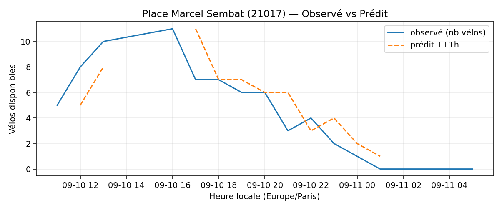
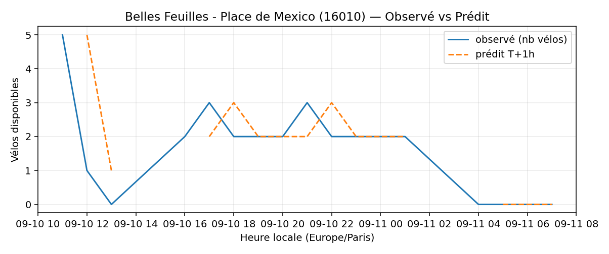

# Prévisions

*Dernière heure considérée : **11/09 05h** (Europe/Paris)*

## Top-10 stations à risque (faible nb vélos prévu T+1h)

| Station                                     |   Prédit T+1h (vélos) | Taux prévu   | Dernière obs.   |
|:--------------------------------------------|----------------------:|:-------------|:----------------|
| Charles Robin - Grange aux Belles (`10207`) |                     0 | 0.0%         | 11/09 05h       |
| De Gaulle - Moulin (`28002`)                |                     0 | 0.0%         | 11/09 05h       |
| Boyer - Ménilmontant (`20121`)              |                     0 | 0.0%         | 11/09 05h       |
| Place Marcel Sembat (`21017`)               |                     0 | 0.0%         | 11/09 05h       |
| Place des Ardoines (`44018`)                |                     0 | 0.0%         | 11/09 05h       |
| Stade - Chevilly (`45504`)                  |                     0 | 0.0%         | 11/09 05h       |
| Champs-Elysees - Bassano (`8116`)           |                     0 | 0.0%         | 11/09 05h       |
| Vivienne - Petits Champs (`2201`)           |                     0 | 0.0%         | 11/09 05h       |
| Belles Feuilles - Place de Mexico (`16010`) |                     0 | 0.0%         | 11/09 05h       |
| Commandant Schloesing - Pétrarque (`16202`) |                     0 | 0.0%         | 11/09 05h       |

## Top-10 risque de saturation (taux prévu élevé)

| Station                                            |   Prédit T+1h (vélos) | Taux prévu   | Dernière obs.   |
|:---------------------------------------------------|----------------------:|:-------------|:----------------|
| Abbé Groult - Convention (`15039`)                 |                    13 | 108.3%       | 11/09 05h       |
| Aristide Briand - Place de la Résistance (`21302`) |                    26 | 104.0%       | 11/09 05h       |
| Place de l'Eglise - Vitry-sur-Seine (`44004`)      |                    28 | 100.0%       | 11/09 05h       |
| Lampes (`42019`)                                   |                    43 | 100.0%       | 11/09 05h       |
| Cadix - Hameau (`15128`)                           |                    37 | 100.0%       | 11/09 05h       |
| Place Charles Vallin (`15122`)                     |                    26 | 100.0%       | 11/09 05h       |
| Pierre Joseph Desault (`13120`)                    |                    19 | 100.0%       | 11/09 05h       |
| Bobillot - Paulin Mery (`13106`)                   |                    23 | 100.0%       | 11/09 05h       |
| Daumesnil - Picpus (`12010`)                       |                    21 | 100.0%       | 11/09 05h       |
| Gabrielle Josserand - Edouard Vaillant (`35003`)   |                    25 | 100.0%       | 11/09 05h       |

## Détails par station (graphiques)

???+ info "Charles Robin - Grange aux Belles (10207)"

    

???+ info "De Gaulle - Moulin (28002)"

    

???+ info "Boyer - Ménilmontant (20121)"

    

???+ info "Place Marcel Sembat (21017)"

    

???+ info "Place des Ardoines (44018)"

    

???+ info "Stade - Chevilly (45504)"

    

???+ info "Champs-Elysees - Bassano (8116)"

    

???+ info "Vivienne - Petits Champs (2201)"

    

???+ info "Belles Feuilles - Place de Mexico (16010)"

    

???+ info "Commandant Schloesing - Pétrarque (16202)"

    

