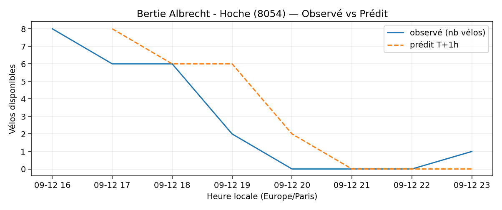
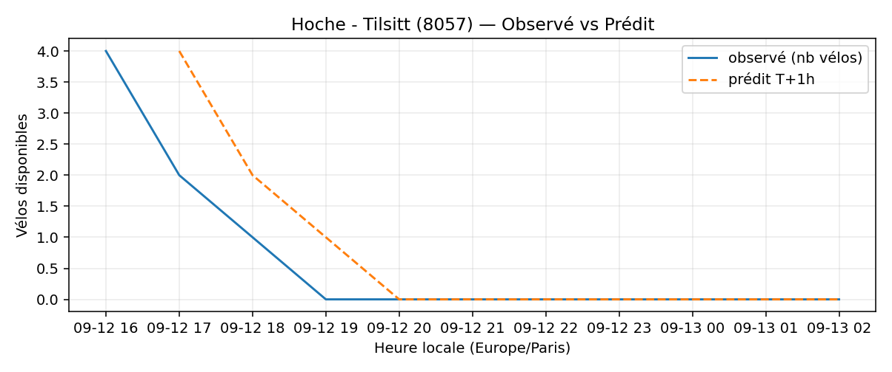
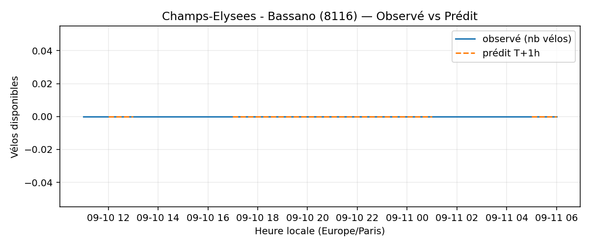
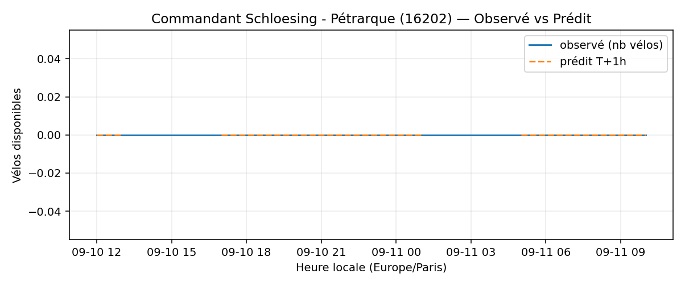
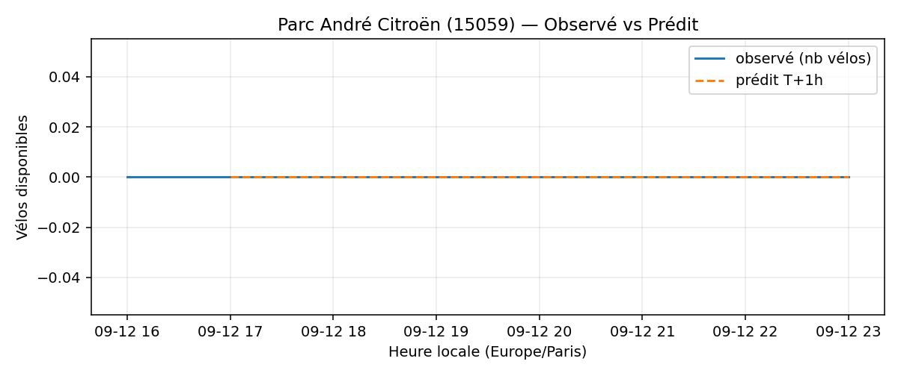
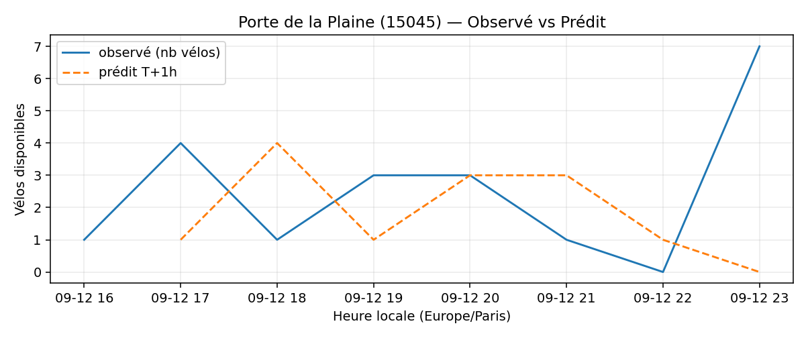
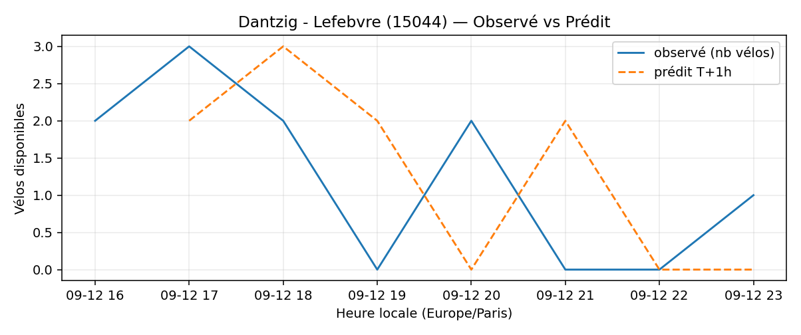
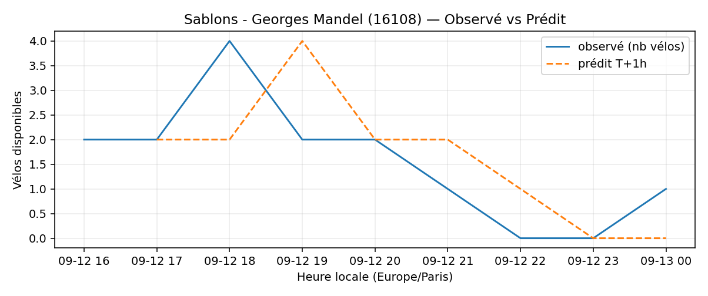
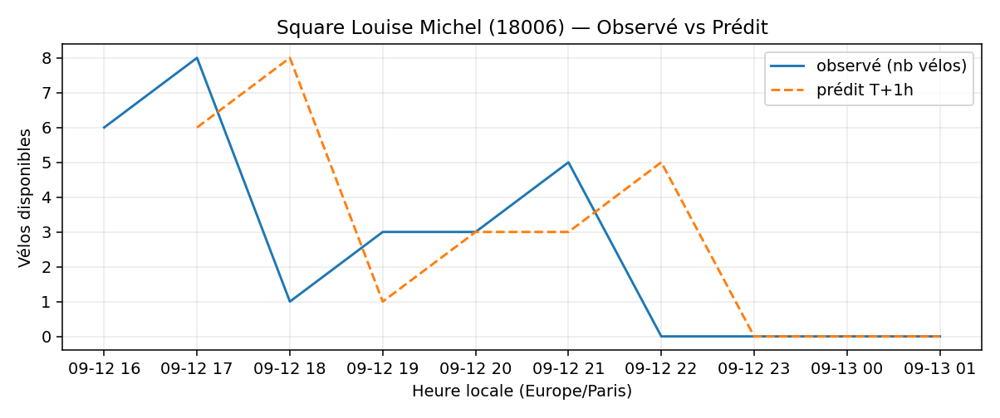
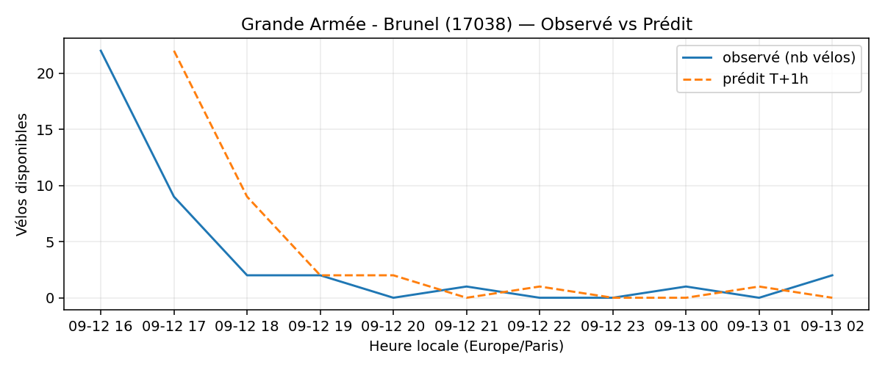

# Prévisions

*Dernière heure considérée : **12/09 23h** (Europe/Paris)*

## Top-10 stations à risque (faible nb vélos prévu T+1h)

| Station                                     |   Prédit T+1h (vélos) | Taux prévu   | Dernière obs.   |
|:--------------------------------------------|----------------------:|:-------------|:----------------|
| Bertie Albrecht - Hoche (`8054`)            |                     0 | 0.0%         | 12/09 23h       |
| Hoche - Tilsitt (`8057`)                    |                     0 | 0.0%         | 12/09 23h       |
| Champs-Elysees - Bassano (`8116`)           |                     0 | 0.0%         | 12/09 23h       |
| Commandant Schloesing - Pétrarque (`16202`) |                     0 | 0.0%         | 12/09 23h       |
| Parc André Citroën (`15059`)                |                     0 | 0.0%         | 12/09 23h       |
| Porte de la Plaine (`15045`)                |                     0 | 0.0%         | 12/09 23h       |
| Dantzig - Lefebvre (`15044`)                |                     0 | 0.0%         | 12/09 23h       |
| Sablons - Georges Mandel (`16108`)          |                     0 | 0.0%         | 12/09 23h       |
| Square Louise Michel (`18006`)              |                     0 | 0.0%         | 12/09 23h       |
| Grande Armée - Brunel (`17038`)             |                     0 | 0.0%         | 12/09 23h       |

## Top-10 risque de saturation (taux prévu élevé)

| Station                                            |   Prédit T+1h (vélos) | Taux prévu   | Dernière obs.   |
|:---------------------------------------------------|----------------------:|:-------------|:----------------|
| BNF - Bibliothèque Nationale de France (`13123`)   |                    57 | 135.7%       | 12/09 23h       |
| Bercy - Villot (`12105`)                           |                    37 | 112.1%       | 12/09 23h       |
| Westermeyer - Paul Vaillant-Couturier (`42004`)    |                    28 | 112.0%       | 12/09 23h       |
| Aristide Briand - Place de la Résistance (`21302`) |                    28 | 112.0%       | 12/09 23h       |
| Jacques Callot - Mazarine (`6013`)                 |                    28 | 100.0%       | 12/09 23h       |
| Place du 17 Octobre (`22306`)                      |                    20 | 100.0%       | 12/09 23h       |
| Argenteuil - Voltaire (`26003`)                    |                    16 | 100.0%       | 12/09 23h       |
| Aboukir - Alexandrie (`2016`)                      |                    21 | 100.0%       | 12/09 23h       |
| Pierre Ginier - Clichy (`18045`)                   |                    16 | 100.0%       | 12/09 23h       |
| Poissy - Saint-Germain (`5019`)                    |                    25 | 100.0%       | 12/09 23h       |

## Détails par station (graphiques)

???+ info "Bertie Albrecht - Hoche (8054)"

    

???+ info "Hoche - Tilsitt (8057)"

    

???+ info "Champs-Elysees - Bassano (8116)"

    

???+ info "Commandant Schloesing - Pétrarque (16202)"

    

???+ info "Parc André Citroën (15059)"

    

???+ info "Porte de la Plaine (15045)"

    

???+ info "Dantzig - Lefebvre (15044)"

    

???+ info "Sablons - Georges Mandel (16108)"

    

???+ info "Square Louise Michel (18006)"

    

???+ info "Grande Armée - Brunel (17038)"

    

