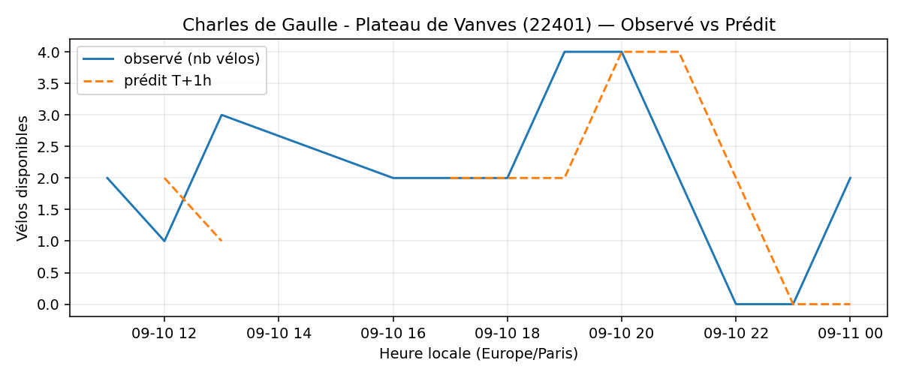

# Prévisions

*Dernière heure considérée : **11/09 00h** (Europe/Paris)*

## Top-10 stations à risque (faible nb vélos prévu T+1h)

| Station                                         |   Prédit T+1h (vélos) | Taux prévu   | Dernière obs.   |
|:------------------------------------------------|----------------------:|:-------------|:----------------|
| Nanterre - Université (`92004`)                 |                     0 | 0.0%         | 11/09 00h       |
| Boudreau - Auber (`9106`)                       |                     0 | 0.0%         | 11/09 00h       |
| Charles Robin - Grange aux Belles (`10207`)     |                     0 | 0.0%         | 11/09 00h       |
| Gare de Sèvres - Ville d'Avray (`23107`)        |                     0 | 0.0%         | 11/09 00h       |
| Charles de Gaulle - Plateau de Vanves (`22401`) |                     0 | 0.0%         | 11/09 00h       |
| Charles de Gaulle (`22019`)                     |                     0 | 0.0%         | 11/09 00h       |
| Champs-Elysees - Bassano (`8116`)               |                     0 | 0.0%         | 11/09 00h       |
| La Jarry - Place Diderot (`43010`)              |                     0 | 0.0%         | 11/09 00h       |
| De Gaulle - Moulin (`28002`)                    |                     0 | 0.0%         | 11/09 00h       |
| Commandant Schloesing - Pétrarque (`16202`)     |                     0 | 0.0%         | 11/09 00h       |

## Top-10 risque de saturation (taux prévu élevé)

| Station                                            |   Prédit T+1h (vélos) | Taux prévu   | Dernière obs.   |
|:---------------------------------------------------|----------------------:|:-------------|:----------------|
| Westermeyer - Paul Vaillant-Couturier (`42004`)    |                    27 | 108.0%       | 11/09 00h       |
| Daumesnil - Picpus (`12010`)                       |                    22 | 104.8%       | 11/09 00h       |
| Place du 17 Octobre (`22306`)                      |                    20 | 100.0%       | 11/09 00h       |
| Pierre Joseph Desault (`13120`)                    |                    19 | 100.0%       | 11/09 00h       |
| Belfort - Victor Hugo (`21119`)                    |                    24 | 100.0%       | 11/09 00h       |
| Convention - Lourmel (`15062`)                     |                    36 | 100.0%       | 11/09 00h       |
| Convention - Saint-Charles (`15063`)               |                    23 | 100.0%       | 11/09 00h       |
| Cadix - Hameau (`15128`)                           |                    37 | 100.0%       | 11/09 00h       |
| Aristide Briand - Place de la Résistance (`21302`) |                    25 | 100.0%       | 11/09 00h       |
| Gare - Aristide Briand (`21329`)                   |                    29 | 100.0%       | 11/09 00h       |

## Détails par station (graphiques)

???+ info "Nanterre - Université (92004)"

    

???+ info "Boudreau - Auber (9106)"

    

???+ info "Charles Robin - Grange aux Belles (10207)"

    

???+ info "Gare de Sèvres - Ville d'Avray (23107)"

    

???+ info "Charles de Gaulle - Plateau de Vanves (22401)"

    

???+ info "Charles de Gaulle (22019)"

    

???+ info "Champs-Elysees - Bassano (8116)"

    

???+ info "La Jarry - Place Diderot (43010)"

    

???+ info "De Gaulle - Moulin (28002)"

    

???+ info "Commandant Schloesing - Pétrarque (16202)"

    

