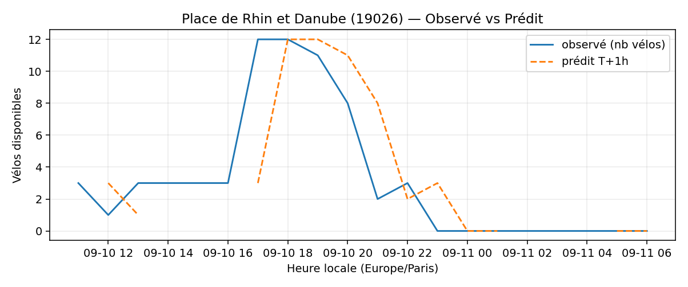
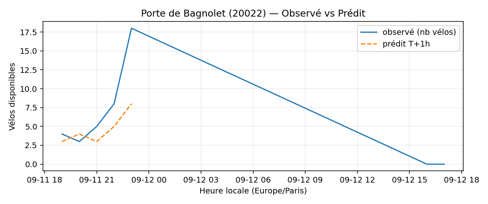
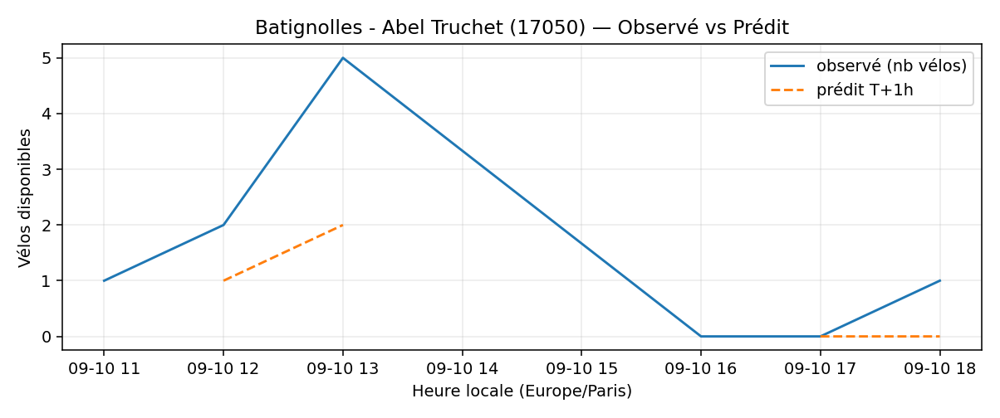

# Prévisions

*Dernière heure considérée : **11/09 06h** (Europe/Paris)*

## Top-10 stations à risque (faible nb vélos prévu T+1h)

| Station                                |   Prédit T+1h (vélos) | Taux prévu   | Dernière obs.   |
|:---------------------------------------|----------------------:|:-------------|:----------------|
| Sully - Morland (`4201`)               |                     0 | 0.0%         | 11/09 06h       |
| Place des Fêtes - Solitaires (`19210`) |                     0 | 0.0%         | 11/09 06h       |
| La Jarry - Place Diderot (`43010`)     |                     0 | 0.0%         | 11/09 06h       |
| Place de Rhin et Danube (`19026`)      |                     0 | 0.0%         | 11/09 06h       |
| Porte de Bagnolet (`20022`)            |                     0 | 0.0%         | 11/09 06h       |
| Place des Ardoines (`44018`)           |                     0 | 0.0%         | 11/09 06h       |
| Parc André Citroën (`15059`)           |                     0 | 0.0%         | 11/09 06h       |
| Champs-Elysees - Bassano (`8116`)      |                     0 | 0.0%         | 11/09 06h       |
| Stade - Chevilly (`45504`)             |                     0 | 0.0%         | 11/09 06h       |
| Batignolles - Abel Truchet (`17050`)   |                     0 | 0.0%         | 11/09 06h       |

## Top-10 risque de saturation (taux prévu élevé)

| Station                                            |   Prédit T+1h (vélos) | Taux prévu   | Dernière obs.   |
|:---------------------------------------------------|----------------------:|:-------------|:----------------|
| Aristide Briand - Place de la Résistance (`21302`) |                    26 | 104.0%       | 11/09 06h       |
| Westermeyer - Paul Vaillant-Couturier (`42004`)    |                    25 | 100.0%       | 11/09 06h       |
| Blanqui - Docteur Bauer (`34013`)                  |                    28 | 100.0%       | 11/09 06h       |
| Bobillot - Paulin Mery (`13106`)                   |                    23 | 100.0%       | 11/09 06h       |
| Geoffroy-Saint-Hilaire - Saint-Marcel (`5105`)     |                    17 | 100.0%       | 11/09 06h       |
| République - Danton (`41204`)                      |                    20 | 100.0%       | 11/09 06h       |
| Place de l'Eglise - Vitry-sur-Seine (`44004`)      |                    28 | 100.0%       | 11/09 06h       |
| Anatole France - President Roosevelt (`33017`)     |                    29 | 100.0%       | 11/09 06h       |
| Averroès - Aimé Césaire (`35015`)                  |                    19 | 100.0%       | 11/09 06h       |
| Pierre Joseph Desault (`13120`)                    |                    19 | 100.0%       | 11/09 06h       |

## Détails par station (graphiques)

???+ info "Sully - Morland (4201)"

    

???+ info "Place des Fêtes - Solitaires (19210)"

    

???+ info "La Jarry - Place Diderot (43010)"

    

???+ info "Place de Rhin et Danube (19026)"

    

???+ info "Porte de Bagnolet (20022)"

    

???+ info "Place des Ardoines (44018)"

    

???+ info "Parc André Citroën (15059)"

    

???+ info "Champs-Elysees - Bassano (8116)"

    

???+ info "Stade - Chevilly (45504)"

    

???+ info "Batignolles - Abel Truchet (17050)"

    

