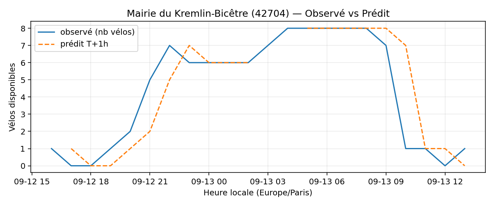
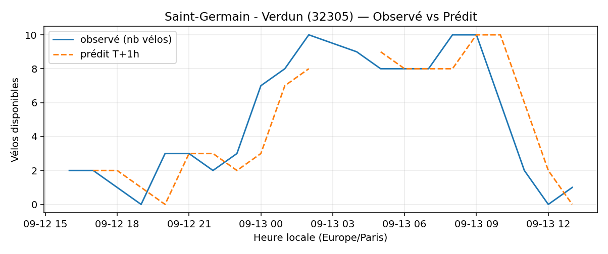

# Prévisions

*Dernière heure considérée : **13/09 13h** (Europe/Paris)*

## Top-10 stations à risque (faible nb vélos prévu T+1h)

| Station                                         |   Prédit T+1h (vélos) | Taux prévu   | Dernière obs.   |
|:------------------------------------------------|----------------------:|:-------------|:----------------|
| Nanterre - Université (`92004`)                 |                     0 | 0.0%         | 13/09 13h       |
| Pyrénées - Ménilmontant (`20035`)               |                     0 | 0.0%         | 13/09 13h       |
| La Jarry - Place Diderot (`43010`)              |                     0 | 0.0%         | 13/09 13h       |
| Alexandre Dumas - Place de la Réunion (`20013`) |                     0 | 0.0%         | 13/09 13h       |
| Mairie du Kremlin-Bicêtre (`42704`)             |                     0 | 0.0%         | 13/09 13h       |
| Square des Saint-Simoniens (`20119`)            |                     0 | 0.0%         | 13/09 13h       |
| Réunion - Avron (`20132`)                       |                     0 | 0.0%         | 13/09 13h       |
| Boyer - Ménilmontant (`20121`)                  |                     0 | 0.0%         | 13/09 13h       |
| Saint-Germain - Verdun (`32305`)                |                     0 | 0.0%         | 13/09 13h       |
| Manin - Secrétan (`19114`)                      |                     0 | 0.0%         | 13/09 13h       |

## Top-10 risque de saturation (taux prévu élevé)

| Station                                          |   Prédit T+1h (vélos) | Taux prévu   | Dernière obs.   |
|:-------------------------------------------------|----------------------:|:-------------|:----------------|
| Westermeyer - Paul Vaillant-Couturier (`42004`)  |                    43 | 172.0%       | 13/09 13h       |
| Bercy - Villot (`12105`)                         |                    35 | 106.1%       | 13/09 13h       |
| Paul Doumer - Stalingrad (`41101`)               |                    24 | 100.0%       | 13/09 13h       |
| Grande Truanderie - Saint-Denis (`1006`)         |                    33 | 100.0%       | 13/09 13h       |
| Eugène Reisz - Davout (`20201`)                  |                    20 | 100.0%       | 13/09 13h       |
| Place de l'Hôtel de Ville (`4017`)               |                    14 | 100.0%       | 13/09 13h       |
| Oratoire - Rivoli (`1025`)                       |                    18 | 100.0%       | 13/09 13h       |
| Port - Maurice Chevalier (`41304`)               |                    30 | 100.0%       | 13/09 13h       |
| Gare d'Austerlitz - Quai Saint-Bernard (`13104`) |                    27 | 100.0%       | 13/09 13h       |
| Bourdonnais - Tour Eiffel (`7023`)               |                    59 | 98.3%        | 13/09 13h       |

## Détails par station (graphiques)

???+ info "Nanterre - Université (92004)"

    

???+ info "Pyrénées - Ménilmontant (20035)"

    

???+ info "La Jarry - Place Diderot (43010)"

    

???+ info "Alexandre Dumas - Place de la Réunion (20013)"

    

???+ info "Mairie du Kremlin-Bicêtre (42704)"

    

???+ info "Square des Saint-Simoniens (20119)"

    

???+ info "Réunion - Avron (20132)"

    

???+ info "Boyer - Ménilmontant (20121)"

    

???+ info "Saint-Germain - Verdun (32305)"

    

???+ info "Manin - Secrétan (19114)"

    

