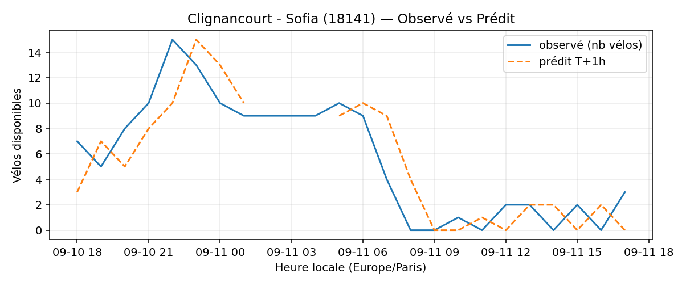
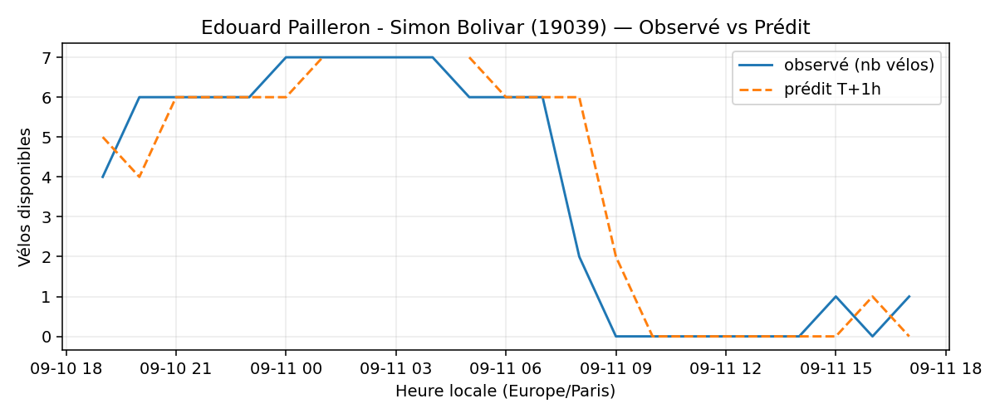
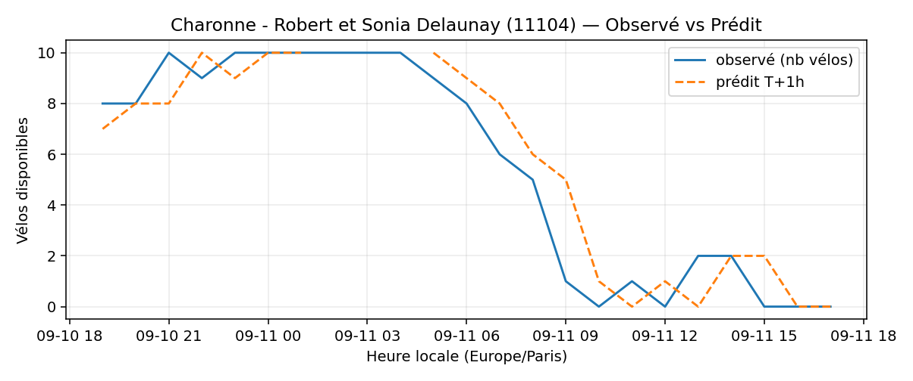

# Prévisions

*Dernière heure considérée : **11/09 17h** (Europe/Paris)*

## Top-10 stations à risque (faible nb vélos prévu T+1h)

| Station                                       |   Prédit T+1h (vélos) | Taux prévu   | Dernière obs.   |
|:----------------------------------------------|----------------------:|:-------------|:----------------|
| Nanterre - Université (`92004`)               |                     0 | 0.0%         | 11/09 17h       |
| Douai - Bruxelles (`9038`)                    |                     0 | 0.0%         | 11/09 17h       |
| Lepic - Armée d'Orient (`18113`)              |                     0 | 0.0%         | 11/09 17h       |
| Charles Robin - Grange aux Belles (`10207`)   |                     0 | 0.0%         | 11/09 17h       |
| Clignancourt - Sofia (`18141`)                |                     0 | 0.0%         | 11/09 17h       |
| Londres - Europe (`8202`)                     |                     0 | 0.0%         | 11/09 17h       |
| Champs-Elysees - Bassano (`8116`)             |                     0 | 0.0%         | 11/09 17h       |
| Edouard Pailleron - Simon Bolivar (`19039`)   |                     0 | 0.0%         | 11/09 17h       |
| Place des Fêtes - Solitaires (`19210`)        |                     0 | 0.0%         | 11/09 17h       |
| Charonne - Robert et Sonia Delaunay (`11104`) |                     0 | 0.0%         | 11/09 17h       |

## Top-10 risque de saturation (taux prévu élevé)

| Station                                          |   Prédit T+1h (vélos) | Taux prévu   | Dernière obs.   |
|:-------------------------------------------------|----------------------:|:-------------|:----------------|
| Enfants du Paradis - Peupliers (`21021`)         |                    73 | 182.5%       | 11/09 17h       |
| BNF - Bibliothèque Nationale de France (`13123`) |                    58 | 138.1%       | 11/09 17h       |
| Place Balard (`15056`)                           |                    29 | 131.8%       | 11/09 17h       |
| Tremblay - Lac des Minimes (`12127`)             |                    62 | 129.2%       | 11/09 17h       |
| Bercy - Villot (`12105`)                         |                    38 | 115.2%       | 11/09 17h       |
| Madeleine Vionnet (`33019`)                      |                    39 | 114.7%       | 11/09 17h       |
| Malesherbes - Place de la Madeleine (`8004`)     |                    76 | 113.4%       | 11/09 17h       |
| Place du Moulin de Javel (`15058`)               |                    49 | 108.9%       | 11/09 17h       |
| Saint-Antoine Sévigné (`4010`)                   |                    27 | 103.8%       | 11/09 17h       |
| Place Denfert-Rochereau (`21002`)                |                    20 | 100.0%       | 11/09 17h       |

## Détails par station (graphiques)

???+ info "Nanterre - Université (92004)"

    

???+ info "Douai - Bruxelles (9038)"

    

???+ info "Lepic - Armée d'Orient (18113)"

    

???+ info "Charles Robin - Grange aux Belles (10207)"

    

???+ info "Clignancourt - Sofia (18141)"

    

???+ info "Londres - Europe (8202)"

    

???+ info "Champs-Elysees - Bassano (8116)"

    

???+ info "Edouard Pailleron - Simon Bolivar (19039)"

    

???+ info "Place des Fêtes - Solitaires (19210)"

    

???+ info "Charonne - Robert et Sonia Delaunay (11104)"

    

