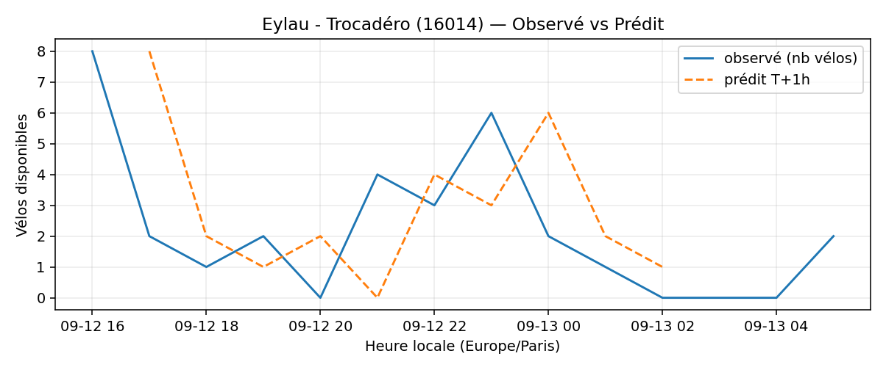
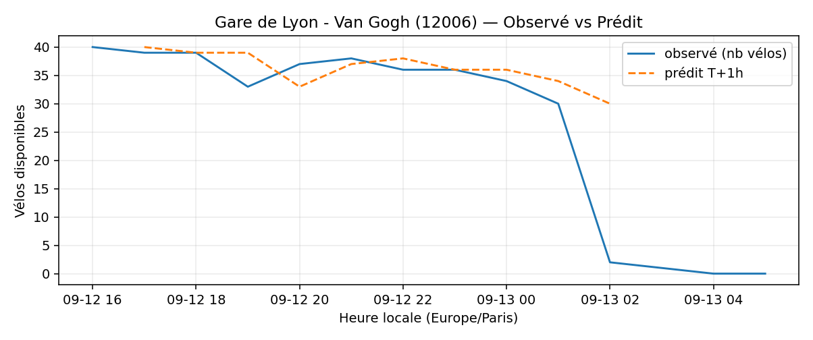

# Prévisions

*Dernière heure considérée : **13/09 05h** (Europe/Paris)*

## Top-10 stations à risque (faible nb vélos prévu T+1h)

| Station                                     |   Prédit T+1h (vélos) | Taux prévu   | Dernière obs.   |
|:--------------------------------------------|----------------------:|:-------------|:----------------|
| Nanterre - Université (`92004`)             |                     0 | 0.0%         | 13/09 05h       |
| Place des Fêtes - Solitaires (`19210`)      |                     0 | 0.0%         | 13/09 05h       |
| Commandant Schloesing - Pétrarque (`16202`) |                     0 | 0.0%         | 13/09 05h       |
| Octave Feuillet - Albéric Magnard (`16110`) |                     0 | 0.0%         | 13/09 05h       |
| Champs-Elysees - Bassano (`8116`)           |                     0 | 0.0%         | 13/09 05h       |
| Eylau - Trocadéro (`16014`)                 |                     0 | 0.0%         | 13/09 05h       |
| Parc André Citroën (`15059`)                |                     0 | 0.0%         | 13/09 05h       |
| Gare de Lyon - Van Gogh (`12006`)           |                     0 | 0.0%         | 13/09 05h       |
| Charles de Gaulle (`22019`)                 |                     0 | 0.0%         | 13/09 05h       |
| Verdun - Henri Barbusse (`22209`)           |                     0 | 0.0%         | 13/09 05h       |

## Top-10 risque de saturation (taux prévu élevé)

| Station                                            |   Prédit T+1h (vélos) | Taux prévu   | Dernière obs.   |
|:---------------------------------------------------|----------------------:|:-------------|:----------------|
| Westermeyer - Paul Vaillant-Couturier (`42004`)    |                    40 | 160.0%       | 13/09 05h       |
| Aristide Briand - Place de la Résistance (`21302`) |                    35 | 140.0%       | 13/09 05h       |
| Abbé Groult - Convention (`15039`)                 |                    15 | 125.0%       | 13/09 05h       |
| Daumesnil - Picpus (`12010`)                       |                    24 | 114.3%       | 13/09 05h       |
| Place Charles Vallin (`15122`)                     |                    29 | 111.5%       | 13/09 05h       |
| Port - Maurice Chevalier (`41304`)                 |                    31 | 103.3%       | 13/09 05h       |
| Place Paul Eluard (`46001`)                        |                    19 | 100.0%       | 13/09 05h       |
| Porte de Versailles (`15203`)                      |                    28 | 100.0%       | 13/09 05h       |
| Place Eustache Deschamps (`42303`)                 |                    20 | 100.0%       | 13/09 05h       |
| Hôpital - Campo-Formio (`13011`)                   |                    11 | 100.0%       | 13/09 05h       |

## Détails par station (graphiques)

???+ info "Nanterre - Université (92004)"

    

???+ info "Place des Fêtes - Solitaires (19210)"

    

???+ info "Commandant Schloesing - Pétrarque (16202)"

    

???+ info "Octave Feuillet - Albéric Magnard (16110)"

    

???+ info "Champs-Elysees - Bassano (8116)"

    

???+ info "Eylau - Trocadéro (16014)"

    

???+ info "Parc André Citroën (15059)"

    

???+ info "Gare de Lyon - Van Gogh (12006)"

    

???+ info "Charles de Gaulle (22019)"

    

???+ info "Verdun - Henri Barbusse (22209)"

    

