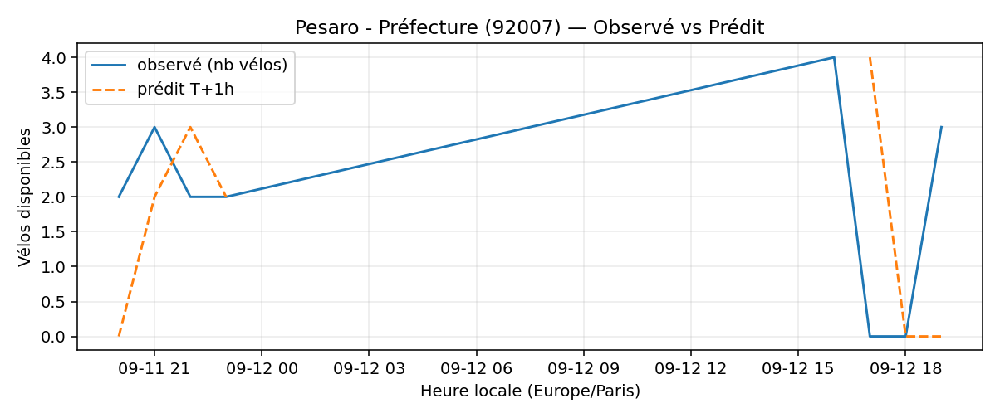
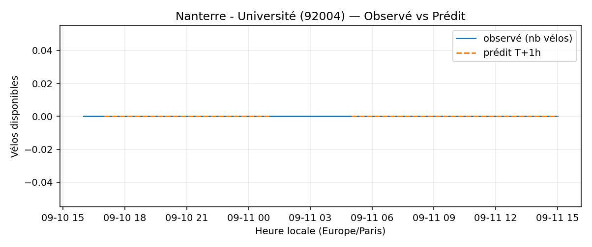
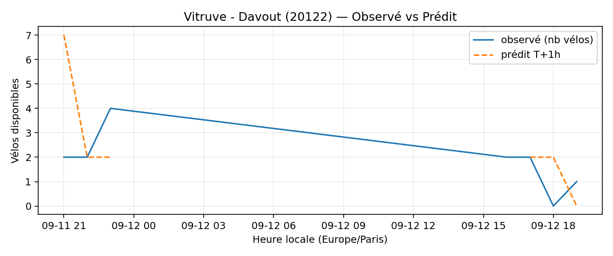
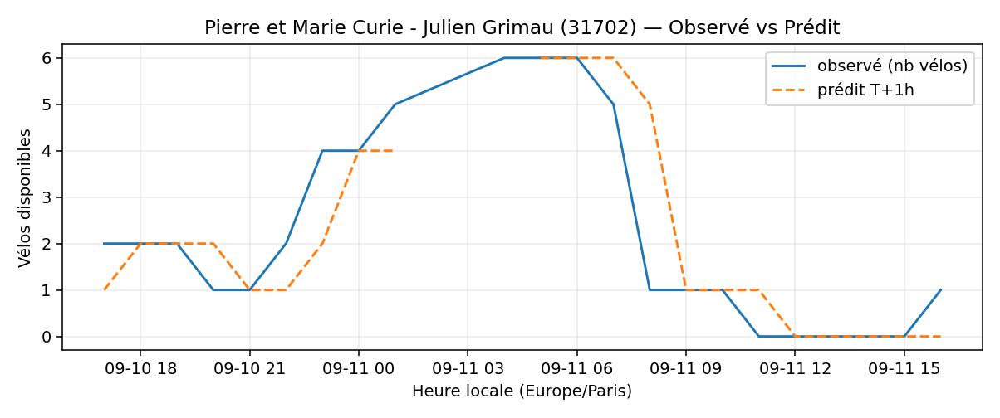
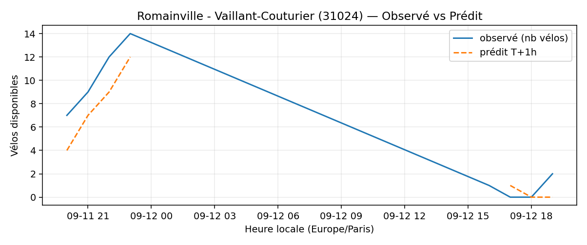
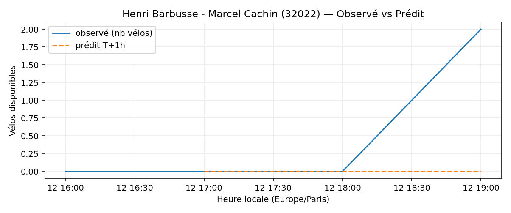
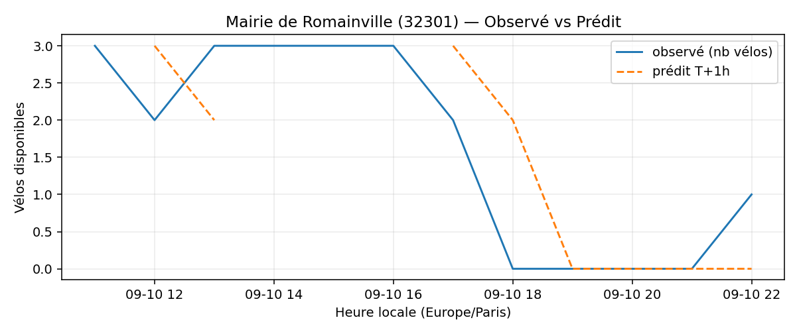
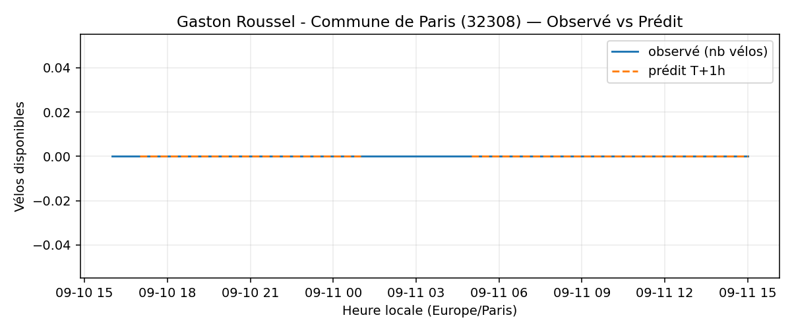
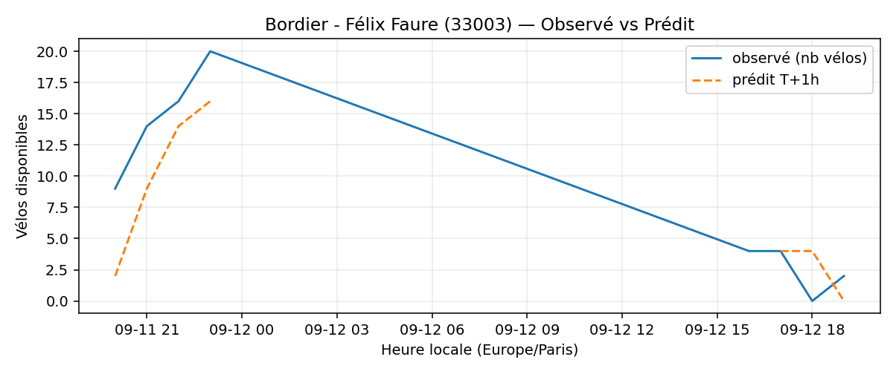

# Prévisions

*Dernière heure considérée : **12/09 19h** (Europe/Paris)*

## Top-10 stations à risque (faible nb vélos prévu T+1h)

| Station                                         |   Prédit T+1h (vélos) | Taux prévu   | Dernière obs.   |
|:------------------------------------------------|----------------------:|:-------------|:----------------|
| Pesaro - Préfecture (`92007`)                   |                     0 | 0.0%         | 12/09 19h       |
| Faubourg Poissonnière - Dunkerque (`9114`)      |                     0 | 0.0%         | 12/09 19h       |
| Nanterre - Université (`92004`)                 |                     0 | 0.0%         | 12/09 19h       |
| Vitruve - Davout (`20122`)                      |                     0 | 0.0%         | 12/09 19h       |
| Pierre et Marie Curie - Julien Grimau (`31702`) |                     0 | 0.0%         | 12/09 19h       |
| Romainville - Vaillant-Couturier (`31024`)      |                     0 | 0.0%         | 12/09 19h       |
| Henri Barbusse - Marcel Cachin (`32022`)        |                     0 | 0.0%         | 12/09 19h       |
| Mairie de Romainville (`32301`)                 |                     0 | 0.0%         | 12/09 19h       |
| Gaston Roussel - Commune de Paris (`32308`)     |                     0 | 0.0%         | 12/09 19h       |
| Bordier - Félix Faure (`33003`)                 |                     0 | 0.0%         | 12/09 19h       |

## Top-10 risque de saturation (taux prévu élevé)

| Station                                            |   Prédit T+1h (vélos) | Taux prévu   | Dernière obs.   |
|:---------------------------------------------------|----------------------:|:-------------|:----------------|
| BNF - Bibliothèque Nationale de France (`13123`)   |                    58 | 138.1%       | 12/09 19h       |
| Bercy - Villot (`12105`)                           |                    37 | 112.1%       | 12/09 19h       |
| Aristide Briand - Place de la Résistance (`21302`) |                    26 | 104.0%       | 12/09 19h       |
| Saint-Denis - Rivoli (`1003`)                      |                    44 | 102.3%       | 12/09 19h       |
| Lourmel - Marie Skobtsov (`15108`)                 |                    22 | 100.0%       | 12/09 19h       |
| Place de l'Hôtel de Ville (`4017`)                 |                    14 | 100.0%       | 12/09 19h       |
| Saint-Marcel - Hôpital (`13013`)                   |                    21 | 100.0%       | 12/09 19h       |
| Chausson - Gabriel Péri (`22301`)                  |                    22 | 100.0%       | 12/09 19h       |
| Place de l'Europe - Quai de Bercy (`42209`)        |                    17 | 100.0%       | 12/09 19h       |
| Charenton - Diderot (`12009`)                      |                    18 | 100.0%       | 12/09 19h       |

## Détails par station (graphiques)

???+ info "Pesaro - Préfecture (92007)"

    

???+ info "Faubourg Poissonnière - Dunkerque (9114)"

    

???+ info "Nanterre - Université (92004)"

    

???+ info "Vitruve - Davout (20122)"

    

???+ info "Pierre et Marie Curie - Julien Grimau (31702)"

    

???+ info "Romainville - Vaillant-Couturier (31024)"

    

???+ info "Henri Barbusse - Marcel Cachin (32022)"

    

???+ info "Mairie de Romainville (32301)"

    

???+ info "Gaston Roussel - Commune de Paris (32308)"

    

???+ info "Bordier - Félix Faure (33003)"

    

