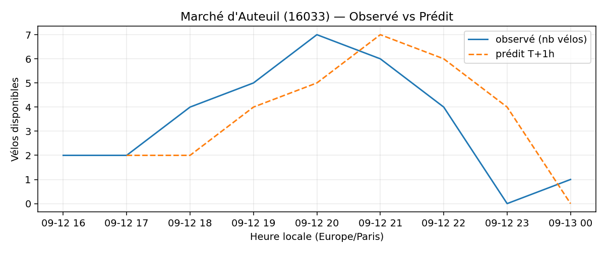

# Prévisions

*Dernière heure considérée : **13/09 00h** (Europe/Paris)*

## Top-10 stations à risque (faible nb vélos prévu T+1h)

| Station                                       |   Prédit T+1h (vélos) | Taux prévu   | Dernière obs.   |
|:----------------------------------------------|----------------------:|:-------------|:----------------|
| Grande Armée - Brunel (`17038`)               |                     0 | 0.0%         | 13/09 00h       |
| Porte de Saint-Ouen - Henri Huchard (`17124`) |                     0 | 0.0%         | 13/09 00h       |
| Square Louise Michel (`18006`)                |                     0 | 0.0%         | 13/09 00h       |
| Commandant Schloesing - Pétrarque (`16202`)   |                     0 | 0.0%         | 13/09 00h       |
| Sablons - Georges Mandel (`16108`)            |                     0 | 0.0%         | 13/09 00h       |
| Champs-Elysees - Bassano (`8116`)             |                     0 | 0.0%         | 13/09 00h       |
| Hoche - Tilsitt (`8057`)                      |                     0 | 0.0%         | 13/09 00h       |
| Porte de Ménilmontant (`20027`)               |                     0 | 0.0%         | 13/09 00h       |
| Porte de la Muette (`16019`)                  |                     0 | 0.0%         | 13/09 00h       |
| Marché d'Auteuil (`16033`)                    |                     0 | 0.0%         | 13/09 00h       |

## Top-10 risque de saturation (taux prévu élevé)

| Station                                            |   Prédit T+1h (vélos) | Taux prévu   | Dernière obs.   |
|:---------------------------------------------------|----------------------:|:-------------|:----------------|
| BNF - Bibliothèque Nationale de France (`13123`)   |                    59 | 140.5%       | 13/09 00h       |
| Bercy - Villot (`12105`)                           |                    38 | 115.2%       | 13/09 00h       |
| Westermeyer - Paul Vaillant-Couturier (`42004`)    |                    28 | 112.0%       | 13/09 00h       |
| Aristide Briand - Place de la Résistance (`21302`) |                    27 | 108.0%       | 13/09 00h       |
| Paul Doumer - Stalingrad (`41101`)                 |                    24 | 100.0%       | 13/09 00h       |
| Argenteuil - Voltaire (`26003`)                    |                    16 | 100.0%       | 13/09 00h       |
| Aboukir - Alexandrie (`2016`)                      |                    21 | 100.0%       | 13/09 00h       |
| Dominique Pado - Croix Nivert (`15050`)            |                    22 | 100.0%       | 13/09 00h       |
| Daumesnil - Picpus (`12010`)                       |                    21 | 100.0%       | 13/09 00h       |
| Gare d'Austerlitz - Quai Saint-Bernard (`13104`)   |                    27 | 100.0%       | 13/09 00h       |

## Détails par station (graphiques)

???+ info "Grande Armée - Brunel (17038)"

    

???+ info "Porte de Saint-Ouen - Henri Huchard (17124)"

    

???+ info "Square Louise Michel (18006)"

    

???+ info "Commandant Schloesing - Pétrarque (16202)"

    

???+ info "Sablons - Georges Mandel (16108)"

    

???+ info "Champs-Elysees - Bassano (8116)"

    

???+ info "Hoche - Tilsitt (8057)"

    

???+ info "Porte de Ménilmontant (20027)"

    

???+ info "Porte de la Muette (16019)"

    

???+ info "Marché d'Auteuil (16033)"

    

