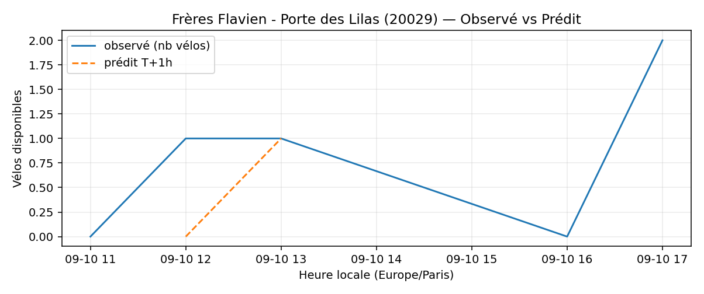
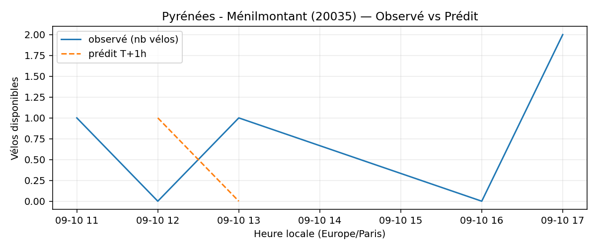
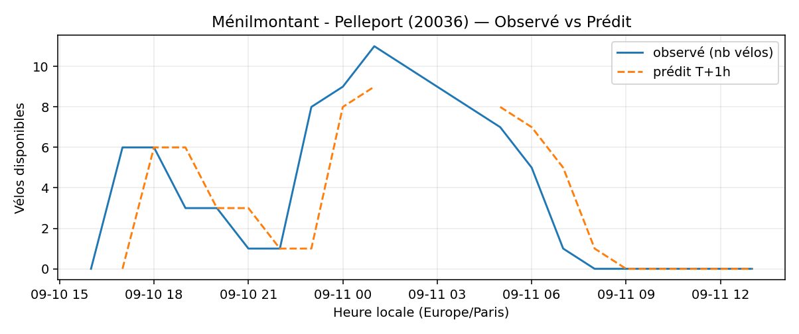
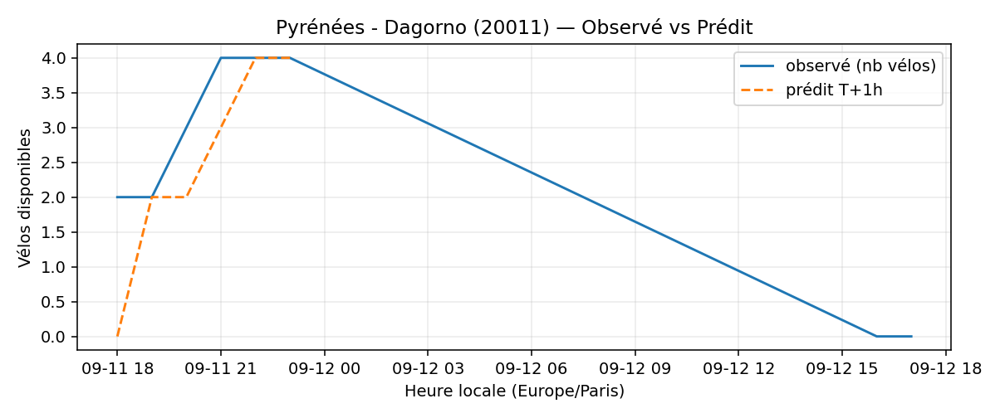
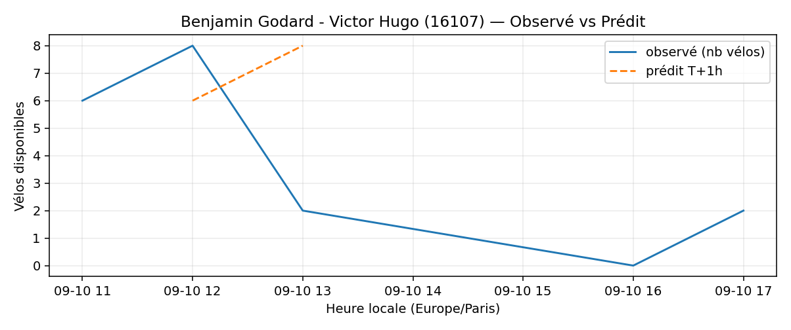
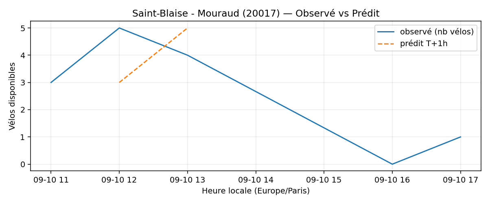

# Prévisions

*Dernière heure considérée : **10/09 17h** (Europe/Paris)*

## Top-10 stations à risque (faible nb vélos prévu T+1h)

| Station                                    |   Prédit T+1h (vélos) | Taux prévu   | Dernière obs.   |
|:-------------------------------------------|----------------------:|:-------------|:----------------|
| Nanterre - Université (`92004`)            |                     0 | 0.0%         | 10/09 17h       |
| Le Vau - Maurice Bertaux (`20103`)         |                     0 | 0.0%         | 10/09 17h       |
| Charonne - Avron (`20043`)                 |                     0 | 0.0%         | 10/09 17h       |
| Frères Flavien - Porte des Lilas (`20029`) |                     0 | 0.0%         | 10/09 17h       |
| Pyrénées - Ménilmontant (`20035`)          |                     0 | 0.0%         | 10/09 17h       |
| Ménilmontant - Pelleport (`20036`)         |                     0 | 0.0%         | 10/09 17h       |
| Pyrénées - Dagorno (`20011`)               |                     0 | 0.0%         | 10/09 17h       |
| Dupont de l'Eure - Gambetta (`20202`)      |                     0 | 0.0%         | 10/09 17h       |
| Benjamin Godard - Victor Hugo (`16107`)    |                     0 | 0.0%         | 10/09 17h       |
| Saint-Blaise - Mouraud (`20017`)           |                     0 | 0.0%         | 10/09 17h       |

## Top-10 risque de saturation (taux prévu élevé)

| Station                                          |   Prédit T+1h (vélos) | Taux prévu   | Dernière obs.   |
|:-------------------------------------------------|----------------------:|:-------------|:----------------|
| Enfants du Paradis - Peupliers (`21021`)         |                    64 | 160.0%       | 10/09 17h       |
| Place Balard (`15056`)                           |                    30 | 136.4%       | 10/09 17h       |
| Saint-Antoine Sévigné (`4010`)                   |                    28 | 107.7%       | 10/09 17h       |
| Sebastopol - Rambuteau (`4104`)                  |                    17 | 106.2%       | 10/09 17h       |
| BNF - Bibliothèque Nationale de France (`13123`) |                    44 | 104.8%       | 10/09 17h       |
| Gare Saint-Lazare - Cour du Havre (`8002`)       |                    45 | 100.0%       | 10/09 17h       |
| Madeleine Vionnet (`33019`)                      |                    34 | 100.0%       | 10/09 17h       |
| Belfort - Victor Hugo (`21119`)                  |                    24 | 100.0%       | 10/09 17h       |
| Belleville -  Pré Saint-Gervais (`19121`)        |                    21 | 100.0%       | 10/09 17h       |
| Montmartre - Etienne Marcel (`2005`)             |                    16 | 100.0%       | 10/09 17h       |

## Détails par station (graphiques)

<strong>Nanterre - Université (92004)</strong>

<strong>Le Vau - Maurice Bertaux (20103)</strong>

<strong>Charonne - Avron (20043)</strong>

<strong>Frères Flavien - Porte des Lilas (20029)</strong>

<strong>Pyrénées - Ménilmontant (20035)</strong>

<strong>Ménilmontant - Pelleport (20036)</strong>

<strong>Pyrénées - Dagorno (20011)</strong>

<strong>Dupont de l'Eure - Gambetta (20202)</strong>

<strong>Benjamin Godard - Victor Hugo (16107)</strong>

<strong>Saint-Blaise - Mouraud (20017)</strong>

