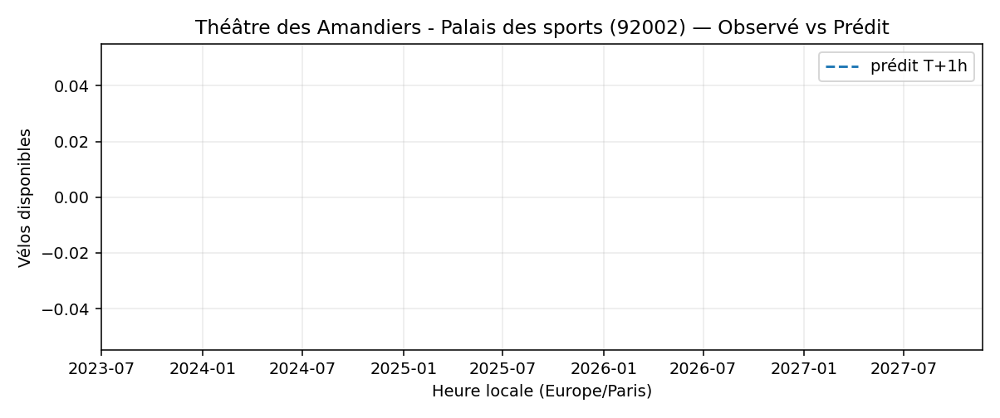
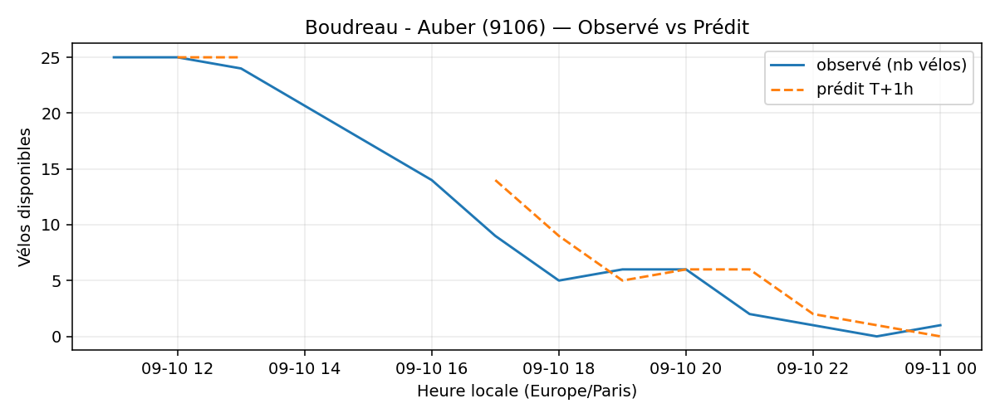
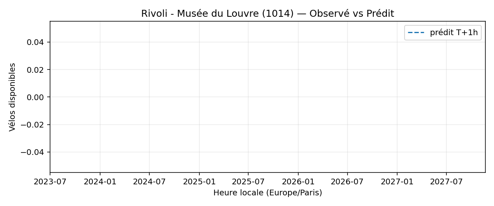
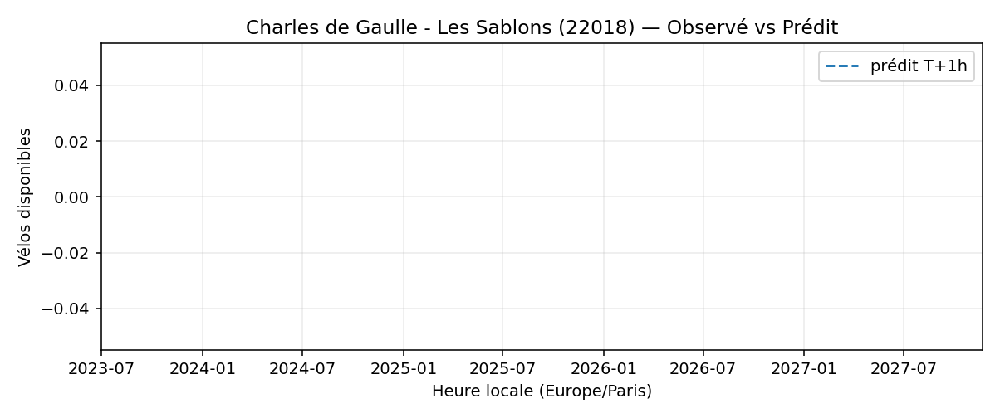
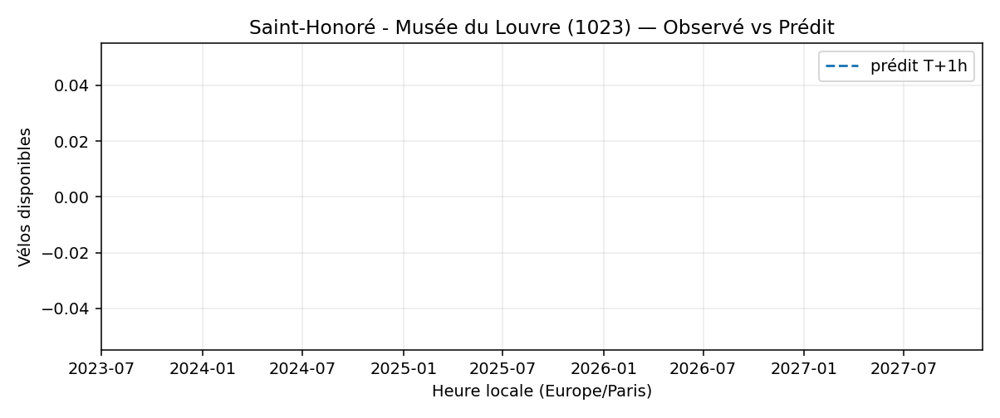

# Prévisions

*Dernière heure considérée : **10/09 01h** (Europe/Paris)*

## Top-10 stations à risque (faible nb vélos prévu T+1h)

| Station                                             |   Prédit T+1h (vélos) | Taux prévu   | Dernière obs.   |
|:----------------------------------------------------|----------------------:|:-------------|:----------------|
| Nanterre - Université (`92004`)                     |                     0 | —            | 10/09 01h       |
| Théâtre des Amandiers - Palais des sports (`92002`) |                     0 | —            | 10/09 01h       |
| Pesaro - Préfecture (`92007`)                       |                     0 | —            | 10/09 01h       |
| Boudreau - Auber (`9106`)                           |                     0 | —            | 10/09 01h       |
| Rivoli - Musée du Louvre (`1014`)                   |                     0 | —            | 10/09 01h       |
| Charles de Gaulle (`22019`)                         |                     0 | —            | 10/09 01h       |
| Charles Robin - Grange aux Belles (`10207`)         |                     0 | —            | 10/09 01h       |
| Charles de Gaulle - Les Sablons (`22018`)           |                     0 | —            | 10/09 01h       |
| Commandant Schloesing - Pétrarque (`16202`)         |                     0 | —            | 10/09 01h       |
| Saint-Honoré - Musée du Louvre (`1023`)             |                     0 | —            | 10/09 01h       |

## Top-10 risque de saturation (taux prévu élevé)

| Station                                           |   Prédit T+1h (vélos) | Taux prévu   | Dernière obs.   |
|:--------------------------------------------------|----------------------:|:-------------|:----------------|
| Hauteville - Bonne Nouvelle (`10003`)             |                     4 | —            | 10/09 01h       |
| Metz - Faubourg Saint-Denis (`10004`)             |                    20 | —            | 10/09 01h       |
| Petites Ecuries - Faubourg Poissonnière (`10005`) |                     7 | —            | 10/09 01h       |
| Petites Ecuries - Faubourg Saint-Denis (`10006`)  |                    13 | —            | 10/09 01h       |
| Cité Riverin - Château d'Eau (`10008`)            |                     7 | —            | 10/09 01h       |
| Mairie du 10ème (`10009`)                         |                    11 | —            | 10/09 01h       |
| Quai de l'Horloge - Pont Neuf (`1001`)            |                     3 | —            | 10/09 01h       |
| Place Jacques Bonsergent (`10010`)                |                    10 | —            | 10/09 01h       |
| Bourse du Travail (`10011`)                       |                     6 | —            | 10/09 01h       |
| Vinaigriers - Magenta (`10012`)                   |                     9 | —            | 10/09 01h       |

## Détails par station (graphiques)

???+ info "Nanterre - Université (92004)"

    

???+ info "Théâtre des Amandiers - Palais des sports (92002)"

    

???+ info "Pesaro - Préfecture (92007)"

    

???+ info "Boudreau - Auber (9106)"

    

???+ info "Rivoli - Musée du Louvre (1014)"

    

???+ info "Charles de Gaulle (22019)"

    

???+ info "Charles Robin - Grange aux Belles (10207)"

    

???+ info "Charles de Gaulle - Les Sablons (22018)"

    

???+ info "Commandant Schloesing - Pétrarque (16202)"

    

???+ info "Saint-Honoré - Musée du Louvre (1023)"

    

