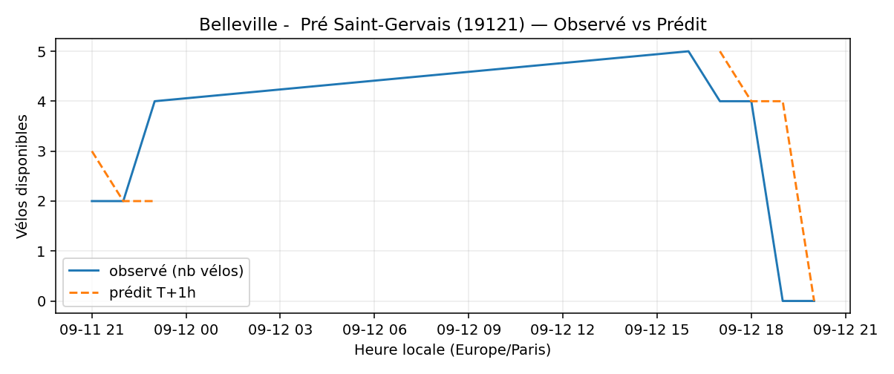
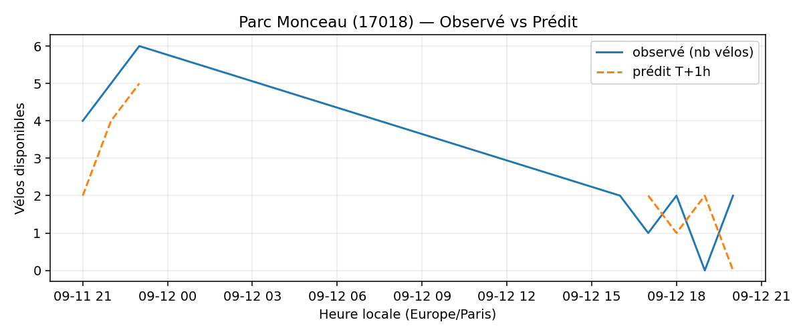
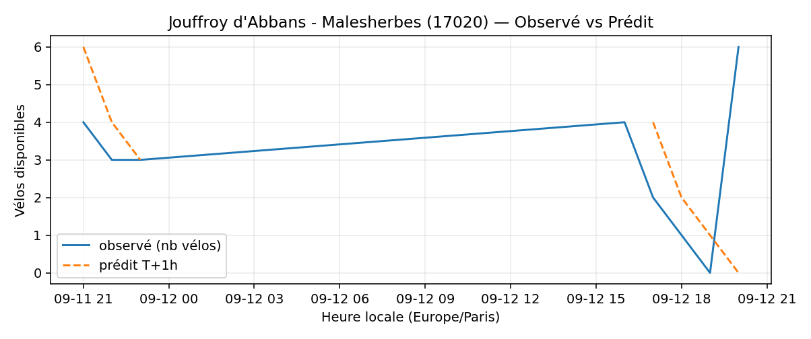
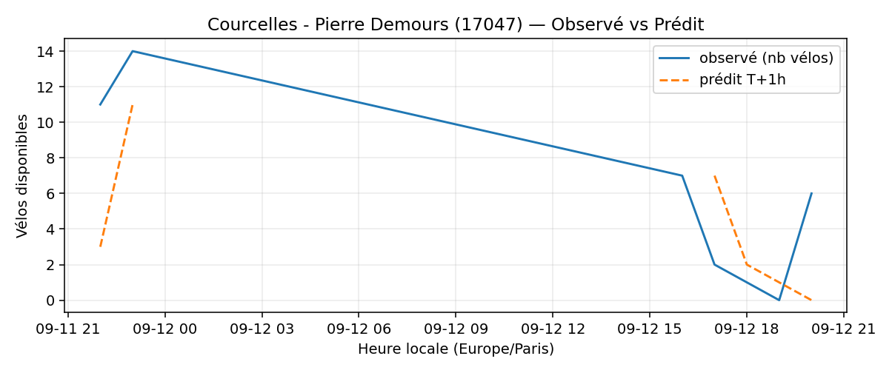
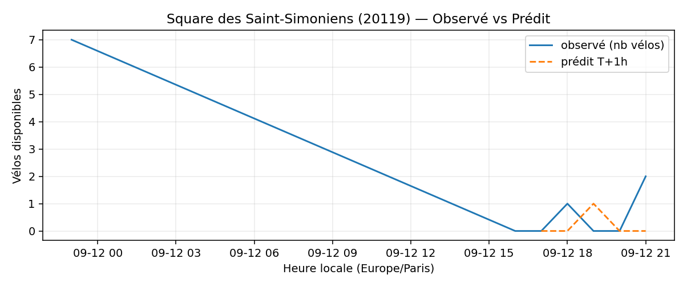
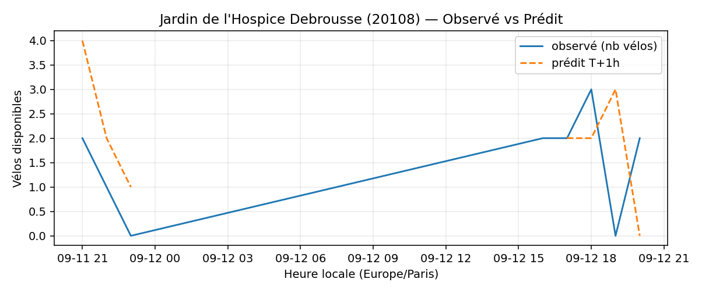

# Prévisions

*Dernière heure considérée : **12/09 20h** (Europe/Paris)*

## Top-10 stations à risque (faible nb vélos prévu T+1h)

| Station                                     |   Prédit T+1h (vélos) | Taux prévu   | Dernière obs.   |
|:--------------------------------------------|----------------------:|:-------------|:----------------|
| Belleville -  Pré Saint-Gervais (`19121`)   |                     0 | 0.0%         | 12/09 20h       |
| Hoche - Tilsitt (`8057`)                    |                     0 | 0.0%         | 12/09 20h       |
| Lieutenant Chauré - Etienne Marey (`20134`) |                     0 | 0.0%         | 12/09 20h       |
| Parc Monceau (`17018`)                      |                     0 | 0.0%         | 12/09 20h       |
| Jouffroy d'Abbans - Malesherbes (`17020`)   |                     0 | 0.0%         | 12/09 20h       |
| Courcelles - Pierre Demours (`17047`)       |                     0 | 0.0%         | 12/09 20h       |
| Commandant Schloesing - Pétrarque (`16202`) |                     0 | 0.0%         | 12/09 20h       |
| Square des Saint-Simoniens (`20119`)        |                     0 | 0.0%         | 12/09 20h       |
| Porte de la Muette (`16019`)                |                     0 | 0.0%         | 12/09 20h       |
| Jardin de l'Hospice Debrousse (`20108`)     |                     0 | 0.0%         | 12/09 20h       |

## Top-10 risque de saturation (taux prévu élevé)

| Station                                            |   Prédit T+1h (vélos) | Taux prévu   | Dernière obs.   |
|:---------------------------------------------------|----------------------:|:-------------|:----------------|
| BNF - Bibliothèque Nationale de France (`13123`)   |                    57 | 135.7%       | 12/09 20h       |
| Aristide Briand - Place de la Résistance (`21302`) |                    27 | 108.0%       | 12/09 20h       |
| Bercy - Villot (`12105`)                           |                    33 | 100.0%       | 12/09 20h       |
| Place du 17 Octobre (`22306`)                      |                    20 | 100.0%       | 12/09 20h       |
| Aboukir - Alexandrie (`2016`)                      |                    21 | 100.0%       | 12/09 20h       |
| Gare d'Austerlitz - Quai Saint-Bernard (`13104`)   |                    27 | 100.0%       | 12/09 20h       |
| Gare Saint-Lazare - Isly (`8009`)                  |                    27 | 100.0%       | 12/09 20h       |
| Saint-Denis - Rivoli (`1003`)                      |                    42 | 97.7%        | 12/09 20h       |
| Buffon - Jardin des Plantes (`5115`)               |                    29 | 96.7%        | 12/09 20h       |
| Charenton - Prague (`12101`)                       |                    25 | 96.2%        | 12/09 20h       |

## Détails par station (graphiques)

???+ info "Belleville -  Pré Saint-Gervais (19121)"

    

???+ info "Hoche - Tilsitt (8057)"

    

???+ info "Lieutenant Chauré - Etienne Marey (20134)"

    

???+ info "Parc Monceau (17018)"

    

???+ info "Jouffroy d'Abbans - Malesherbes (17020)"

    

???+ info "Courcelles - Pierre Demours (17047)"

    

???+ info "Commandant Schloesing - Pétrarque (16202)"

    

???+ info "Square des Saint-Simoniens (20119)"

    

???+ info "Porte de la Muette (16019)"

    

???+ info "Jardin de l'Hospice Debrousse (20108)"

    

