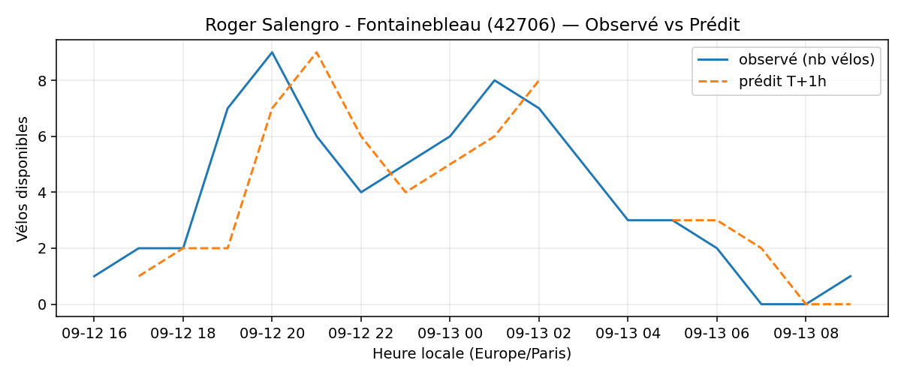

# Prévisions

*Dernière heure considérée : **13/09 09h** (Europe/Paris)*

## Top-10 stations à risque (faible nb vélos prévu T+1h)

| Station                                     |   Prédit T+1h (vélos) | Taux prévu   | Dernière obs.   |
|:--------------------------------------------|----------------------:|:-------------|:----------------|
| De Gaulle - Moulin (`28002`)                |                     0 | 0.0%         | 13/09 09h       |
| Boissière - Etienne Dolet (`31102`)         |                     0 | 0.0%         | 13/09 09h       |
| Henri Barbusse (`31203`)                    |                     0 | 0.0%         | 13/09 09h       |
| Gaston Roussel - Commune de Paris (`32308`) |                     0 | 0.0%         | 13/09 09h       |
| Roger Salengro - Fontainebleau (`42706`)    |                     0 | 0.0%         | 13/09 09h       |
| Place Aimé Césaire (`21402`)                |                     0 | 0.0%         | 13/09 09h       |
| Charles de Gaulle (`22019`)                 |                     0 | 0.0%         | 13/09 09h       |
| Parc André Citroën (`15059`)                |                     0 | 0.0%         | 13/09 09h       |
| Place des Ardoines (`44018`)                |                     0 | 0.0%         | 13/09 09h       |
| Jean Calvin - Tournefort (`5014`)           |                     0 | 0.0%         | 13/09 09h       |

## Top-10 risque de saturation (taux prévu élevé)

| Station                                            |   Prédit T+1h (vélos) | Taux prévu   | Dernière obs.   |
|:---------------------------------------------------|----------------------:|:-------------|:----------------|
| Westermeyer - Paul Vaillant-Couturier (`42004`)    |                    42 | 168.0%       | 13/09 09h       |
| Aristide Briand - Place de la Résistance (`21302`) |                    34 | 136.0%       | 13/09 09h       |
| Port - Maurice Chevalier (`41304`)                 |                    31 | 103.3%       | 13/09 09h       |
| Roquette - Auguste Laurent (`11022`)               |                    16 | 100.0%       | 13/09 09h       |
| Place Jacques Madaule (`21305`)                    |                    25 | 100.0%       | 13/09 09h       |
| Porte de Versailles (`15203`)                      |                    28 | 100.0%       | 13/09 09h       |
| Liberté - Vert-de-Maisons (`47007`)                |                    20 | 100.0%       | 13/09 09h       |
| Cadix - Hameau (`15128`)                           |                    36 | 97.3%        | 13/09 09h       |
| Quai Jules Guesde - Saint-Simon (`44001`)          |                    29 | 96.7%        | 13/09 09h       |
| Gare de la Garenne-Colombes (`27004`)              |                    27 | 96.4%        | 13/09 09h       |

## Détails par station (graphiques)

???+ info "De Gaulle - Moulin (28002)"

    

???+ info "Boissière - Etienne Dolet (31102)"

    

???+ info "Henri Barbusse (31203)"

    

???+ info "Gaston Roussel - Commune de Paris (32308)"

    

???+ info "Roger Salengro - Fontainebleau (42706)"

    

???+ info "Place Aimé Césaire (21402)"

    

???+ info "Charles de Gaulle (22019)"

    

???+ info "Parc André Citroën (15059)"

    

???+ info "Place des Ardoines (44018)"

    

???+ info "Jean Calvin - Tournefort (5014)"

    

