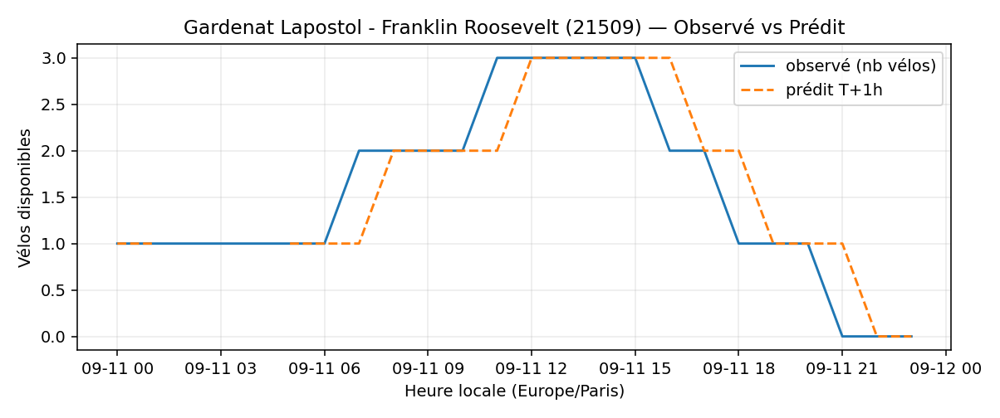
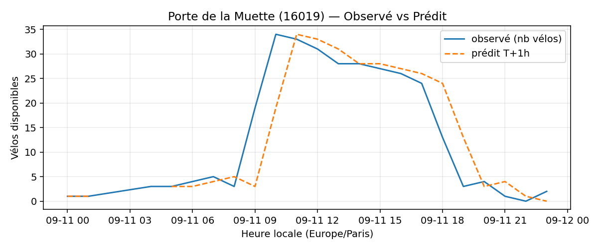
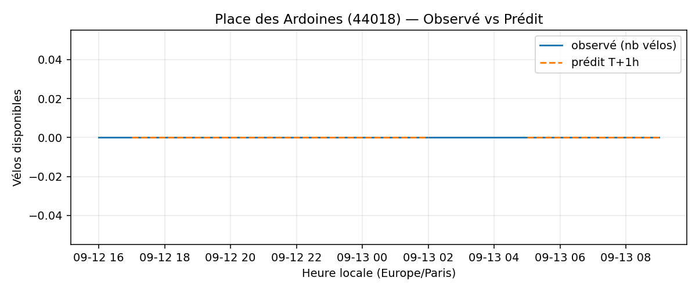
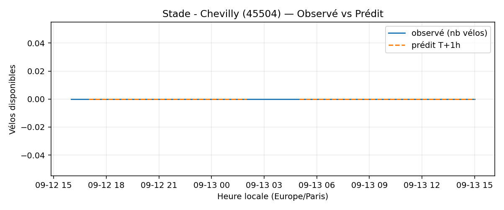

# Prévisions

*Dernière heure considérée : **11/09 23h** (Europe/Paris)*

## Top-10 stations à risque (faible nb vélos prévu T+1h)

| Station                                          |   Prédit T+1h (vélos) | Taux prévu   | Dernière obs.   |
|:-------------------------------------------------|----------------------:|:-------------|:----------------|
| Place du 14 Juillet (`22408`)                    |                     0 | 0.0%         | 11/09 23h       |
| Vivienne - Petits Champs (`2201`)                |                     0 | 0.0%         | 11/09 23h       |
| Charles Robin - Grange aux Belles (`10207`)      |                     0 | 0.0%         | 11/09 23h       |
| Gardenat Lapostol - Franklin Roosevelt (`21509`) |                     0 | 0.0%         | 11/09 23h       |
| Sablons - Georges Mandel (`16108`)               |                     0 | 0.0%         | 11/09 23h       |
| Commandant Schloesing - Pétrarque (`16202`)      |                     0 | 0.0%         | 11/09 23h       |
| La Jarry - Place Diderot (`43010`)               |                     0 | 0.0%         | 11/09 23h       |
| Porte de la Muette (`16019`)                     |                     0 | 0.0%         | 11/09 23h       |
| Place des Ardoines (`44018`)                     |                     0 | 0.0%         | 11/09 23h       |
| Stade - Chevilly (`45504`)                       |                     0 | 0.0%         | 11/09 23h       |

## Top-10 risque de saturation (taux prévu élevé)

| Station                                            |   Prédit T+1h (vélos) | Taux prévu   | Dernière obs.   |
|:---------------------------------------------------|----------------------:|:-------------|:----------------|
| Westermeyer - Paul Vaillant-Couturier (`42004`)    |                    34 | 136.0%       | 11/09 23h       |
| BNF - Bibliothèque Nationale de France (`13123`)   |                    48 | 114.3%       | 11/09 23h       |
| Aristide Briand - Place de la Résistance (`21302`) |                    28 | 112.0%       | 11/09 23h       |
| Oratoire - Rivoli (`1025`)                         |                    18 | 100.0%       | 11/09 23h       |
| Convention - Lourmel (`15062`)                     |                    36 | 100.0%       | 11/09 23h       |
| Boutroux - Porte de Vitry (`13047`)                |                    49 | 100.0%       | 11/09 23h       |
| Hôtel de Ville de Sèvres (`23102`)                 |                    31 | 96.9%        | 11/09 23h       |
| Gare - Aristide Briand (`21329`)                   |                    28 | 96.6%        | 11/09 23h       |
| Quai Marcel Boyer - Victor Hugo (`42011`)          |                    28 | 96.6%        | 11/09 23h       |
| Quai de Sèvres - Manufacture Nationale (`23104`)   |                    27 | 96.4%        | 11/09 23h       |

## Détails par station (graphiques)

???+ info "Place du 14 Juillet (22408)"

    

???+ info "Vivienne - Petits Champs (2201)"

    

???+ info "Charles Robin - Grange aux Belles (10207)"

    

???+ info "Gardenat Lapostol - Franklin Roosevelt (21509)"

    

???+ info "Sablons - Georges Mandel (16108)"

    

???+ info "Commandant Schloesing - Pétrarque (16202)"

    

???+ info "La Jarry - Place Diderot (43010)"

    

???+ info "Porte de la Muette (16019)"

    

???+ info "Place des Ardoines (44018)"

    

???+ info "Stade - Chevilly (45504)"

    

