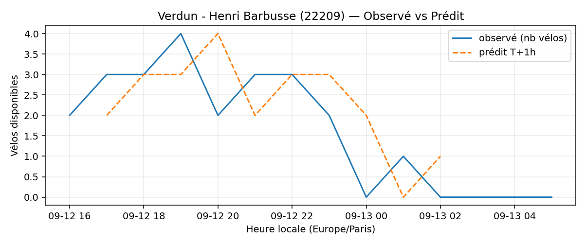

# Prévisions

*Dernière heure considérée : **13/09 06h** (Europe/Paris)*

## Top-10 stations à risque (faible nb vélos prévu T+1h)

| Station                                     |   Prédit T+1h (vélos) | Taux prévu   | Dernière obs.   |
|:--------------------------------------------|----------------------:|:-------------|:----------------|
| Rossini - Laffitte (`9022`)                 |                     0 | 0.0%         | 13/09 06h       |
| De Gaulle - Moulin (`28002`)                |                     0 | 0.0%         | 13/09 06h       |
| Henri Barbusse (`31203`)                    |                     0 | 0.0%         | 13/09 06h       |
| Boissière - Etienne Dolet (`31102`)         |                     0 | 0.0%         | 13/09 06h       |
| Place des Fêtes - Solitaires (`19210`)      |                     0 | 0.0%         | 13/09 06h       |
| Octave Feuillet - Albéric Magnard (`16110`) |                     0 | 0.0%         | 13/09 06h       |
| Champs-Elysees - Bassano (`8116`)           |                     0 | 0.0%         | 13/09 06h       |
| Verdun - Henri Barbusse (`22209`)           |                     0 | 0.0%         | 13/09 06h       |
| Commandant Schloesing - Pétrarque (`16202`) |                     0 | 0.0%         | 13/09 06h       |
| La Jarry - Place Diderot (`43010`)          |                     0 | 0.0%         | 13/09 06h       |

## Top-10 risque de saturation (taux prévu élevé)

| Station                                            |   Prédit T+1h (vélos) | Taux prévu   | Dernière obs.   |
|:---------------------------------------------------|----------------------:|:-------------|:----------------|
| Westermeyer - Paul Vaillant-Couturier (`42004`)    |                    42 | 168.0%       | 13/09 06h       |
| Aristide Briand - Place de la Résistance (`21302`) |                    35 | 140.0%       | 13/09 06h       |
| Daumesnil - Picpus (`12010`)                       |                    25 | 119.0%       | 13/09 06h       |
| Abbé Groult - Convention (`15039`)                 |                    14 | 116.7%       | 13/09 06h       |
| Place Charles Vallin (`15122`)                     |                    28 | 107.7%       | 13/09 06h       |
| Port - Maurice Chevalier (`41304`)                 |                    31 | 103.3%       | 13/09 06h       |
| Balard - Montagne de la Fage (`15070`)             |                    36 | 100.0%       | 13/09 06h       |
| Blanqui - Docteur Bauer (`34013`)                  |                    28 | 100.0%       | 13/09 06h       |
| Lourmel - Marie Skobtsov (`15108`)                 |                    22 | 100.0%       | 13/09 06h       |
| Riquet - Marx Dormoy (`18010`)                     |                    36 | 100.0%       | 13/09 06h       |

## Détails par station (graphiques)

???+ info "Rossini - Laffitte (9022)"

    

???+ info "De Gaulle - Moulin (28002)"

    

???+ info "Henri Barbusse (31203)"

    

???+ info "Boissière - Etienne Dolet (31102)"

    

???+ info "Place des Fêtes - Solitaires (19210)"

    

???+ info "Octave Feuillet - Albéric Magnard (16110)"

    

???+ info "Champs-Elysees - Bassano (8116)"

    

???+ info "Verdun - Henri Barbusse (22209)"

    

???+ info "Commandant Schloesing - Pétrarque (16202)"

    

???+ info "La Jarry - Place Diderot (43010)"

    

