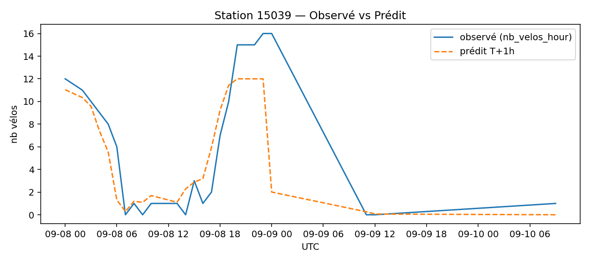
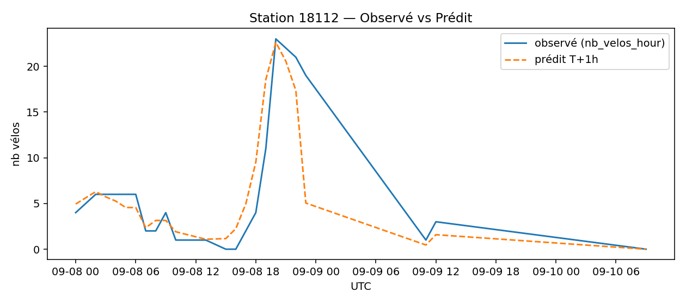
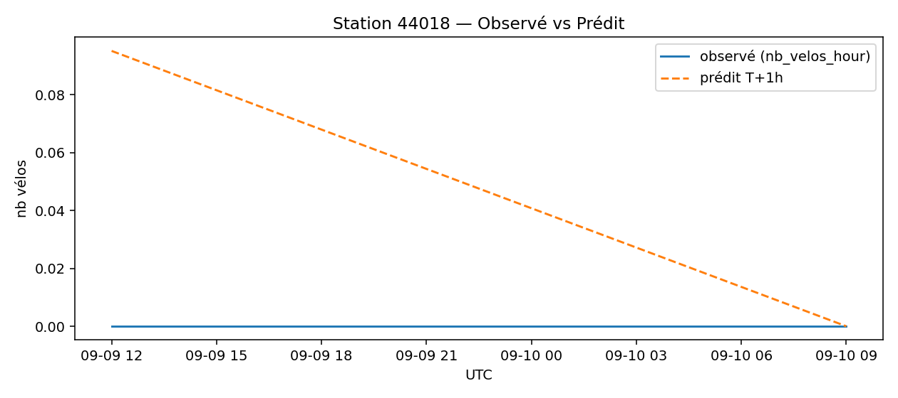
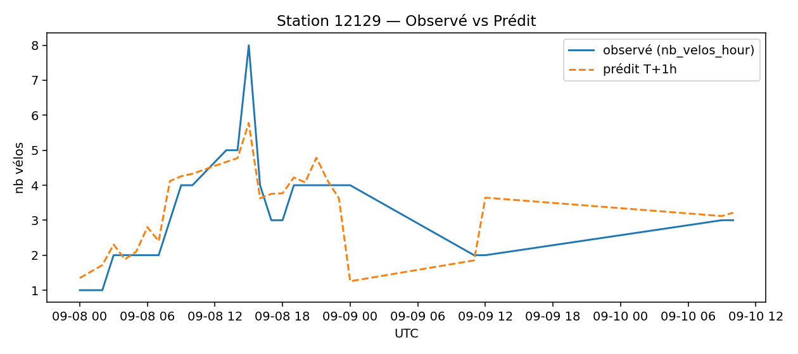
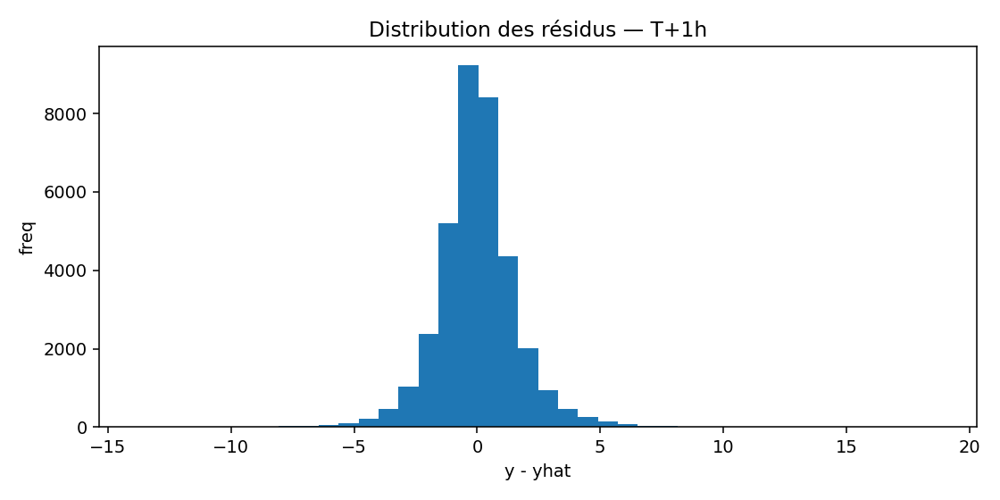

# Prévisions
**Échéance la plus récente** : `2025-09-10 09:00:00` (UTC)

## Top-10 stations à risque (faible nb vélos prévu T+1h)

| station | y_nb_pred | occ_ratio_pred |
|---|---:|---:|
| `15039` | 0 | 0.00 |
| `18112` | 0 | 0.00 |
| `44018` | 0 | 0.00 |
| `20035` | 0 | 0.00 |
| `20027` | 0 | 0.00 |
| `20019` | 0 | 0.00 |
| `15047` | 0 | 0.00 |
| `15041` | 0 | 0.00 |
| `16108` | 0 | 0.00 |
| `18137` | 0 | 0.00 |

## Observé vs Prédit (échantillon)

### Station `15039`

### Station `18112`

### Station `44018`

### Station `42503`

### Station `12129`

## Qualité (in-sample, ordre de grandeur)
- MAE ≈ **1.15** vélos — RMSE ≈ **1.63** vélos

## Importance des variables

> Remarque : ces métriques sont in-sample (à raffiner avec une validation temporelle TSSplit).