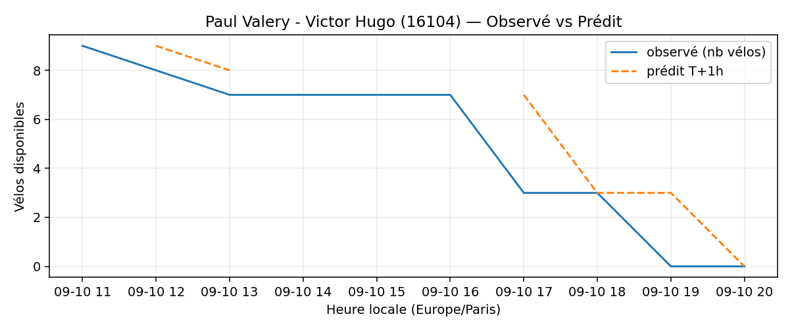
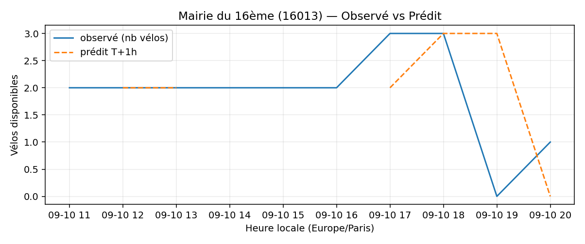
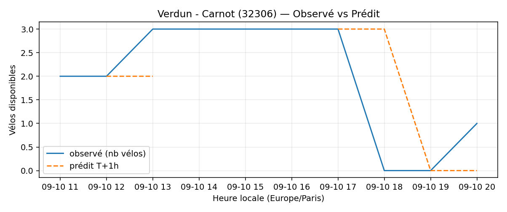

# Prévisions

*Dernière heure considérée : **10/09 20h** (Europe/Paris)*

## Top-10 stations à risque (faible nb vélos prévu T+1h)

| Station                                     |   Prédit T+1h (vélos) | Taux prévu   | Dernière obs.   |
|:--------------------------------------------|----------------------:|:-------------|:----------------|
| Charles Robin - Grange aux Belles (`10207`) |                     0 | 0.0%         | 10/09 20h       |
| Henri Barbusse (`31203`)                    |                     0 | 0.0%         | 10/09 20h       |
| De Gaulle - Moulin (`28002`)                |                     0 | 0.0%         | 10/09 20h       |
| Paul Valery - Victor Hugo (`16104`)         |                     0 | 0.0%         | 10/09 20h       |
| Flandrin - Henri Martin (`16018`)           |                     0 | 0.0%         | 10/09 20h       |
| Mairie du 16ème (`16013`)                   |                     0 | 0.0%         | 10/09 20h       |
| Verdun - Carnot (`32306`)                   |                     0 | 0.0%         | 10/09 20h       |
| Mairie de Romainville (`32301`)             |                     0 | 0.0%         | 10/09 20h       |
| Place des Ardoines (`44018`)                |                     0 | 0.0%         | 10/09 20h       |
| Division Leclerc - Kléber (`23203`)         |                     0 | 0.0%         | 10/09 20h       |

## Top-10 risque de saturation (taux prévu élevé)

| Station                                     |   Prédit T+1h (vélos) | Taux prévu   | Dernière obs.   |
|:--------------------------------------------|----------------------:|:-------------|:----------------|
| Félix Faure - Convention (`15069`)          |                    44 | 100.0%       | 10/09 20h       |
| Les Planètes (`47008`)                      |                    21 | 100.0%       | 10/09 20h       |
| Aboukir - Alexandrie (`2016`)               |                    21 | 100.0%       | 10/09 20h       |
| Belleville - Pyrénées (`19041`)             |                    42 | 100.0%       | 10/09 20h       |
| Square Emile - Chautemps (`3012`)           |                    25 | 100.0%       | 10/09 20h       |
| Place de l'Europe - Quai de Bercy (`42209`) |                    17 | 100.0%       | 10/09 20h       |
| Gare du Stade (`27005`)                     |                    20 | 100.0%       | 10/09 20h       |
| Gare RER - Général de Gaulle (`22302`)      |                    40 | 97.6%        | 10/09 20h       |
| Convention - Lourmel (`15062`)              |                    35 | 97.2%        | 10/09 20h       |
| Temple - Jean-Pierre Timbaud (`11040`)      |                    35 | 97.2%        | 10/09 20h       |

## Détails par station (graphiques)

???+ info "Charles Robin - Grange aux Belles (10207)"

    

???+ info "Henri Barbusse (31203)"

    

???+ info "De Gaulle - Moulin (28002)"

    

???+ info "Paul Valery - Victor Hugo (16104)"

    

???+ info "Flandrin - Henri Martin (16018)"

    

???+ info "Mairie du 16ème (16013)"

    

???+ info "Verdun - Carnot (32306)"

    

???+ info "Mairie de Romainville (32301)"

    

???+ info "Place des Ardoines (44018)"

    

???+ info "Division Leclerc - Kléber (23203)"

    

