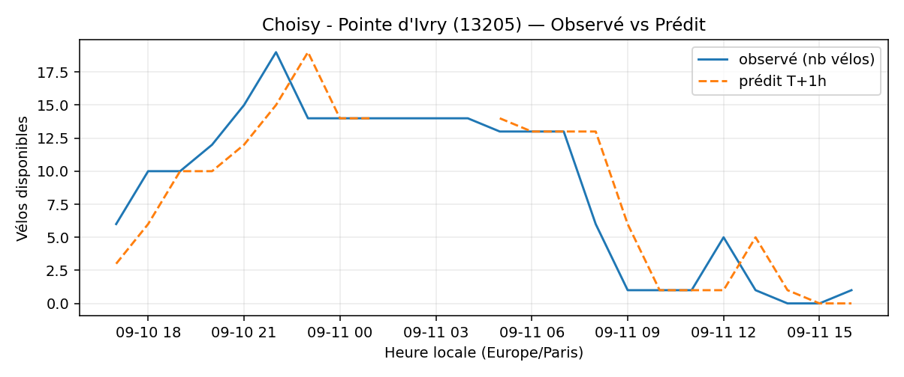
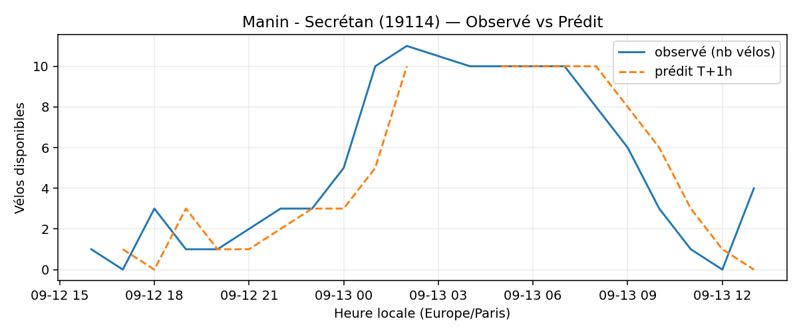
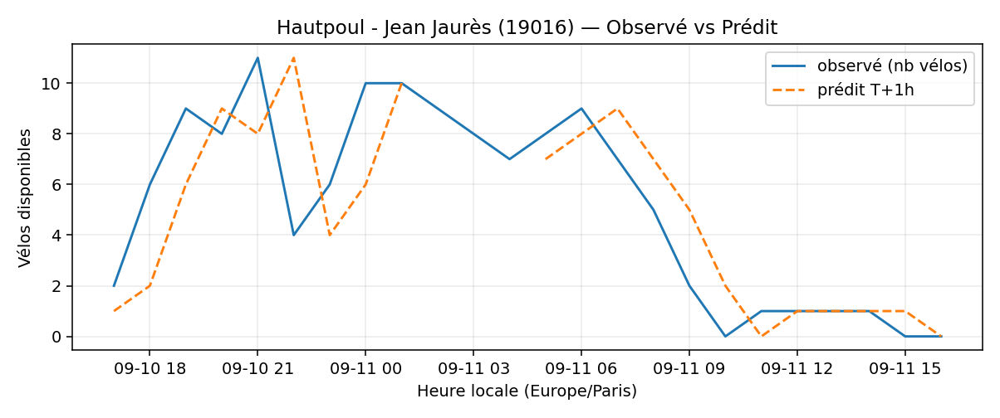
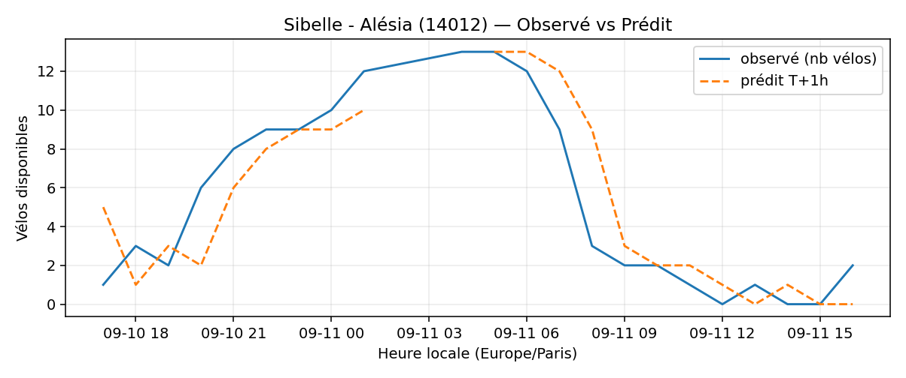

# Prévisions

*Dernière heure considérée : **11/09 16h** (Europe/Paris)*

## Top-10 stations à risque (faible nb vélos prévu T+1h)

| Station                                         |   Prédit T+1h (vélos) | Taux prévu   | Dernière obs.   |
|:------------------------------------------------|----------------------:|:-------------|:----------------|
| Nanterre - Université (`92004`)                 |                     0 | 0.0%         | 11/09 16h       |
| Pierre et Marie Curie - Julien Grimau (`31702`) |                     0 | 0.0%         | 11/09 16h       |
| Champs-Elysees - Bassano (`8116`)               |                     0 | 0.0%         | 11/09 16h       |
| Charles Robin - Grange aux Belles (`10207`)     |                     0 | 0.0%         | 11/09 16h       |
| Londres - Europe (`8202`)                       |                     0 | 0.0%         | 11/09 16h       |
| Choisy - Pointe d'Ivry (`13205`)                |                     0 | 0.0%         | 11/09 16h       |
| Manin - Secrétan (`19114`)                      |                     0 | 0.0%         | 11/09 16h       |
| Hautpoul - Jean Jaurès (`19016`)                |                     0 | 0.0%         | 11/09 16h       |
| Sibelle - Alésia (`14012`)                      |                     0 | 0.0%         | 11/09 16h       |
| Poissonniers - Nord (`18137`)                   |                     0 | 0.0%         | 11/09 16h       |

## Top-10 risque de saturation (taux prévu élevé)

| Station                                          |   Prédit T+1h (vélos) | Taux prévu   | Dernière obs.   |
|:-------------------------------------------------|----------------------:|:-------------|:----------------|
| Enfants du Paradis - Peupliers (`21021`)         |                    71 | 177.5%       | 11/09 16h       |
| Tremblay - Lac des Minimes (`12127`)             |                    67 | 139.6%       | 11/09 16h       |
| BNF - Bibliothèque Nationale de France (`13123`) |                    58 | 138.1%       | 11/09 16h       |
| Place Balard (`15056`)                           |                    28 | 127.3%       | 11/09 16h       |
| Bercy - Villot (`12105`)                         |                    40 | 121.2%       | 11/09 16h       |
| Madeleine Vionnet (`33019`)                      |                    41 | 120.6%       | 11/09 16h       |
| Place du Moulin de Javel (`15058`)               |                    52 | 115.6%       | 11/09 16h       |
| Saint-Antoine Sévigné (`4010`)                   |                    30 | 115.4%       | 11/09 16h       |
| Malesherbes - Place de la Madeleine (`8004`)     |                    75 | 111.9%       | 11/09 16h       |
| Caumartin - Provence (`9104`)                    |                    22 | 100.0%       | 11/09 16h       |

## Détails par station (graphiques)

???+ info "Nanterre - Université (92004)"

    

???+ info "Pierre et Marie Curie - Julien Grimau (31702)"

    

???+ info "Champs-Elysees - Bassano (8116)"

    

???+ info "Charles Robin - Grange aux Belles (10207)"

    

???+ info "Londres - Europe (8202)"

    

???+ info "Choisy - Pointe d'Ivry (13205)"

    

???+ info "Manin - Secrétan (19114)"

    

???+ info "Hautpoul - Jean Jaurès (19016)"

    

???+ info "Sibelle - Alésia (14012)"

    

???+ info "Poissonniers - Nord (18137)"

    

