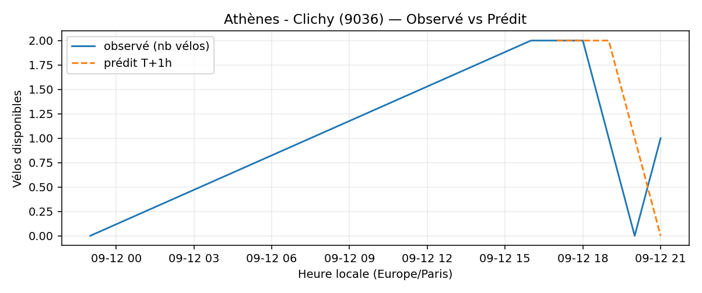
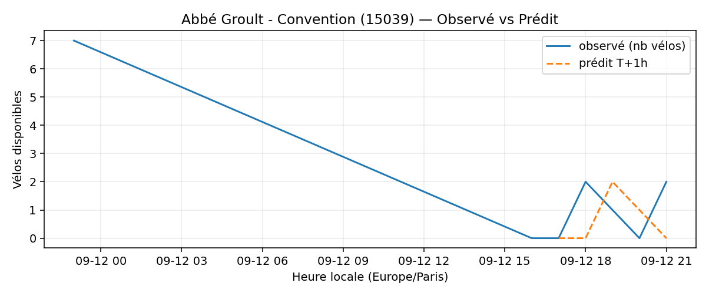
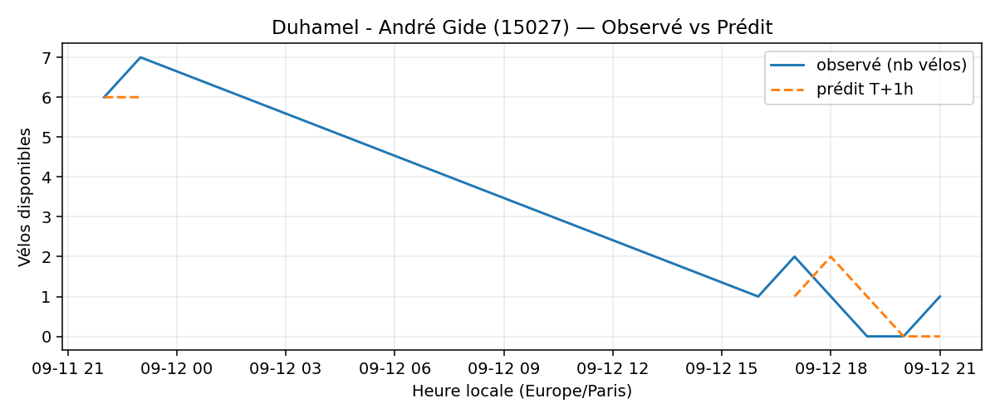
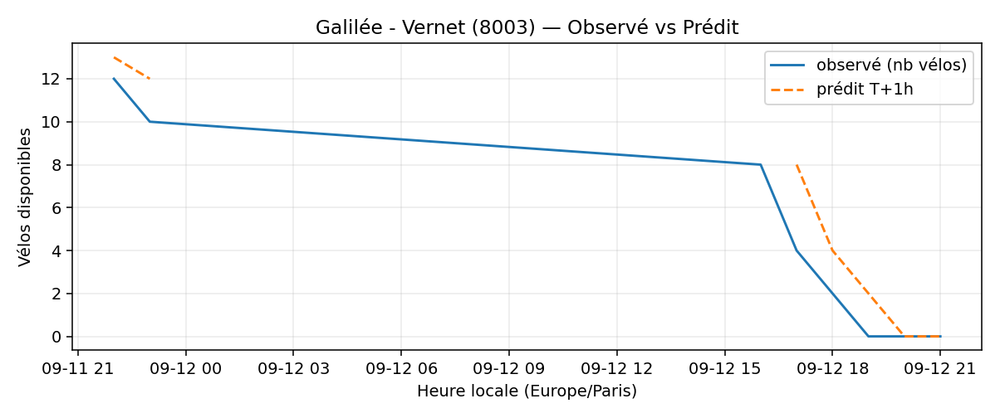
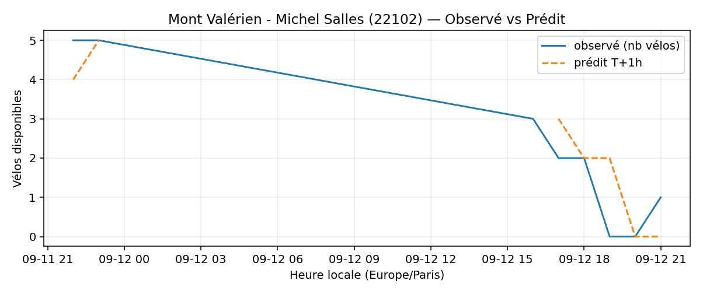
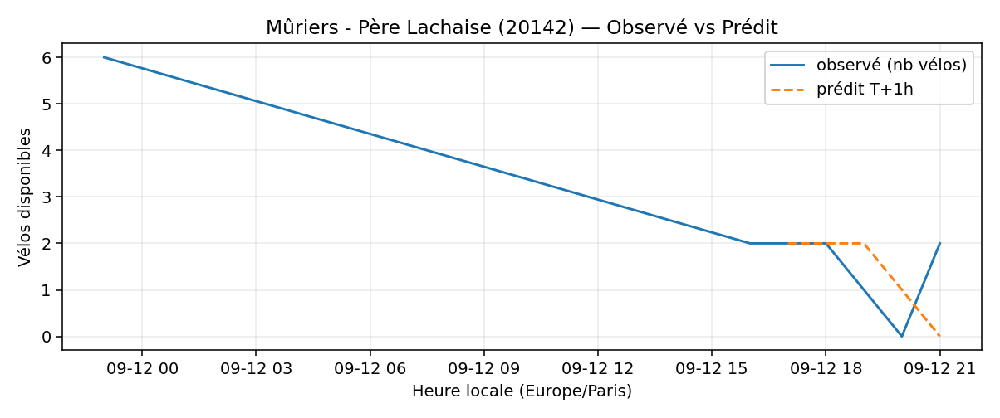

# Prévisions

*Dernière heure considérée : **12/09 21h** (Europe/Paris)*

## Top-10 stations à risque (faible nb vélos prévu T+1h)

| Station                                 |   Prédit T+1h (vélos) | Taux prévu   | Dernière obs.   |
|:----------------------------------------|----------------------:|:-------------|:----------------|
| Athènes - Clichy (`9036`)               |                     0 | 0.0%         | 12/09 21h       |
| Nanterre - Université (`92004`)         |                     0 | 0.0%         | 12/09 21h       |
| Bienfaisance - Place de Narvik (`8035`) |                     0 | 0.0%         | 12/09 21h       |
| Abbé Groult - Convention (`15039`)      |                     0 | 0.0%         | 12/09 21h       |
| Charles de Gaulle (`22019`)             |                     0 | 0.0%         | 12/09 21h       |
| Duhamel - André Gide (`15027`)          |                     0 | 0.0%         | 12/09 21h       |
| Galilée - Vernet (`8003`)               |                     0 | 0.0%         | 12/09 21h       |
| Mont Valérien - Michel Salles (`22102`) |                     0 | 0.0%         | 12/09 21h       |
| Mûriers - Père Lachaise (`20142`)       |                     0 | 0.0%         | 12/09 21h       |
| Square des Saint-Simoniens (`20119`)    |                     0 | 0.0%         | 12/09 21h       |

## Top-10 risque de saturation (taux prévu élevé)

| Station                                          |   Prédit T+1h (vélos) | Taux prévu   | Dernière obs.   |
|:-------------------------------------------------|----------------------:|:-------------|:----------------|
| BNF - Bibliothèque Nationale de France (`13123`) |                    56 | 133.3%       | 12/09 21h       |
| Bercy - Villot (`12105`)                         |                    34 | 103.0%       | 12/09 21h       |
| Harpe - Saint-Germain (`5001`)                   |                    45 | 100.0%       | 12/09 21h       |
| Sèvres-Gallieni (`21032`)                        |                    27 | 100.0%       | 12/09 21h       |
| Chausson - Gabriel Péri (`22301`)                |                    22 | 100.0%       | 12/09 21h       |
| Quai de l'Horloge - Pont Neuf (`1001`)           |                    17 | 100.0%       | 12/09 21h       |
| Paul Klee - Place Augusta Holmes (`13020`)       |                    42 | 97.7%        | 12/09 21h       |
| Saint-Denis - Rivoli (`1003`)                    |                    42 | 97.7%        | 12/09 21h       |
| Primo Levi - Frigos (`13016`)                    |                    33 | 97.1%        | 12/09 21h       |
| Quai de la Gare - Pont de Bercy (`13128`)        |                    29 | 96.7%        | 12/09 21h       |

## Détails par station (graphiques)

???+ info "Athènes - Clichy (9036)"

    

???+ info "Nanterre - Université (92004)"

    

???+ info "Bienfaisance - Place de Narvik (8035)"

    

???+ info "Abbé Groult - Convention (15039)"

    

???+ info "Charles de Gaulle (22019)"

    

???+ info "Duhamel - André Gide (15027)"

    

???+ info "Galilée - Vernet (8003)"

    

???+ info "Mont Valérien - Michel Salles (22102)"

    

???+ info "Mûriers - Père Lachaise (20142)"

    

???+ info "Square des Saint-Simoniens (20119)"

    

