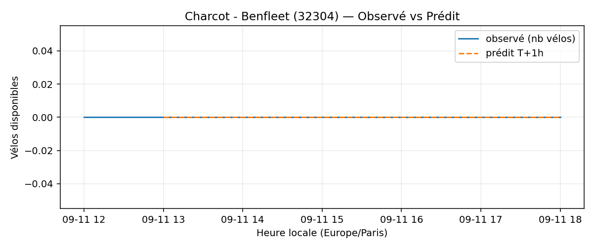
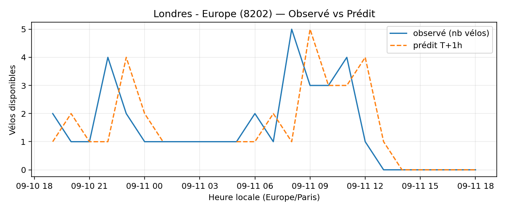
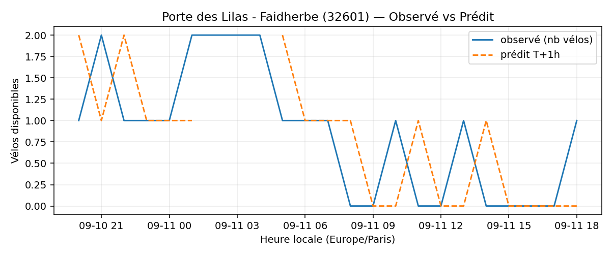

# Prévisions

*Dernière heure considérée : **11/09 18h** (Europe/Paris)*

## Top-10 stations à risque (faible nb vélos prévu T+1h)

| Station                                     |   Prédit T+1h (vélos) | Taux prévu   | Dernière obs.   |
|:--------------------------------------------|----------------------:|:-------------|:----------------|
| Nanterre - Université (`92004`)             |                     0 | 0.0%         | 11/09 18h       |
| Vivienne - Petits Champs (`2201`)           |                     0 | 0.0%         | 11/09 18h       |
| Charles Robin - Grange aux Belles (`10207`) |                     0 | 0.0%         | 11/09 18h       |
| Charcot - Benfleet (`32304`)                |                     0 | 0.0%         | 11/09 18h       |
| Champs-Elysees - Bassano (`8116`)           |                     0 | 0.0%         | 11/09 18h       |
| Londres - Europe (`8202`)                   |                     0 | 0.0%         | 11/09 18h       |
| Henri Barbusse (`31203`)                    |                     0 | 0.0%         | 11/09 18h       |
| Charles de Gaulle (`22019`)                 |                     0 | 0.0%         | 11/09 18h       |
| Gaston Roussel - Commune de Paris (`32308`) |                     0 | 0.0%         | 11/09 18h       |
| Porte des Lilas - Faidherbe (`32601`)       |                     0 | 0.0%         | 11/09 18h       |

## Top-10 risque de saturation (taux prévu élevé)

| Station                                          |   Prédit T+1h (vélos) | Taux prévu   | Dernière obs.   |
|:-------------------------------------------------|----------------------:|:-------------|:----------------|
| Enfants du Paradis - Peupliers (`21021`)         |                    70 | 175.0%       | 11/09 18h       |
| BNF - Bibliothèque Nationale de France (`13123`) |                    55 | 131.0%       | 11/09 18h       |
| Place Balard (`15056`)                           |                    26 | 118.2%       | 11/09 18h       |
| Bercy - Villot (`12105`)                         |                    36 | 109.1%       | 11/09 18h       |
| Tremblay - Lac des Minimes (`12127`)             |                    52 | 108.3%       | 11/09 18h       |
| Malesherbes - Place de la Madeleine (`8004`)     |                    72 | 107.5%       | 11/09 18h       |
| Madeleine Vionnet (`33019`)                      |                    36 | 105.9%       | 11/09 18h       |
| Saint-Antoine Sévigné (`4010`)                   |                    27 | 103.8%       | 11/09 18h       |
| Gare d'Austerlitz - Quai Saint-Bernard (`13104`) |                    27 | 100.0%       | 11/09 18h       |
| Sebastopol - Rambuteau (`4104`)                  |                    16 | 100.0%       | 11/09 18h       |

## Détails par station (graphiques)

???+ info "Nanterre - Université (92004)"

    

???+ info "Vivienne - Petits Champs (2201)"

    

???+ info "Charles Robin - Grange aux Belles (10207)"

    

???+ info "Charcot - Benfleet (32304)"

    

???+ info "Champs-Elysees - Bassano (8116)"

    

???+ info "Londres - Europe (8202)"

    

???+ info "Henri Barbusse (31203)"

    

???+ info "Charles de Gaulle (22019)"

    

???+ info "Gaston Roussel - Commune de Paris (32308)"

    

???+ info "Porte des Lilas - Faidherbe (32601)"

    

