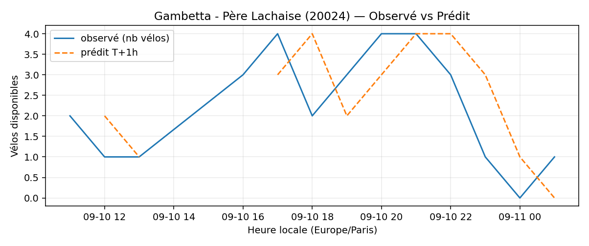

# Prévisions

*Dernière heure considérée : **11/09 01h** (Europe/Paris)*

## Top-10 stations à risque (faible nb vélos prévu T+1h)

| Station                                     |   Prédit T+1h (vélos) | Taux prévu   | Dernière obs.   |
|:--------------------------------------------|----------------------:|:-------------|:----------------|
| Charles de Gaulle (`22019`)                 |                     0 | 0.0%         | 11/09 01h       |
| Gare de Sèvres - Ville d'Avray (`23107`)    |                     0 | 0.0%         | 11/09 01h       |
| Henri Barbusse (`31203`)                    |                     0 | 0.0%         | 11/09 01h       |
| Vivienne - Petits Champs (`2201`)           |                     0 | 0.0%         | 11/09 01h       |
| De Gaulle - Moulin (`28002`)                |                     0 | 0.0%         | 11/09 01h       |
| Place Aimé Césaire (`21402`)                |                     0 | 0.0%         | 11/09 01h       |
| Charles Robin - Grange aux Belles (`10207`) |                     0 | 0.0%         | 11/09 01h       |
| Gaston Roussel - Commune de Paris (`32308`) |                     0 | 0.0%         | 11/09 01h       |
| Gambetta - Père Lachaise (`20024`)          |                     0 | 0.0%         | 11/09 01h       |
| Danielle Casanova - Opéra (`2020`)          |                     0 | 0.0%         | 11/09 01h       |

## Top-10 risque de saturation (taux prévu élevé)

| Station                                         |   Prédit T+1h (vélos) | Taux prévu   | Dernière obs.   |
|:------------------------------------------------|----------------------:|:-------------|:----------------|
| Westermeyer - Paul Vaillant-Couturier (`42004`) |                    26 | 104.0%       | 11/09 01h       |
| Pierre Joseph Desault (`13120`)                 |                    19 | 100.0%       | 11/09 01h       |
| Belfort - Victor Hugo (`21119`)                 |                    24 | 100.0%       | 11/09 01h       |
| Cadix - Hameau (`15128`)                        |                    37 | 100.0%       | 11/09 01h       |
| Général Leclerc - République (`22701`)          |                    30 | 100.0%       | 11/09 01h       |
| Jules Guesdes - Carnot (`32020`)                |                    16 | 100.0%       | 11/09 01h       |
| Daumesnil - Picpus (`12010`)                    |                    21 | 100.0%       | 11/09 01h       |
| Faidherbe - Dahomey (`11107`)                   |                    44 | 100.0%       | 11/09 01h       |
| Amelot - Saint-Sébastien (`11047`)              |                    30 | 100.0%       | 11/09 01h       |
| Place du 17 Octobre (`22306`)                   |                    20 | 100.0%       | 11/09 01h       |

## Détails par station (graphiques)

???+ info "Charles de Gaulle (22019)"

    

???+ info "Gare de Sèvres - Ville d'Avray (23107)"

    

???+ info "Henri Barbusse (31203)"

    

???+ info "Vivienne - Petits Champs (2201)"

    

???+ info "De Gaulle - Moulin (28002)"

    

???+ info "Place Aimé Césaire (21402)"

    

???+ info "Charles Robin - Grange aux Belles (10207)"

    

???+ info "Gaston Roussel - Commune de Paris (32308)"

    

???+ info "Gambetta - Père Lachaise (20024)"

    

???+ info "Danielle Casanova - Opéra (2020)"

    

