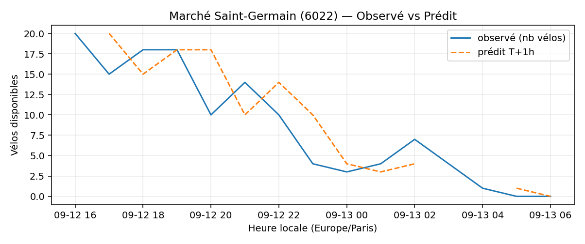

# Prévisions

*Dernière heure considérée : **13/09 06h** (Europe/Paris)*

## Top-10 stations à risque (faible nb vélos prévu T+1h)

| Station                                     |   Prédit T+1h (vélos) | Taux prévu   | Dernière obs.   |
|:--------------------------------------------|----------------------:|:-------------|:----------------|
| Nanterre - Université (`92004`)             |                     0 | 0.0%         | 13/09 06h       |
| Gaston Roussel - Commune de Paris (`32308`) |                     0 | 0.0%         | 13/09 06h       |
| De Gaulle - Moulin (`28002`)                |                     0 | 0.0%         | 13/09 06h       |
| Champs-Elysees - Bassano (`8116`)           |                     0 | 0.0%         | 13/09 06h       |
| Pereire - Ternes (`17040`)                  |                     0 | 0.0%         | 13/09 06h       |
| Place des Fêtes - Solitaires (`19210`)      |                     0 | 0.0%         | 13/09 06h       |
| Parc André Citroën (`15059`)                |                     0 | 0.0%         | 13/09 06h       |
| Sully - Morland (`4201`)                    |                     0 | 0.0%         | 13/09 06h       |
| Verdun - Henri Barbusse (`22209`)           |                     0 | 0.0%         | 13/09 06h       |
| Marché Saint-Germain (`6022`)               |                     0 | 0.0%         | 13/09 06h       |

## Top-10 risque de saturation (taux prévu élevé)

| Station                                            |   Prédit T+1h (vélos) | Taux prévu   | Dernière obs.   |
|:---------------------------------------------------|----------------------:|:-------------|:----------------|
| Westermeyer - Paul Vaillant-Couturier (`42004`)    |                    42 | 168.0%       | 13/09 06h       |
| Aristide Briand - Place de la Résistance (`21302`) |                    35 | 140.0%       | 13/09 06h       |
| Daumesnil - Picpus (`12010`)                       |                    25 | 119.0%       | 13/09 06h       |
| Abbé Groult - Convention (`15039`)                 |                    14 | 116.7%       | 13/09 06h       |
| Place Charles Vallin (`15122`)                     |                    28 | 107.7%       | 13/09 06h       |
| Port - Maurice Chevalier (`41304`)                 |                    31 | 103.3%       | 13/09 06h       |
| Balard - Montagne de la Fage (`15070`)             |                    36 | 100.0%       | 13/09 06h       |
| Liberté - Vert-de-Maisons (`47007`)                |                    20 | 100.0%       | 13/09 06h       |
| Lourmel - Marie Skobtsov (`15108`)                 |                    22 | 100.0%       | 13/09 06h       |
| Pajol - Riquet (`18109`)                           |                    47 | 100.0%       | 13/09 06h       |

## Détails par station (graphiques)

???+ info "Nanterre - Université (92004)"

    

???+ info "Gaston Roussel - Commune de Paris (32308)"

    

???+ info "De Gaulle - Moulin (28002)"

    

???+ info "Champs-Elysees - Bassano (8116)"

    

???+ info "Pereire - Ternes (17040)"

    

???+ info "Place des Fêtes - Solitaires (19210)"

    

???+ info "Parc André Citroën (15059)"

    

???+ info "Sully - Morland (4201)"

    

???+ info "Verdun - Henri Barbusse (22209)"

    

???+ info "Marché Saint-Germain (6022)"

    

