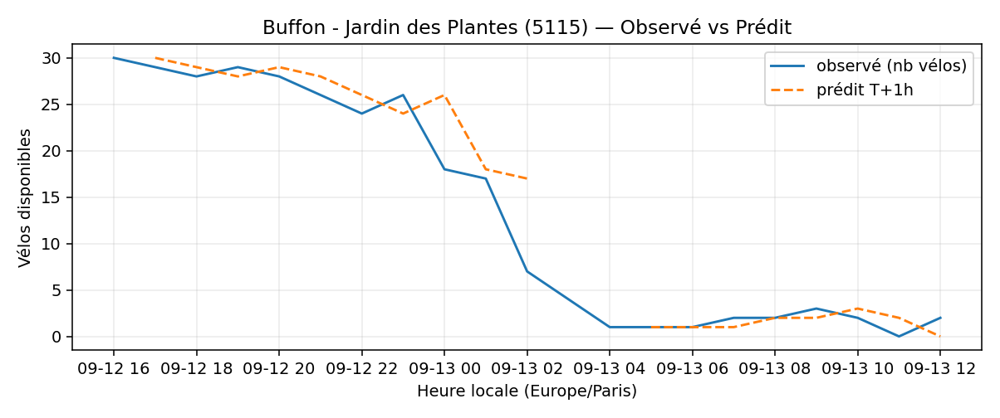

# Prévisions

*Dernière heure considérée : **13/09 12h** (Europe/Paris)*

## Top-10 stations à risque (faible nb vélos prévu T+1h)

| Station                                         |   Prédit T+1h (vélos) | Taux prévu   | Dernière obs.   |
|:------------------------------------------------|----------------------:|:-------------|:----------------|
| Nanterre - Université (`92004`)                 |                     0 | 0.0%         | 13/09 12h       |
| Boyer - Ménilmontant (`20121`)                  |                     0 | 0.0%         | 13/09 12h       |
| Lieutenant Chauré - Etienne Marey (`20134`)     |                     0 | 0.0%         | 13/09 12h       |
| Henri Chevreau - Couronnes (`20136`)            |                     0 | 0.0%         | 13/09 12h       |
| Square des Saint-Simoniens (`20119`)            |                     0 | 0.0%         | 13/09 12h       |
| Cujas - Saint-Michel (`5106`)                   |                     0 | —            | 13/09 12h       |
| Buffon - Jardin des Plantes (`5115`)            |                     0 | 0.0%         | 13/09 12h       |
| Buzenval - Vignoles (`20012`)                   |                     0 | 0.0%         | 13/09 12h       |
| Gay Lussac - Saint-Jacques (`5005`)             |                     0 | 0.0%         | 13/09 12h       |
| Alexandre Dumas - Place de la Réunion (`20013`) |                     0 | 0.0%         | 13/09 12h       |

## Top-10 risque de saturation (taux prévu élevé)

| Station                                         |   Prédit T+1h (vélos) | Taux prévu   | Dernière obs.   |
|:------------------------------------------------|----------------------:|:-------------|:----------------|
| Westermeyer - Paul Vaillant-Couturier (`42004`) |                    45 | 180.0%       | 13/09 12h       |
| Port - Maurice Chevalier (`41304`)              |                    31 | 103.3%       | 13/09 12h       |
| Oratoire - Rivoli (`1025`)                      |                    18 | 100.0%       | 13/09 12h       |
| Paul Doumer - Stalingrad (`41101`)              |                    24 | 100.0%       | 13/09 12h       |
| Roquette - Auguste Laurent (`11022`)            |                    16 | 100.0%       | 13/09 12h       |
| Gare Saint-Lazare - Isly (`8009`)               |                    27 | 100.0%       | 13/09 12h       |
| Gare de Bellevue (`21953`)                      |                    20 | 100.0%       | 13/09 12h       |
| Gare de Lyon - Roland Barthes (`12106`)         |                    67 | 98.5%        | 13/09 12h       |
| Gare RER - Général de Gaulle (`22302`)          |                    40 | 97.6%        | 13/09 12h       |
| Turbigo - Réaumur (`3011`)                      |                    30 | 96.8%        | 13/09 12h       |

## Détails par station (graphiques)

???+ info "Nanterre - Université (92004)"

    

???+ info "Boyer - Ménilmontant (20121)"

    

???+ info "Lieutenant Chauré - Etienne Marey (20134)"

    

???+ info "Henri Chevreau - Couronnes (20136)"

    

???+ info "Square des Saint-Simoniens (20119)"

    

???+ info "Cujas - Saint-Michel (5106)"

    

???+ info "Buffon - Jardin des Plantes (5115)"

    

???+ info "Buzenval - Vignoles (20012)"

    

???+ info "Gay Lussac - Saint-Jacques (5005)"

    

???+ info "Alexandre Dumas - Place de la Réunion (20013)"

    

