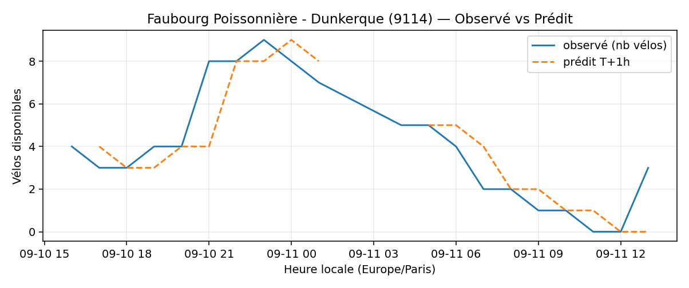
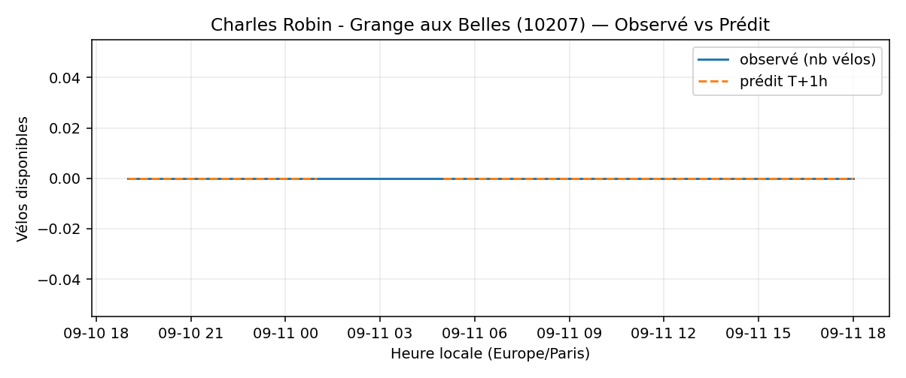
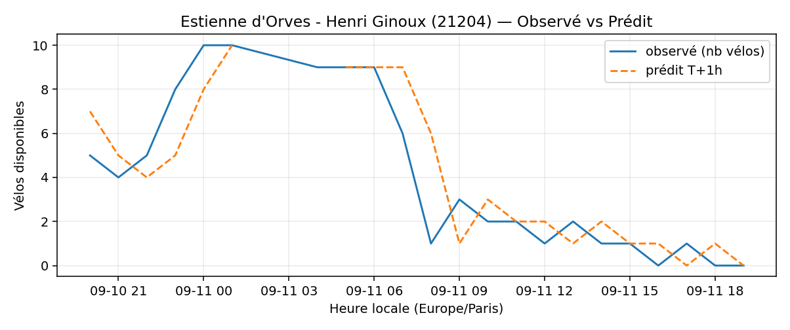
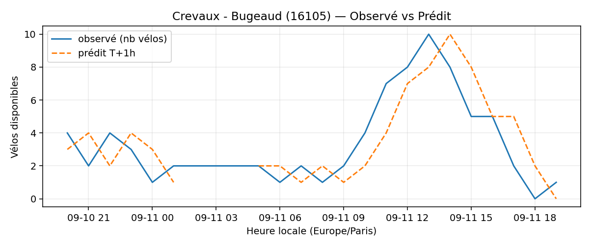
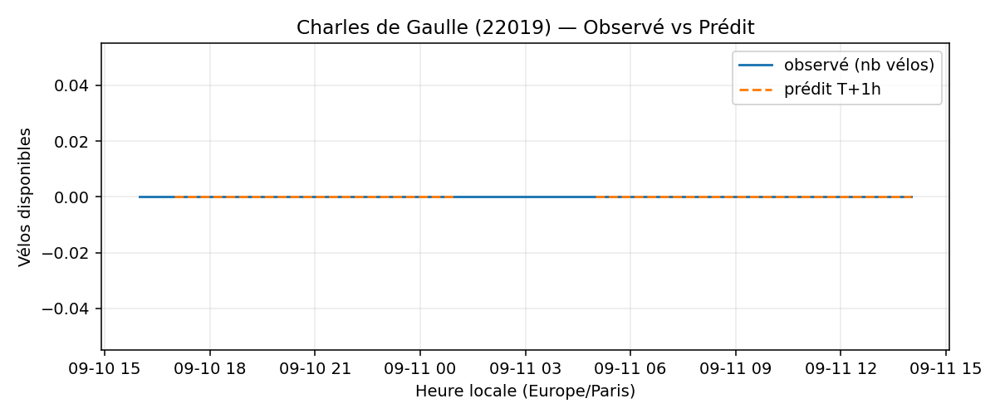
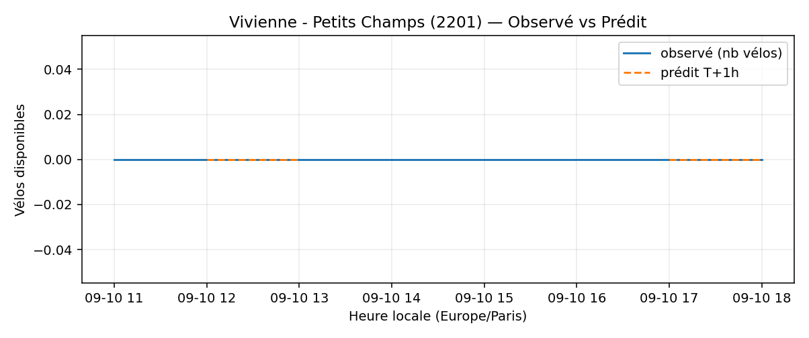
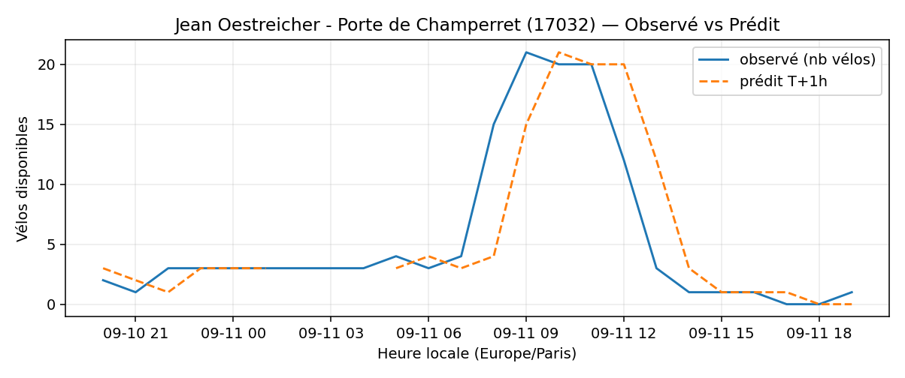
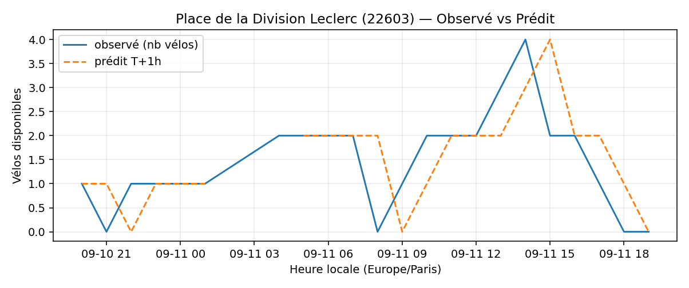
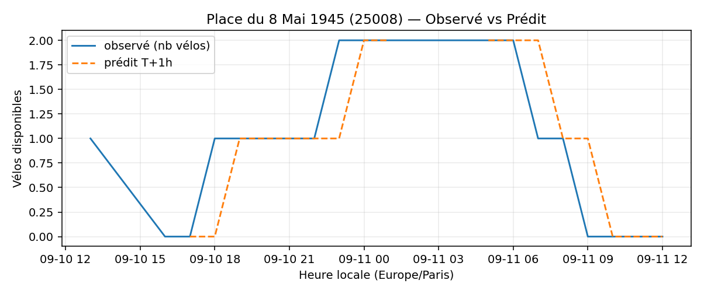

# Prévisions

*Dernière heure considérée : **11/09 19h** (Europe/Paris)*

## Top-10 stations à risque (faible nb vélos prévu T+1h)

| Station                                          |   Prédit T+1h (vélos) | Taux prévu   | Dernière obs.   |
|:-------------------------------------------------|----------------------:|:-------------|:----------------|
| Faubourg Poissonnière - Dunkerque (`9114`)       |                     0 | 0.0%         | 11/09 19h       |
| Charles Robin - Grange aux Belles (`10207`)      |                     0 | 0.0%         | 11/09 19h       |
| Estienne d'Orves - Henri Ginoux (`21204`)        |                     0 | 0.0%         | 11/09 19h       |
| Crevaux - Bugeaud (`16105`)                      |                     0 | 0.0%         | 11/09 19h       |
| Commandant Schloesing - Pétrarque (`16202`)      |                     0 | 0.0%         | 11/09 19h       |
| Charles de Gaulle (`22019`)                      |                     0 | 0.0%         | 11/09 19h       |
| Vivienne - Petits Champs (`2201`)                |                     0 | 0.0%         | 11/09 19h       |
| Jean Oestreicher - Porte de Champerret (`17032`) |                     0 | 0.0%         | 11/09 19h       |
| Place de la Division Leclerc (`22603`)           |                     0 | 0.0%         | 11/09 19h       |
| Place du 8 Mai 1945 (`25008`)                    |                     0 | 0.0%         | 11/09 19h       |

## Top-10 risque de saturation (taux prévu élevé)

| Station                                            |   Prédit T+1h (vélos) | Taux prévu   | Dernière obs.   |
|:---------------------------------------------------|----------------------:|:-------------|:----------------|
| BNF - Bibliothèque Nationale de France (`13123`)   |                    54 | 128.6%       | 11/09 19h       |
| Enfants du Paradis - Peupliers (`21021`)           |                    42 | 105.0%       | 11/09 19h       |
| Château - Bineau (`22001`)                         |                    23 | 100.0%       | 11/09 19h       |
| Jean Bouin - Gouverneur Général Eboué (`21327`)    |                    30 | 96.8%        | 11/09 19h       |
| Lucien Lanternier - Le Luth (`22303`)              |                    26 | 96.3%        | 11/09 19h       |
| Lavandieres Sainte Opportune - Rivoli (`1120`)     |                    26 | 96.3%        | 11/09 19h       |
| Aristide Briand - Place de la Résistance (`21302`) |                    24 | 96.0%        | 11/09 19h       |
| Boutroux - Porte de Vitry (`13047`)                |                    47 | 95.9%        | 11/09 19h       |
| Kléber - Gouverneur Général Eboué (`21310`)        |                    23 | 95.8%        | 11/09 19h       |
| Payenne - Square George Caïn (`3201`)              |                    23 | 95.8%        | 11/09 19h       |

## Détails par station (graphiques)

???+ info "Faubourg Poissonnière - Dunkerque (9114)"

    

???+ info "Charles Robin - Grange aux Belles (10207)"

    

???+ info "Estienne d'Orves - Henri Ginoux (21204)"

    

???+ info "Crevaux - Bugeaud (16105)"

    

???+ info "Commandant Schloesing - Pétrarque (16202)"

    

???+ info "Charles de Gaulle (22019)"

    

???+ info "Vivienne - Petits Champs (2201)"

    

???+ info "Jean Oestreicher - Porte de Champerret (17032)"

    

???+ info "Place de la Division Leclerc (22603)"

    

???+ info "Place du 8 Mai 1945 (25008)"

    

