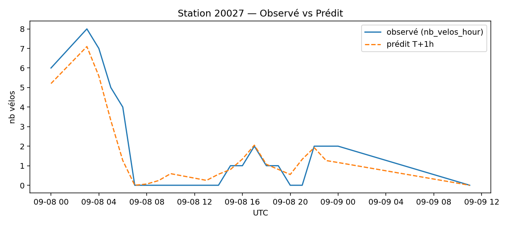
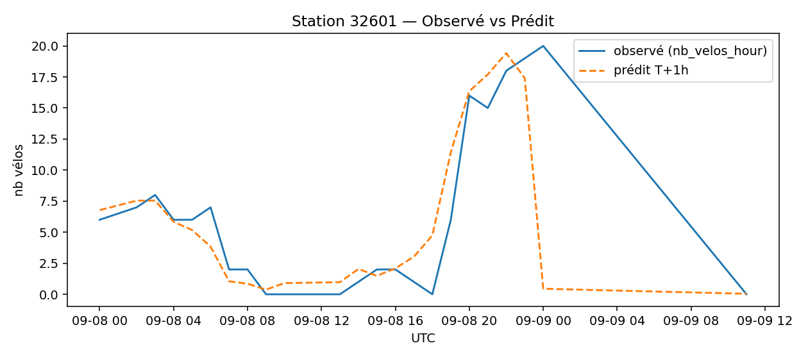
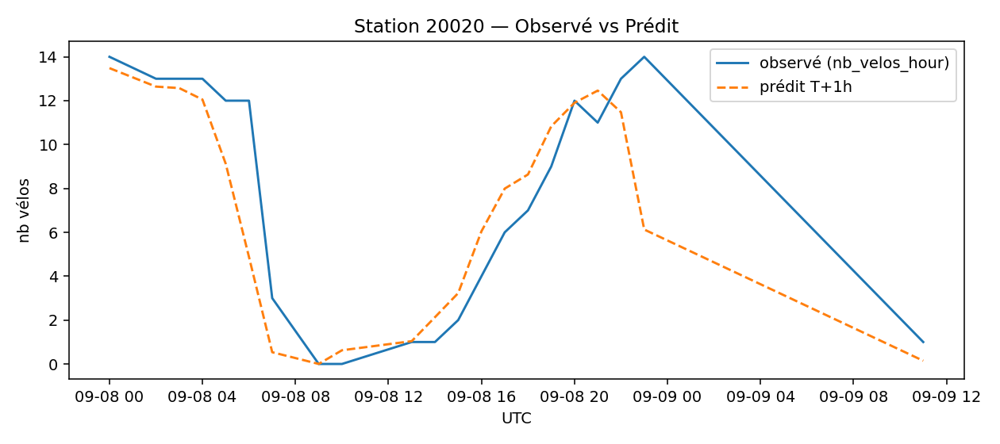
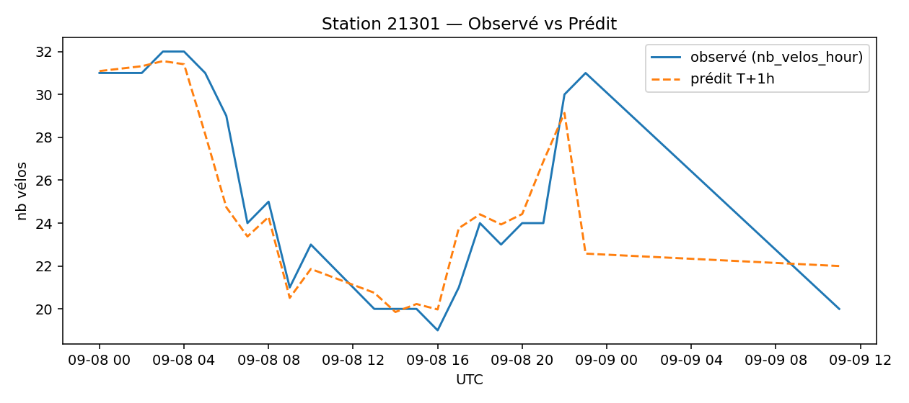
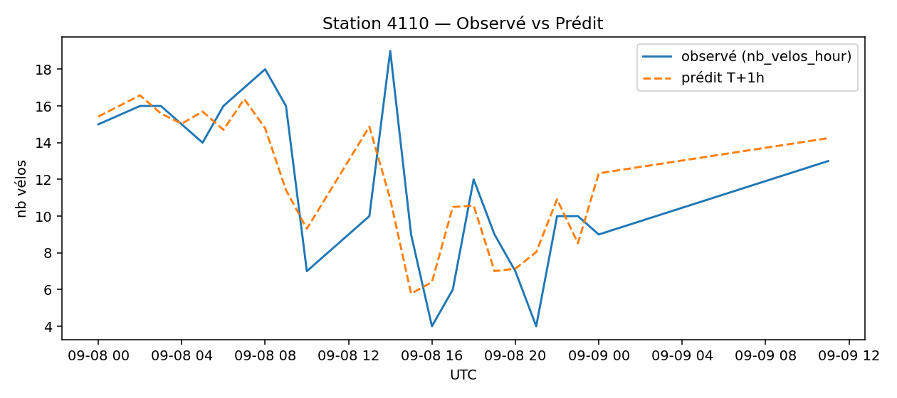

# Prévisions
**Échéance la plus récente** : `2025-09-09 11:00:00` (UTC)

## Top-10 stations à risque (faible nb vélos prévu T+1h)

| station | y_nb_pred | occ_ratio_pred |
|---|---:|---:|
| `20027` | 0 | 0.00 |
| `32601` | 0 | 0.00 |
| `20020` | 0 | 0.01 |
| `20035` | 0 | 0.01 |
| `20117` | 0 | 0.01 |
| `13203` | 0 | 0.01 |
| `48010` | 0 | 0.02 |
| `21505` | 0 | 0.02 |
| `18024` | 0 | 0.01 |
| `20103` | 0 | 0.02 |

## Observé vs Prédit (échantillon)

### Station `20027`

### Station `32601`

### Station `20020`

### Station `21301`

### Station `4110`

## Qualité (in-sample, ordre de grandeur)
- MAE ≈ **1.05** vélos — RMSE ≈ **1.50** vélos

## Importance des variables

> Remarque : ces métriques sont in-sample (à raffiner avec une validation temporelle TSSplit).