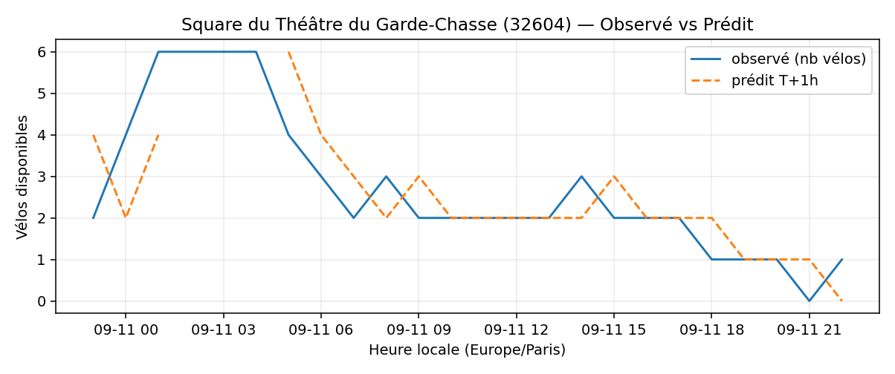
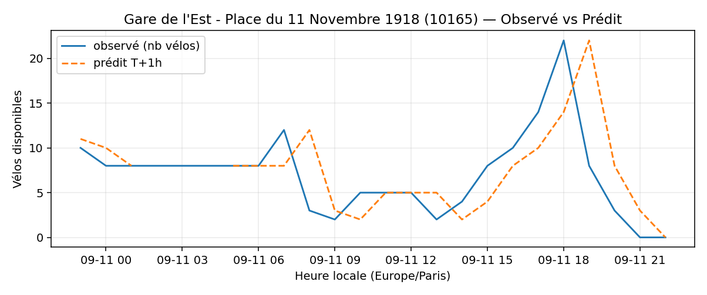
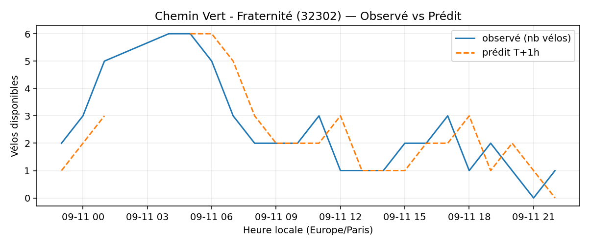

# Prévisions

*Dernière heure considérée : **11/09 22h** (Europe/Paris)*

## Top-10 stations à risque (faible nb vélos prévu T+1h)

| Station                                             |   Prédit T+1h (vélos) | Taux prévu   | Dernière obs.   |
|:----------------------------------------------------|----------------------:|:-------------|:----------------|
| Nanterre - Université (`92004`)                     |                     0 | 0.0%         | 11/09 22h       |
| Récollets - Square Villemin (`10016`)               |                     0 | 0.0%         | 11/09 22h       |
| Gaston Roussel - Commune de Paris (`32308`)         |                     0 | 0.0%         | 11/09 22h       |
| Square du Théâtre du Garde-Chasse (`32604`)         |                     0 | 0.0%         | 11/09 22h       |
| Gare de l'Est - Place du 11 Novembre 1918 (`10165`) |                     0 | 0.0%         | 11/09 22h       |
| Henri Barbusse (`31203`)                            |                     0 | 0.0%         | 11/09 22h       |
| Douai - Bruxelles (`9038`)                          |                     0 | 0.0%         | 11/09 22h       |
| Chemin Vert - Fraternité (`32302`)                  |                     0 | 0.0%         | 11/09 22h       |
| Division Leclerc - Kléber (`23203`)                 |                     0 | 0.0%         | 11/09 22h       |
| Charles de Gaulle (`22019`)                         |                     0 | 0.0%         | 11/09 22h       |

## Top-10 risque de saturation (taux prévu élevé)

| Station                                            |   Prédit T+1h (vélos) | Taux prévu   | Dernière obs.   |
|:---------------------------------------------------|----------------------:|:-------------|:----------------|
| BNF - Bibliothèque Nationale de France (`13123`)   |                    51 | 121.4%       | 11/09 22h       |
| Westermeyer - Paul Vaillant-Couturier (`42004`)    |                    28 | 112.0%       | 11/09 22h       |
| Aristide Briand - Place de la Résistance (`21302`) |                    26 | 104.0%       | 11/09 22h       |
| Boutroux - Porte de Vitry (`13047`)                |                    49 | 100.0%       | 11/09 22h       |
| Place de Verdun (`43402`)                          |                    39 | 97.5%        | 11/09 22h       |
| Hôtel de Ville de Sèvres (`23102`)                 |                    31 | 96.9%        | 11/09 22h       |
| Gare - Aristide Briand (`21329`)                   |                    28 | 96.6%        | 11/09 22h       |
| Quai de Sèvres - Manufacture Nationale (`23104`)   |                    27 | 96.4%        | 11/09 22h       |
| André Mazet - Saint-André des Arts (`6015`)        |                    53 | 96.4%        | 11/09 22h       |
| Poissy - Saint-Germain (`5019`)                    |                    24 | 96.0%        | 11/09 22h       |

## Détails par station (graphiques)

???+ info "Nanterre - Université (92004)"

    

???+ info "Récollets - Square Villemin (10016)"

    

???+ info "Gaston Roussel - Commune de Paris (32308)"

    

???+ info "Square du Théâtre du Garde-Chasse (32604)"

    

???+ info "Gare de l'Est - Place du 11 Novembre 1918 (10165)"

    

???+ info "Henri Barbusse (31203)"

    

???+ info "Douai - Bruxelles (9038)"

    

???+ info "Chemin Vert - Fraternité (32302)"

    

???+ info "Division Leclerc - Kléber (23203)"

    

???+ info "Charles de Gaulle (22019)"

    

