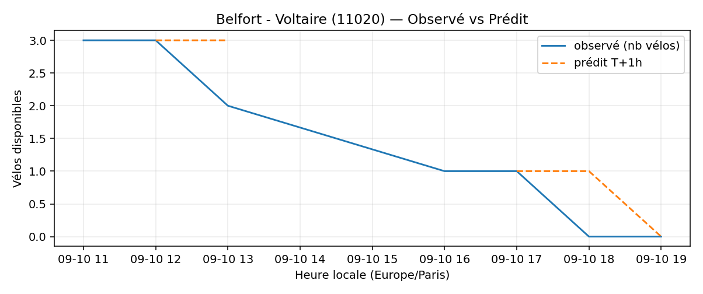
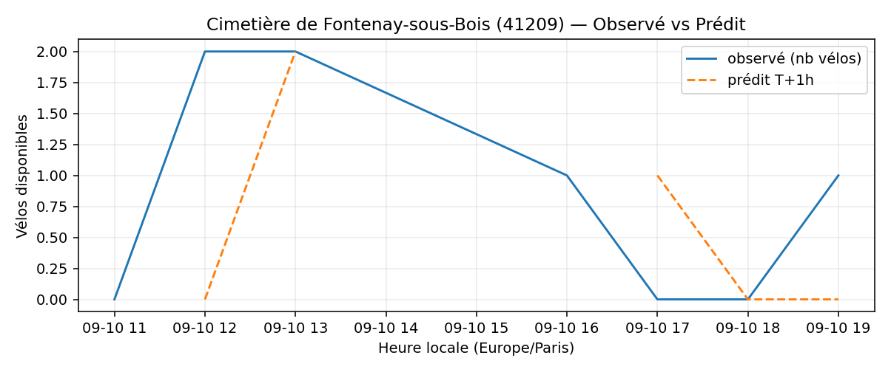
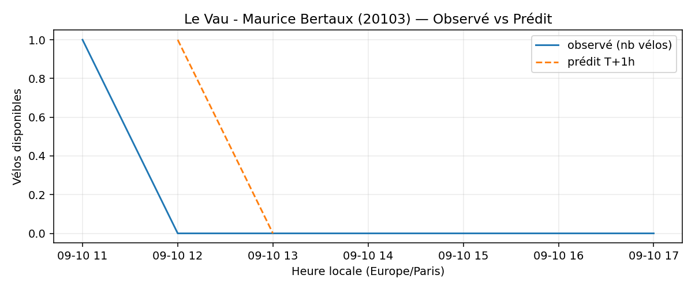

# Prévisions

*Dernière heure considérée : **10/09 19h** (Europe/Paris)*

## Top-10 stations à risque (faible nb vélos prévu T+1h)

| Station                                     |   Prédit T+1h (vélos) | Taux prévu   | Dernière obs.   |
|:--------------------------------------------|----------------------:|:-------------|:----------------|
| Nanterre - Université (`92004`)             |                     0 | 0.0%         | 10/09 19h       |
| Commandant Schloesing - Pétrarque (`16202`) |                     0 | 0.0%         | 10/09 19h       |
| Belfort - Voltaire (`11020`)                |                     0 | 0.0%         | 10/09 19h       |
| Cimetière de Fontenay-sous-Bois (`41209`)   |                     0 | 0.0%         | 10/09 19h       |
| Le Vau - Maurice Bertaux (`20103`)          |                     0 | 0.0%         | 10/09 19h       |
| Mairie de Romainville (`32301`)             |                     0 | 0.0%         | 10/09 19h       |
| Sully - Morland (`4201`)                    |                     0 | 0.0%         | 10/09 19h       |
| Henri Barbusse (`31203`)                    |                     0 | 0.0%         | 10/09 19h       |
| De Gaulle - Moulin (`28002`)                |                     0 | 0.0%         | 10/09 19h       |
| Division Leclerc - Kléber (`23203`)         |                     0 | 0.0%         | 10/09 19h       |

## Top-10 risque de saturation (taux prévu élevé)

| Station                                          |   Prédit T+1h (vélos) | Taux prévu   | Dernière obs.   |
|:-------------------------------------------------|----------------------:|:-------------|:----------------|
| Convention - Lourmel (`15062`)                   |                    36 | 100.0%       | 10/09 19h       |
| Gare Saint-Lazare - Cour du Havre (`8002`)       |                    45 | 100.0%       | 10/09 19h       |
| Paul Vaillant-Couturier - Gare RER (`44002`)     |                    26 | 100.0%       | 10/09 19h       |
| Place de l'Europe - Quai de Bercy (`42209`)      |                    17 | 100.0%       | 10/09 19h       |
| BNF - Bibliothèque Nationale de France (`13123`) |                    42 | 100.0%       | 10/09 19h       |
| Grand Prieuré - Crussol (`11042`)                |                    48 | 98.0%        | 10/09 19h       |
| Porte Saint-Martin (`3101`)                      |                    33 | 97.1%        | 10/09 19h       |
| Place de l'Eglise - Vitry-sur-Seine (`44004`)    |                    27 | 96.4%        | 10/09 19h       |
| Voltaire - Anatole France (`23010`)              |                    26 | 96.3%        | 10/09 19h       |
| Château - Bineau (`22001`)                       |                    22 | 95.7%        | 10/09 19h       |

## Détails par station (graphiques)

???+ info "Nanterre - Université (92004)"

    

???+ info "Commandant Schloesing - Pétrarque (16202)"

    

???+ info "Belfort - Voltaire (11020)"

    

???+ info "Cimetière de Fontenay-sous-Bois (41209)"

    

???+ info "Le Vau - Maurice Bertaux (20103)"

    

???+ info "Mairie de Romainville (32301)"

    

???+ info "Sully - Morland (4201)"

    

???+ info "Henri Barbusse (31203)"

    

???+ info "De Gaulle - Moulin (28002)"

    

???+ info "Division Leclerc - Kléber (23203)"

    

