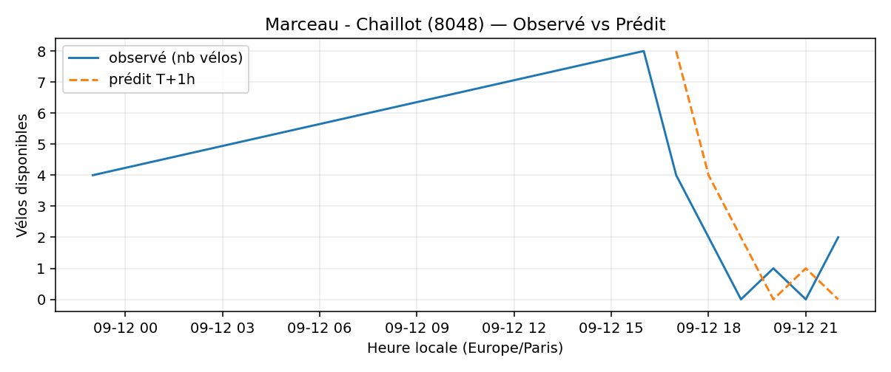
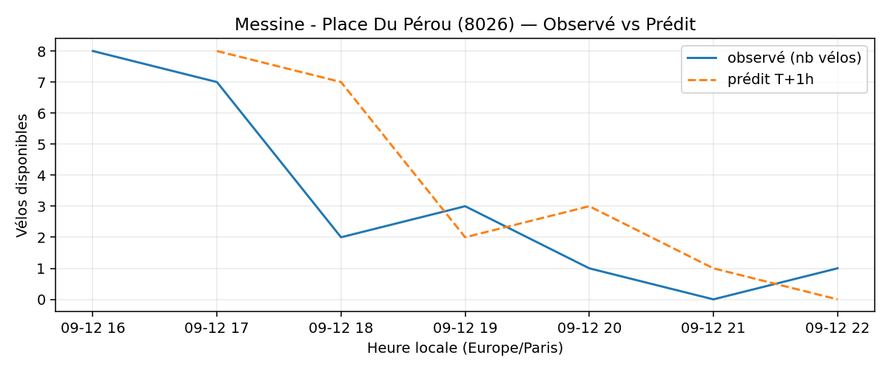
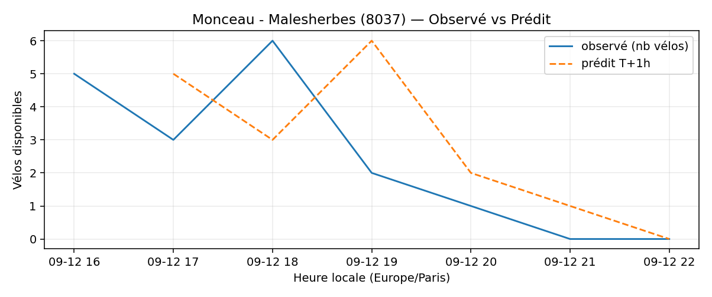
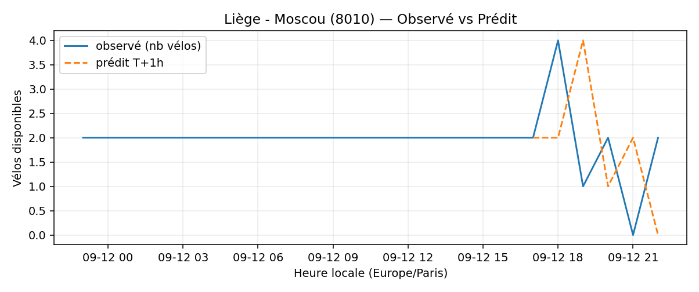

# Prévisions

*Dernière heure considérée : **12/09 22h** (Europe/Paris)*

## Top-10 stations à risque (faible nb vélos prévu T+1h)

| Station                                 |   Prédit T+1h (vélos) | Taux prévu   | Dernière obs.   |
|:----------------------------------------|----------------------:|:-------------|:----------------|
| Batignolles - Rome (`8051`)             |                     0 | 0.0%         | 12/09 22h       |
| Marceau - Chaillot (`8048`)             |                     0 | 0.0%         | 12/09 22h       |
| Bienfaisance - Place de Narvik (`8035`) |                     0 | 0.0%         | 12/09 22h       |
| Messine - Place Du Pérou (`8026`)       |                     0 | 0.0%         | 12/09 22h       |
| Nanterre - Université (`92004`)         |                     0 | 0.0%         | 12/09 22h       |
| Monceau - Malesherbes (`8037`)          |                     0 | 0.0%         | 12/09 22h       |
| Parc André Citroën (`15059`)            |                     0 | 0.0%         | 12/09 22h       |
| Place des Fêtes - Solitaires (`19210`)  |                     0 | 0.0%         | 12/09 22h       |
| Liège - Moscou (`8010`)                 |                     0 | 0.0%         | 12/09 22h       |
| Vitruve - Davout (`20122`)              |                     0 | 0.0%         | 12/09 22h       |

## Top-10 risque de saturation (taux prévu élevé)

| Station                                            |   Prédit T+1h (vélos) | Taux prévu   | Dernière obs.   |
|:---------------------------------------------------|----------------------:|:-------------|:----------------|
| BNF - Bibliothèque Nationale de France (`13123`)   |                    60 | 142.9%       | 12/09 22h       |
| Bercy - Villot (`12105`)                           |                    37 | 112.1%       | 12/09 22h       |
| Aristide Briand - Place de la Résistance (`21302`) |                    26 | 104.0%       | 12/09 22h       |
| Westermeyer - Paul Vaillant-Couturier (`42004`)    |                    26 | 104.0%       | 12/09 22h       |
| Gare d'Austerlitz - Quai Saint-Bernard (`13104`)   |                    27 | 100.0%       | 12/09 22h       |
| Chausson - Gabriel Péri (`22301`)                  |                    22 | 100.0%       | 12/09 22h       |
| Charenton - Prague (`12101`)                       |                    26 | 100.0%       | 12/09 22h       |
| Harpe - Saint-Germain (`5001`)                     |                    44 | 97.8%        | 12/09 22h       |
| Paul Klee - Place Augusta Holmes (`13020`)         |                    42 | 97.7%        | 12/09 22h       |
| Saint-Denis - Rivoli (`1003`)                      |                    42 | 97.7%        | 12/09 22h       |

## Détails par station (graphiques)

???+ info "Batignolles - Rome (8051)"

    

???+ info "Marceau - Chaillot (8048)"

    

???+ info "Bienfaisance - Place de Narvik (8035)"

    

???+ info "Messine - Place Du Pérou (8026)"

    

???+ info "Nanterre - Université (92004)"

    

???+ info "Monceau - Malesherbes (8037)"

    

???+ info "Parc André Citroën (15059)"

    

???+ info "Place des Fêtes - Solitaires (19210)"

    

???+ info "Liège - Moscou (8010)"

    

???+ info "Vitruve - Davout (20122)"

    

