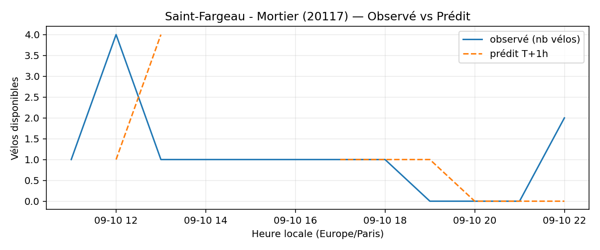
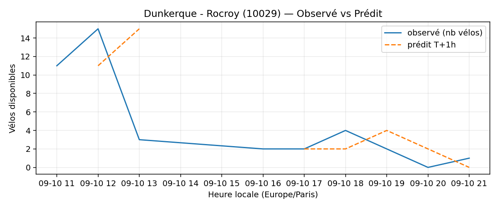
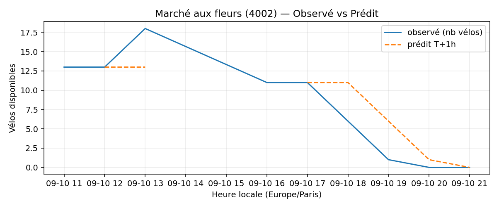
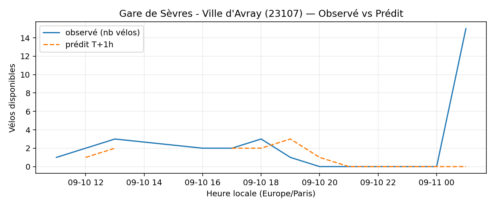
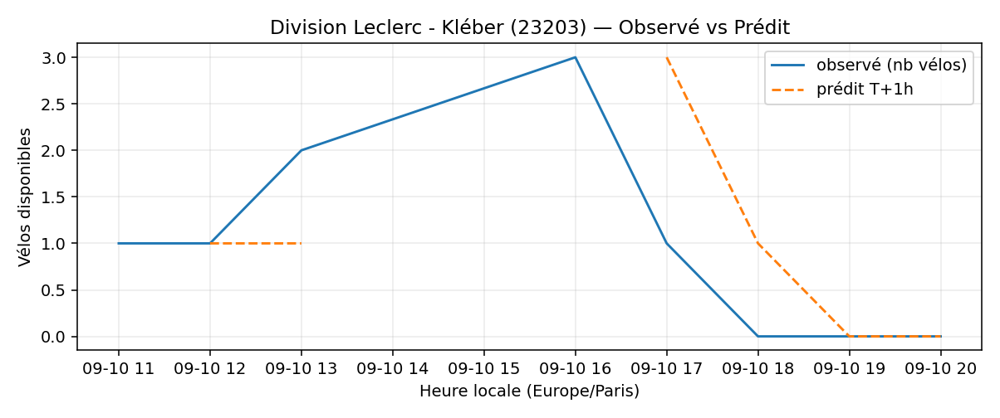
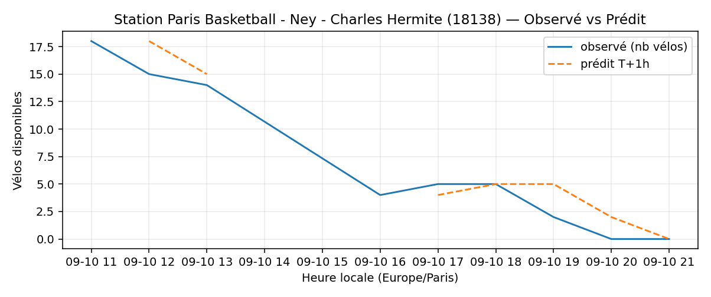

# Prévisions

*Dernière heure considérée : **10/09 21h** (Europe/Paris)*

## Top-10 stations à risque (faible nb vélos prévu T+1h)

| Station                                                    |   Prédit T+1h (vélos) | Taux prévu   | Dernière obs.   |
|:-----------------------------------------------------------|----------------------:|:-------------|:----------------|
| Nanterre - Université (`92004`)                            |                     0 | 0.0%         | 10/09 21h       |
| Saint-Fargeau - Mortier (`20117`)                          |                     0 | 0.0%         | 10/09 21h       |
| Dunkerque - Rocroy (`10029`)                               |                     0 | 0.0%         | 10/09 21h       |
| Marché aux fleurs (`4002`)                                 |                     0 | 0.0%         | 10/09 21h       |
| Gare de Sèvres - Ville d'Avray (`23107`)                   |                     0 | 0.0%         | 10/09 21h       |
| Division Leclerc - Kléber (`23203`)                        |                     0 | 0.0%         | 10/09 21h       |
| Gaston Roussel - Commune de Paris (`32308`)                |                     0 | 0.0%         | 10/09 21h       |
| Station Paris Basketball - Ney - Charles Hermite (`18138`) |                     0 | 0.0%         | 10/09 21h       |
| De Gaulle - Moulin (`28002`)                               |                     0 | 0.0%         | 10/09 21h       |
| Champs-Elysees - Bassano (`8116`)                          |                     0 | 0.0%         | 10/09 21h       |

## Top-10 risque de saturation (taux prévu élevé)

| Station                                         |   Prédit T+1h (vélos) | Taux prévu   | Dernière obs.   |
|:------------------------------------------------|----------------------:|:-------------|:----------------|
| Westermeyer - Paul Vaillant-Couturier (`42004`) |                    27 | 108.0%       | 10/09 21h       |
| Place de l'Eglise - Vitry-sur-Seine (`44004`)   |                    28 | 100.0%       | 10/09 21h       |
| Convention - Saint-Charles (`15063`)            |                    23 | 100.0%       | 10/09 21h       |
| Gare - Aristide Briand (`21329`)                |                    29 | 100.0%       | 10/09 21h       |
| Paul Vaillant-Couturier - Gare RER (`44002`)    |                    26 | 100.0%       | 10/09 21h       |
| Convention - Lourmel (`15062`)                  |                    35 | 97.2%        | 10/09 21h       |
| Charlot - Stade Gabriel Voisin (`21323`)        |                    30 | 96.8%        | 10/09 21h       |
| Charles Tillon - Cimetière Communal (`33015`)   |                    29 | 96.7%        | 10/09 21h       |
| Roger Salengro - Général de Gaulle (`45002`)    |                    26 | 96.3%        | 10/09 21h       |
| Île de la Jatte (`22015`)                       |                    22 | 95.7%        | 10/09 21h       |

## Détails par station (graphiques)

???+ info "Nanterre - Université (92004)"

    

???+ info "Saint-Fargeau - Mortier (20117)"

    

???+ info "Dunkerque - Rocroy (10029)"

    

???+ info "Marché aux fleurs (4002)"

    

???+ info "Gare de Sèvres - Ville d'Avray (23107)"

    

???+ info "Division Leclerc - Kléber (23203)"

    

???+ info "Gaston Roussel - Commune de Paris (32308)"

    

???+ info "Station Paris Basketball - Ney - Charles Hermite (18138)"

    

???+ info "De Gaulle - Moulin (28002)"

    

???+ info "Champs-Elysees - Bassano (8116)"

    

